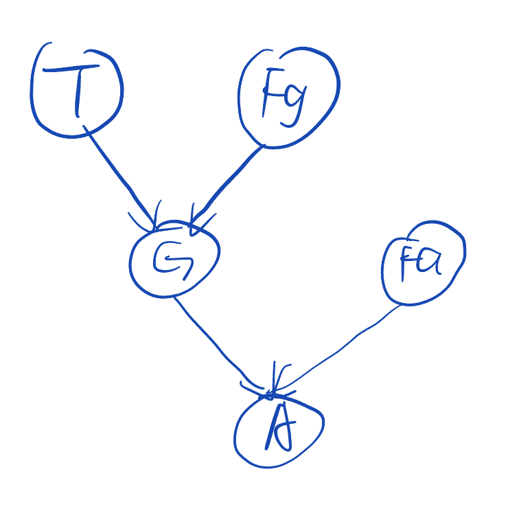
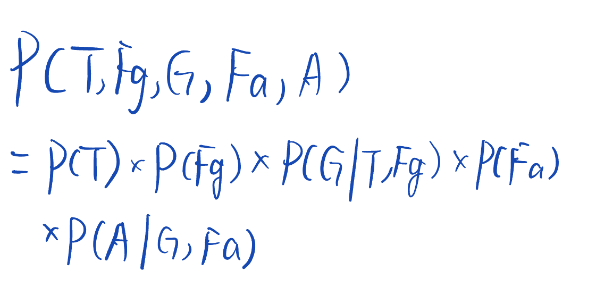
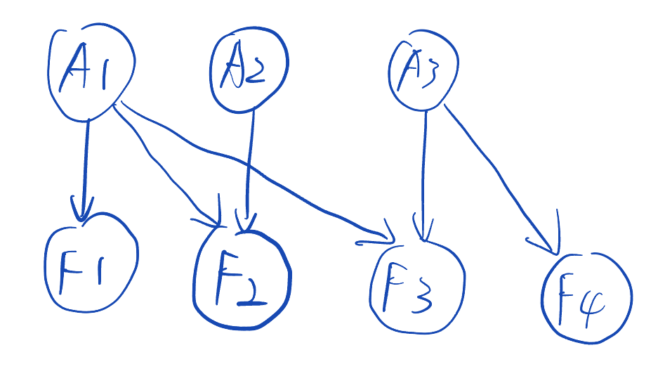
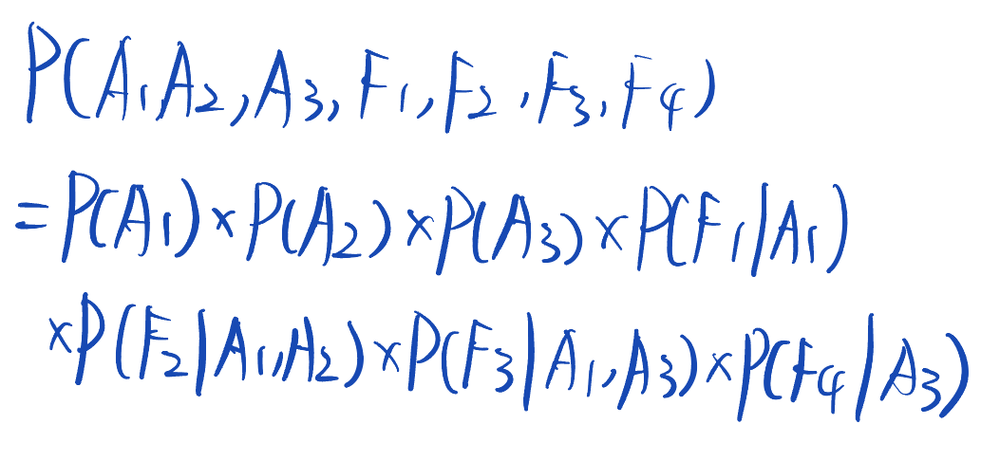
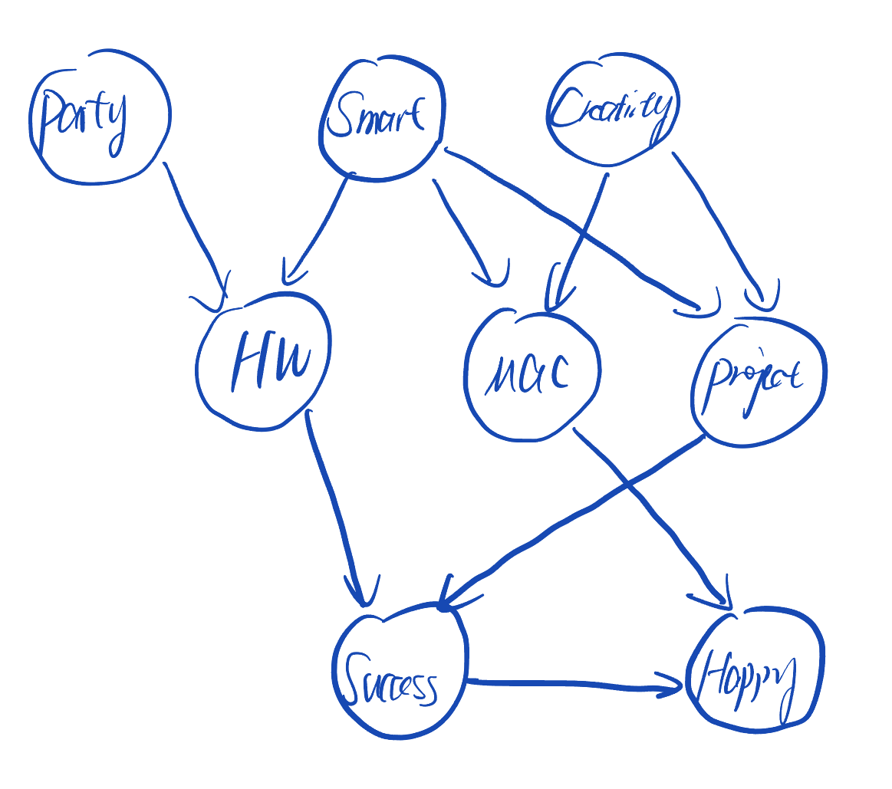

---
tags:
  - AI
  - DL
  - ML
---

# Week 4 - Bayesian Network

### Bayes' Theory

<figure><figcaption></figcaption></figure>

其中p(θ)p(x|θ) = p(x,θ)

### Bayesian Network

通过有向图的方法来表示贝叶斯网络。一种使用边缘方向表示因果关系和贝叶斯定理进行概率推断的概率图模型。

优势：

图形表示：提供不同随机变量的联合概率分布的可视化表示 - 可解释性

强大：能够捕捉随机变量之间复杂的关系

结合数据和先验知识：可以将先验知识与来自数据的统计显著信息相结合并更新 - 更好地逼近真实知识。

生成方法：生成类似于现有数据的新数据

缺点：

需要对许多概率有先验知识。

有时在计算上是棘手的。

P（Xi | Parents（Xi））

<figure><figcaption></figcaption></figure>

<figure><figcaption></figcaption></figure>

你观察到草是湿的，下雨的概率是多少？

<figure><figcaption></figcaption></figure>

不允许以下结构：&#x20;

<figure><figcaption></figcaption></figure>

### Exercise

<figure><figcaption></figcaption></figure>

> (a)
>
> 
>
> (b)
>
> 
>
> (c) 1+1+4+1+4=11

<figure><figcaption></figcaption></figure>

> (1)
>
> 
>
> (2)
>
> 
>
> (3) 1+1+1+2+4+4+2 = 15
>
> (4) With F2 = 1, observing F4 = 1 still gives us information only about A3. If we observe F3 = 1 instead of F2, then observing F4 = 1 will give us information about A1 and A3 due to competing causes

<figure><figcaption></figcaption></figure>

<figure><figcaption></figcaption></figure>

> (a)
>
> 
>
> 这题和上面完全一样。
