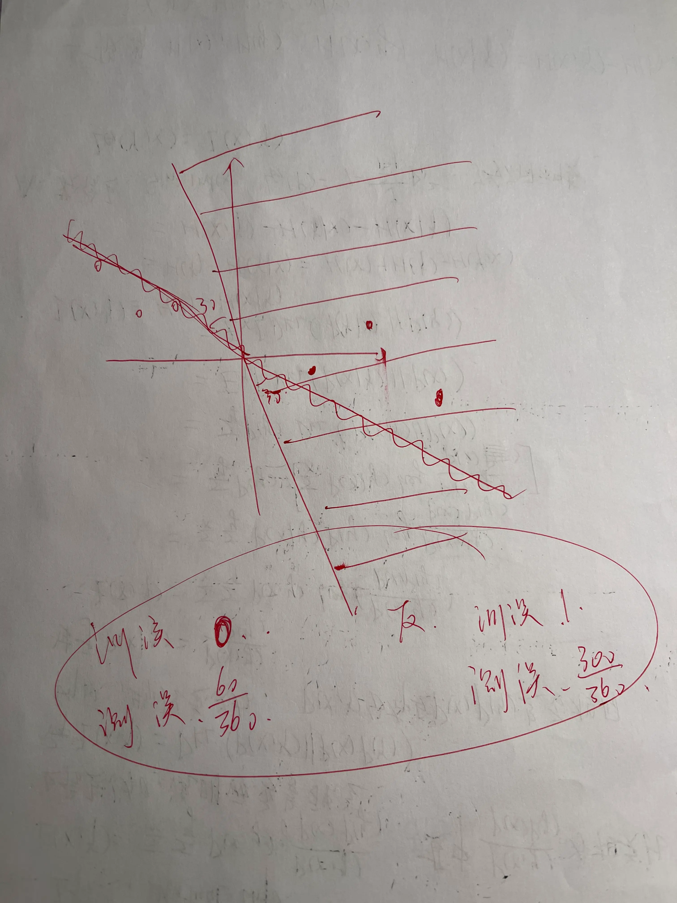

# Learning Feasibility
## 背景声明
我们本节的所有内容，都是基于二分类问题上的。

在这里我们重申一下什么是Hypothesis set。在 [2 - Logistic-Regression](2%20-%20Logistic-Regression.md) 中，我曾经写过一个关于hypothesis set的内容，但是我用深度学习做类比了，那种认识水平对于Leaning Theory的学习是不够的。在这里，重新定义一下。
假如说你的函数f(x) = w0 + w1x, 那么你的h(x)就可以是 0+x, 1+3x, 5+6x ....，所以H就有无限种。Learning Algorithm就是从你f(x)能够fit的h(x)中挑出一个最好的。这里我给出两个合理的假设集：
$$\mathcal{H}=\{h(x)=w\cdot x+b\mid w\in\mathbb{R}^d,b\in\mathbb{R}\}$$
$$\mathcal{H}=\{h(x)=\mathrm{sign}(w\cdot x+b)\mid w\in\mathbb{R}^d,b\in\mathbb{R}\}$$

那么对于一个学习过程，我们如何说这个过程Learning Feasible?
首先我们定义, In-sample为训练集数据，Out-sample为测试集数据。假设我们有训练集D，我们是否能学到f呢？
- 学：利用数据D去从H中找到一个f
- 成功：在训练集全部正确，在测试集也预测正确。
	- 如果是的话，我们说学习是可行的。

然后就是，D不能准确的告诉我们f在D之外的表现，但如果训练和测试数据来自同一个分布，且数据独立，那么D可以大概告诉我们一些f在D之外的表现。

## Hoeffding不等式
如果一个大容器里装了橘色和绿色两种球，我们如何估计比例？一般做法是，我们取出N个球，计算橘球比例v，则我们推算罐子中橘球比例也是v。
但这种随机的做法能否说明容器中的橘球比例一定是v呢？不是，但我们知道，N越大，越准。这就有了Hoeffding不等式：
$$P[|v-u|>\epsilon]\leq2exp(-2\epsilon^2N)$$
如果用机器学习语言说，霍夫丁不等式就是这样的：
$$\mathbb{P}\left[|E_{{\mathrm{in}}}(h)-E_{{\mathrm{out}}}(h)|>\epsilon\right]\leq2\mathrm{e}^{{-2\epsilon^{2}N}}.$$
这给了我们两个信息。
1. 你可以用Ein来限制Eout。因为你知道Ein，你可以通过放大N来使Eout接近Ein的概率变大。
2. 霍夫丁不等式是一个全局情况，和学习算法A，假设集H，目标函数f以及分布p(x)无关

如果我们定义 $\delta=2e^{-2\epsilon^2N}$ , 那么 $1-\delta$ 就被成为置信度。那么我们可以把 $\epsilon$ 写成delta的函数：
$$\epsilon=\sqrt{\frac1{2N}\log\frac2\delta}.$$
我们把 $1-\epsilon$ 叫做精度。

如果对于任何 $\epsilon$ 和 $\delta$，存在足够大的 N，使得霍夫丁不等式成立，那么目标函数是**PAC**可学习的。

另外，霍夫丁不等式成立的条件之一是h是固定的，在我们看到D之前就定好的。可是在实际的学习过程当中，我们就是要在h1 ... hM中选出最棒的g，这就意味着我们要重复霍夫丁M次。这相当于放缩，10个条件仅仅满足第3个的概率，肯定小于10个条件仅满足第1个 或 10个条件只满足第2个 ... 10个条件仅满足第10个。

所以我们有针对特选g的集合霍夫丁不等式：
$$P\left(\left|E_{in}(g)-E_{out}(g)\right|>\epsilon\right)\leq2Me^{-2\epsilon^2N}$$
坏消息是，M可能无限大，linear regression就是无限大M。但好消息是，我们其实可以限制M。

### 各参数变动对我们的学习目标有什么影响呢
- 如果H复杂了，那么M就变大了，所以虽然Ein变小了，但由于M变大，Ein和Eout不同（坏事件）的概率就会变大，Eout就不约等于Ein了
- 如果f很复杂，那么霍夫丁不等式是不受影响的，但这意味着Ein很难变小。所以即使Eout和Ein很相近，也没啥用
### Generalization bound
我们如果重写霍夫丁不等式，可以写成：
（前提，以概率至少 $1-\delta$，所以能脱掉P）
$$2Me^{-2\epsilon^2N}=\delta\quad\Rightarrow\quad\epsilon=\sqrt{\frac1{2N}\log\frac{2M}\delta}$$
$$E_{{\mathrm{in}}}(g)-\epsilon\leq E_{{\mathrm{out}}}(g)\leq E_{{\mathrm{in}}}(g)+\epsilon.$$
$$E_{{\mathrm{in}}}(g)-\sqrt{\frac{1}{2N}\log\frac{2M}{\delta}}\leq E_{{\mathrm{out}}}(g)\leq E_{{\mathrm{in}}}(g)+\sqrt{\frac{1}{2N}\log\frac{2M}{\delta}}.$$
这个bound叫做Generalization Bound。
- N是训练样本数量，越多越好
-  $\delta$ 是宽容度，如果小了的话，你就需要大的N去限制delta的影响。
- M是假设集容量。如果你用了一个大的M，你就需要一个大的N去中和影响。
Upper Bound保证了，你再差也不会差过Ein + epsilon。Lower Bound取决于很多内在参数，数据集的内在限制（控制N），模型复杂度（控制M）以及您想要的程度（delta）。

所以如果M是有限的，N足够大了，PAC就保证了Eout也能收敛于0.
- 小的M，能保证Eout 和 Ein相近，但不能保证Ein趋于0。
- 大的M不能保证Eout和Ein相近，但能保证Ein趋于0。

我们是否能找到一个有限量来替换掉M？
可以，看有效二分数。

## mH替换M

对于2个点，如果进行二分类的话，有效的分类组合数为4，线形分割的话是能做到的。

对于3个点，进行二分类，最多有8种分法。
但对于4个点，最多只有14种

Dichotomy指的是将特定的数据点集划分的方式。
假设你有数据点集(x1 .. xN), 每个数据点都通过假设h进行二分类，则 $\mathcal{H}(x_1, x_2 .. x_n)$ 表示对数据点x1..xn所有可能的二分法集合。
是由假设集H对这些数据点实现的所有可能的划分。
虽然假设集H的大小可能是无限的，但在特定的N个点上实现二分类的数量上限为 $2^N$.
可以用 $|\mathcal{H}(x_1, x_2 .. x_n)|$ 替代M。

这里说一道题

这里着重说一下，为什么h1和h3的bad data相同。
首先我们定义什么叫bad data。
Bad Events：使得Ein和Eout之间差距大于某个epsilon的事件叫Bad Events。
那什么是Bad Data呢？就是 使得Ein低，Eout高的一组训练集。
为什么h1和h3 bad data相同呢？看这个图：

其中训练数据（bad data）是白色点和黑色点，波浪线是h，直线是真实的分界。
h1左边白右边黑，h3左边黑右边白。
我们看到，h1训练误差是0，测试误差为30+30/360 = 1/6. 
h3的训练误差是1.测试误差是150 + 150 / 360 = 5/6.
所以我们看到，对于符号恰好相反的h1和h3，他们的泛化-训练误差始终相同。所以使得h1坏的数据，也会使得h3坏。