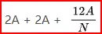
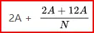
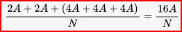

# Efficient Neural Network Training
我们将跟着这个路线图，讲解里面的技术：

## 混合精度浮点数 & BFloat16
首先，我们知道FP32是这样表示的：

而FP16和FP32的对比如下：

这里表示了FP16的范围：

所以我们就想到了用FP16替代FP32做NN的训练，但是会有这样的问题：
- 梯度下溢：梯度小的时候就变成0了
- 权重更新不准确
所以我们就有了第一个解决方案：混合精度
### 混合精度
存一份model的FP32 参数，前向传播反向传播用FP16，梯度计算用FP16 后拷贝到FP32，然后用FP32梯度去更新FP32权重，再把FP32权重拷贝到FP16权重

这样做的问题是，梯度由于是现在FP16计算的，所以其还是有可能先下溢，再被拷贝成FP32，那就没用了。
但是，我们可以借位精度，这样range就可以变大了。所以我们可以先scale，然后再恢复：

code如下：

### BFloat16
观察到我们上面可以先scale up再down，那么我们可以设计一种新的Float，其Range借位精度几位，这样就可以了，因为我们不需要那么高的精度。这种Float就是BFloat16：

code如下：

可以看到，BFloat16以更低的精度，居然能达到相同的准确度：

## 多GPU训练
GPU上存了什么东西？
- **模型参数**(fp16/bf16，**2A**)
- **模型梯度**(fp16/bf16，**2A**)
- **Adam状态**
	- fp32的模型参数备份 **4A**
	- fp32的momentum **4A**
	- fp32的variance **4A**
- 假设模型参数量为 A，则共需要：2A + 2A + (4A + 4A + 4A) = 16A 字节存储，如一个7B的模型，模型状态就需要 16 * 7 = 112GB

### Distributed Data Parallel (DDP)
最拉胯的分布式训练，全存，只不过输入数据的时候用的是sub batch

### ZeRO Stage-1: Optimizer State Sharding
针对 **Adam 状态进行分片**，此时每张卡模型状态所需显存变成了我们以单机8卡，7B模型为例，此时**模型状态部分**所需显存 降低到 4 * 7 + (12\*7)/8 = **38.5GB**。

### ZeRO Stage-2: Optimizer State + gradient sharding
在Zero-1 的基础上，针对**模型梯度再次分片**，此时每张卡模型状态所需显存变成了  同样以单机8卡，7B模型为例，此时**模型状态部分**所需显存降低到 2*7+(14\*7)/8=**26.25GB**。

### ZeRO Stage-3 (Full FSDP)
在Zero-2的基础上，对**模型参数**也进行分片，此时每张卡模型状态所需显存变成了
同样以单机8卡，7B模型为例，此时**模型状态部分**所需显存降低到 16 \*7/8=**14GB**

###  Zero-offload
显存不足，内存来补，用时间来换空间。Zero-offload 核心是在 Zero-2的基础上将Adam状态，梯度转移到 CPU内存。一般情况下不推荐。

这些都是Deepspeed, 微软实现的技术。
- **速度：** Zero 1 > Zero 2 > Zero 2 + offload > Zero 3 > Zero 3 + offload
- **显存：** Zero 0 (DDP) < Zero 1 < Zero 2 < Zero 2 + offload < Zero 3 < Zero 3 + offload
注意，Deepspeed 优化的是模型参数，梯度，Adam状态所占的显存，而实际上，激活值同样占用着巨大的显存，此外还有一些其他的显存碎片。

以 qwen 1.5 为例，per_gpu_batch_size=1，seq_length=2048，精度bf16 时所需显存为 **28.5G**（粗略估计），此时即使用 Deepspeed zero 3（非常慢） ，都需要 28.5+14=42.5GB 显存。

这意味着在大模型时代中，如果不引入流水线并行和张量并行的情况下，V100-32G 和 A100-40G 对 7B 的模型训练都非常吃力。
一些take away：

> [!tip] **训练时显存不足怎么办？**
> 下面列出一些常见的节省显存的操作，**优先级从高到低排列**。
> - **去掉compute_metrics： 有些代码会在输出层后计算rouge分等，这个会输出一个**batch_size\*vocab_size\*seq_len 的一个大向量，非常占显存。
> - 采用bf16/fp16进行混合精度训练：现在大模型基本上都采用 bf16 来进行训练，但是如v100这些机器不支持，可以采用fp16进行训练。显存占用能够降低一倍。
> - Flash attention：不仅能够降低显存，更能提高训练速度。
> - 降低你的batch size：如上文所述，batch size 与模型每层的激活状态所占显存呈正相关，降低batch size 能够很大程度上降低这部分显存占用。
> - 采用梯度累积：global batch size = batch size \* 梯度累积，如果降低 batch size 后想保持你的 global batch size 不变，可以适当提高梯度累积值。
> - 选择合适的上下文长度：如上文所述，上下文长度与激活状态所占显存呈正相关，因此可以通过适当降低上下文长度来降低显存占用。
> - DeepSpeed Zero：显存占用从高到低为：Zero 1 > Zero 2 > Zero 2 + offload > zero 3 > zero 3 + offload，推荐最多试到 Zero2 + offload。
> - 选择更小的基座模型：在满足需求的情况下，尽量选择更小的基座模型。
>
> 几个慎重选择的操作：
>
> - Lora：能跑全参就别跑 Lora 或 Qlora，一方面是麻烦，另一方面的确是效果差点。
> - Qlora：Qlora 的速度比lora慢，但所需显存更少，实在没资源可以试试。
> - Megatron-LM：可以采用流水线并行和**张量并行，使用比较麻烦，适合喜欢折腾的同学。
> -  Pai-Megatron-LM：Megatron-LM 的衍生，支持 Qwen 的sft和pt，坑比较多，爱折腾可以试试。
> - 激活检查点：不推荐，非常耗时。在反向传播时重新计算深度神经网络的中间值。用时间（重新计算这些值两次的时间成本）来换空间（提前存储这些值的内存成本）。

## LoRA: Low-Rank Adaptation of Large Language Models
如下图所示，核心思想是在预训练模型上增加旁路，通过降维矩阵 $A$ 和升维矩阵 $B$ 实现低秩更新。训练时固定预训练模型参数，仅优化 $A$ 和 $B$。模型输入输出维度不变，输出时将 $BA$ 与预训练权重叠加。初始化时用随机高斯分布生成 $A$，用零矩阵初始化 $B$，确保初始 $BA=0$ 对结果无影响。推理时，将训练好的 $BA$ 加到原权重 $W$ 中作为新权重，计算资源不增加。LoRA 的优势是训练更快，内存占用更少。

Code：

LoRA效果很棒：

给哪个矩阵用LoRA，用什么r？

最后，就能看懂这张图了：
