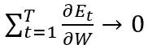
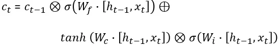

# How LSTM networks solve the problem of vanishing gradients

## A simple, straightforward mathematical explanation  

When diving into the theory behind Recurrent Neural Networks (RNNs) and Long Short-Term Memory (LSTM) networks, two main questions arise:  
探讨循环神经网络（RNNs）和长短期记忆网络（LSTM）背后的理论时，会出现两个主要问题：

1. Why do RNNs suffer from vanishing and exploding gradients?  
1. 为什么 RNNs 会遭遇梯度消失和梯度爆炸的问题？

2. How do LSTMs keep the gradients from vanishing or explode?  
2. LSTM 如何防止梯度消失或爆炸？

When I tried answering these questions, I searched for a mathematical explanation to get a better understanding of how these networks work. I had a hard time finding proofs that were understandable and clear enough for me. After reading the recommended papers and known blogs dealing with these questions I wrote an explanation that worked for me and made me feel I better understand the problem and solution.  
当我尝试回答这些问题时，我寻找了一种数学解释，以更好地理解这些网络的工作原理。我很难找到对我来说足够清晰易懂的证明。在阅读了推荐的论文和处理这些问题的知名博客后，我写下了一个对我有效的解释，使我觉得自己更好地理解了问题和解决方案。

## RNNs and vanishing gradients  
RNN 和梯度消失

RNNs enable modelling time-dependent and sequential data tasks, such as stock market prediction, machine translation, text generation and many more.  
RNN 能够对时间依赖和序列数据任务进行建模，例如股票市场预测、机器翻译、文本生成等。

However, RNNs suffer from the problem of vanishing gradients, which hampers learning of long data sequences. The gradients carry information used in the RNN parameter update and when the gradient becomes smaller and smaller, the parameter updates become insignificant which means no real learning is done.  
然而，RNNs 存在梯度消失问题，这阻碍了对长数据序列的学习。梯度携带用于 RNN 参数更新的信息，当梯度变得越来越小时，参数更新变得微不足道，这意味着没有进行真正的学习。

Let’s have a short reminder of how RNNs look like. We will work with a simple single hidden layer RNN with a single output sequence. The network looks like this:  
让我们简要回顾一下 RNNs 的结构。我们将使用一个简单的单隐藏层 RNN，并具有单一输出序列。网络看起来是这样的：

The network has an input sequence of vectors [x(1), x(2),…, x(k)], at time step t the network has an input vector x(t). Past information and learned knowledge is encoded in the network state vectors [c(1), c(2),…, c(k-1)], at time step t the network has an input state vector c(t-1). The input vector x(t) and the state vector c(t-1) are concatenated to comprise the complete input vector at time step t, [c(t-1), x(t)] .  
网络具有一个向量序列输入 [x(1), x(2),…, x(k)]，在时间步 t，网络有一个输入向量 x(t)。过去的信息和学习到的知识被编码在网络状态向量 [c(1), c(2),…, c(k-1)] 中，在时间步 t，网络有一个输入状态向量 c(t-1)。输入向量 x(t) 和状态向量 c(t-1) 被连接在一起，构成时间步 t 的完整输入向量 [c(t-1), x(t)]。

The network has two weight matrices: Wrec and Win connecting c(t-1) and x(t), the two parts of the input vector [c(t-1), x(t)], to the hidden layer. For simplicity, we leave out the bias vectors in our computations, and denote W = [Wrec, Win].  
网络有两个权重矩阵：Wrec 和 Win，连接输入向量 [c(t-1), x(t)] 的两个部分 c(t-1) 和 x(t) 到隐藏层。为简化计算，我们省略了偏置向量，并表示 W = [Wrec, Win]。

The sigmoid function is used as the activation function in the hidden layer.  
在隐藏层中使用了 S 型函数作为激活函数。

The network outputs a single vector at the last time step (RNNs can output a vector on each time step, but we’ll use this simpler model).  
网络在最后一个时间步输出一个向量（RNN 可以在每个时间步输出一个向量，但我们将使用这个更简单的模型）。

## Backpropagation through time (BPTT) in RNNs  
RNN 中的时间反向传播（BPTT）

After the RNN outputs the prediction vector h(k), we compute the prediction error E(k) and use the Back Propagation Through time algorithm to compute the gradient  
在 RNN 输出预测向量 h(k)后，我们计算预测误差 E(k)，并使用时间反向传播算法计算梯度

The gradient of the error term in an RNN  
RNN 中误差项的梯度

The gradient is used to update the model parameters by:  
梯度用于通过以下方式更新模型参数：

And we continue the learning process using the Gradient Descent (GD) algorithm (we use the basic version of the GD in this work).  
我们继续使用梯度下降（GD）算法进行学习过程（在这项工作中我们使用的是 GD 的基本版本）。

Say we have learning task that includes T time steps, the gradient of the error on the k time step is given by:  
假设我们有一个包含 T 个时间步的学习任务，第 k 个时间步的误差梯度由以下公式给出：

Notice that since W=[Wrec, Win], c(t) can be written as:  
注意，由于 W=[Wrec, Win]，c(t) 可以写为：

Compute the derivative of c(t) and get:  
计算 c(t) 的导数并得到：

Plug (2) into (1) and get our backpropagated gradient  
将（2）代入（1）并得到我们的反向传播梯度

The last expression **tends to vanish when k is large**, this is due to the derivative of the tanh activation function which is smaller than 1.  
当 k 很大时，最后一个表达式趋于消失，这是由于 tanh 激活函数的导数小于 1。

**The product of derivatives can also explode** if the weights Wrec are large enough to overpower the smaller tanh derivative, this is known as the exploding gradient problem.  
如果权重 Wrec 足够大以压倒较小的 tanh 导数，导数的乘积也可能会爆炸，这被称为梯度爆炸问题。

We have: 我们有：

So for some time step k:  
因此，对于某个时间步长 k：

And our complete error gradient will vanish  
我们的完整误差梯度将消失

The network’s weights update will be:  
网络的权重更新将是：

And no significant learning will be done in reasonable time.  
在合理的时间内不会进行显著的学习。

## How LSTMs solve this? LSTMs 如何解决这个问题？

I recommend reading [Colah’s blog](https://www.google.com/url?sa=t&rct=j&q=&esrc=s&cd=1&cad=rja&uact=8&ved=2ahUKEwjGu_Kb9qHfAhUD0RoKHYSjAgwQFjAAegQIAhAC&url=http%3A%2F%2Fcolah.github.io%2F&usg=AOvVaw1GKlzuXDPgSuty6MfhWlol) for an in-depth review of LSTMs since we are only going to have a short reminder here.  
我建议阅读 Colah 的博客以深入了解 LSTMs，因为我们这里只会做一个简短的提醒。

An LSTM network has an input vector [h(t-1),x(t)] at time step t. The network cell state is denoted by c(t). The output vectors passed through the network between consecutive time steps t, t+1 are denoted by h(t).  
在时间步 t，LSTM 网络的输入向量为[h(t-1),x(t)]。网络单元状态表示为 c(t)。在连续时间步 t, t+1 之间通过网络的输出向量表示为 h(t)。

LSTM network cells at time steps t-1, t, t+1  
在时间步 t-1, t, t+1 的 LSTM 网络单元

an LSTM network has three gates that update and control the cell states, these are the forget gate, input gate and output gate. The gates use hyperbolic tangent and sigmoid activation functions.  
LSTM 网络有三个门来更新和控制单元状态，分别是遗忘门、输入门和输出门。这些门使用双曲正切和 Sigmoid 激活函数。

The forget gate controls what information in the cell state to forget, given new information than entered the network.  
遗忘门控制在给定新信息进入网络的情况下，单元状态中需要遗忘的信息。

The LSTM forget gate update of the cell state  
LSTM 遗忘门的细胞状态更新

The forget gate’s output is given by:  
遗忘门的输出由以下公式给出：

The input gate controls what new information will be encoded into the cell state, given the new input information.  
输入门控制将哪些新信息编码到单元状态中，给定新的输入信息。

The LSTM input gate update of the cell state  
LSTM 输入门对单元状态的更新

The input gate’s output has the form:  
输入门的输出形式为：

and is equal to the element-wise product of the outputs of the two fully connected layers:  
等于两个全连接层输出的逐元素乘积：

The output gate controls what information encoded in the cell state is sent to the network as input in the following time step, this is done via the output vector h(t).  
输出门控制在下一个时间步中作为输入发送到网络的单元状态中编码的信息，这是通过输出向量 h(t) 完成的。

The LSTM output gate’s action on the cell state  
LSTM 输出门对单元状态的作用

The output gate’s activations are given by:  
输出门的激活由以下公式给出：

and the cell’s output vector is given by:  
单元的输出向量由以下公式给出：

## **The LSTM cell state LSTM 单元状态**

The long term dependencies and relations are encoded in the cell state vectors and it’s the cell state derivative that can prevent the LSTM gradients from vanishing. The LSTM cell state has the form:  
长期依赖关系和关系被编码在单元状态向量中，单元状态的导数可以防止 LSTM 梯度消失。LSTM 单元状态的形式为：

## **Backpropagation through time in LSTMs  
LSTM 中的时间反向传播**

As in the RNN model, our LSTM network outputs a prediction vector h(k) on the k-th time step. The knowledge encoded in the state vectors c(t) captures long-term dependencies and relations in the sequential data.  
与 RNN 模型一样，我们的 LSTM 网络在第 k 个时间步输出预测向量 h(k)。状态向量 c(t)中编码的知识捕捉了序列数据中的长期依赖关系和关联。

The length of the data sequences can be hundreds and even thousands of time steps, making it extremely difficult to learn using a basic RNN.  
数据序列的长度可以是数百甚至数千个时间步长，这使得使用基本的 RNN 进行学习极其困难。

We compute the gradient used to update the network parameters, the computation is done over T time steps.  
我们计算用于更新网络参数的梯度，计算是在 T 个时间步长上完成的。

Backpropagating through time for gradient computation  
通过时间反向传播进行梯度计算

As in RNNs, the error term gradient is given by the following sum of T gradients:  
如同在 RNN 中，误差项的梯度由以下 T 个梯度的总和给出：

The gradient of the error in an LSTM  
LSTM 中误差的梯度

For the complete error gradient to vanish, all of these T sub gradients need to vanish. If we think of (3) as a series of functions, then by definition, this series converges to zero if the sequence of its partial sums tends to zero, so  
为了使完整的误差梯度消失，所有这些 T 子梯度都需要消失。如果我们将(3)视为一系列函数，那么根据定义，如果其部分和的序列趋于零，则该系列收敛于零，因此

if the series of partial sums  
如果部分和的序列

where 在哪里

tends to zero. 趋于零。

**So if we want (3) not to vanish, our network needs to increase the likelihood that at least some of these sub gradients will not vanish**, in other words, make the series of sub gradients in (3) not converge to zero.  
因此，如果我们希望（3）不消失，我们的网络需要增加至少一些这些子梯度不消失的可能性，换句话说，使（3）中的子梯度序列不收敛于零。

## The error gradients in an LSTM network  
LSTM 网络中的误差梯度

The gradient of the error for some time step k has the form:  
某个时间步 k 的误差梯度形式为：

As we have seen, the following product causes the gradients to vanish:  
如我们所见，以下乘积导致梯度消失：

In an LTSM, the state vector c(t), has the form:  
在 LTSM 中，状态向量 c(t)的形式为：

which can be written compactly as  
可以简洁地写为

Notice that the state vector c(t) is a function of the following elements, which should be taken into account when computing the derivative during backpropagation:  
注意，状态向量 c(t)是以下元素的函数，在反向传播过程中计算导数时应考虑这些元素：

Compute the derivative of (5) and get:  
计算(5)的导数，得到：

We compute (detailed computations are given in the end of the article) the four derivative terms and write:  
我们计算（详细计算在文章末尾给出）四个导数项并写出：

Denote the four elements comprising the derivative of the cell state by:  
记由以下四个元素组成的细胞状态的导数：

We write the additive gradient as:  
我们将加性梯度写为：

Plug (6) into (4) and get the LSTM states gradient:  
将（6）代入（4）并得到 LSTM 状态梯度：

## Preventing the error gradients from vanishing  
防止误差梯度消失

**Notice that the gradient contains the forget gate’s vector of activations, which allows the network to better control the gradients values, at each time step, using suitable parameter updates of the forget gate.** The presence of the forget gate’s activations allows the LSTM to decide, at each time step, that certain information should not be forgotten and to update the model’s parameters accordingly.  
请注意，梯度包含遗忘门的激活向量，这使得网络能够在每个时间步更好地控制梯度值，使用遗忘门的适当参数更新。遗忘门激活的存在使得 LSTM 能够在每个时间步决定某些信息不应被遗忘，并相应地更新模型的参数。

Let’s go over how this property helps us. Say that for some time step k<T, we have that:  
让我们来看看这个特性如何帮助我们。假设在某个时间步 k

Then for the gradient not to vanish, we can find a suitable parameter update of the forget gate at time step k+1 such that:  
然后为了使梯度不消失，我们可以在时间步 k+1 找到遗忘门的合适参数更新，使得：

**It is the presence of the forget gate’s vector of activations in the gradient term along with additive structure which allows the LSTM to find such a parameter update at any time step**, and this yields:  
正是遗忘门激活向量在梯度项中的存在以及加法结构，使得 LSTM 能够在任何时间步找到这样的参数更新，这产生了：

and the gradient doesn’t vanish.  
梯度不会消失。

**Another important property to notice is that the cell state gradient is an additive function** made up from four elements denoted A(t), B(t), C(t), D(t). This additive property enables better balancing of gradient values during backpropagation. The LSTM updates and balances the values of the four components making it more likely the additive expression does not vanish.  
另一个需要注意的重要性质是，细胞状态梯度是由四个元素 A(t)、B(t)、C(t)、D(t)组成的加法函数。这种加法性质在反向传播过程中能够更好地平衡梯度值。LSTM 更新并平衡这四个组成部分的值，使得加法表达式更不容易消失。

For example, say that for every t in {2,3,…,k} we take the following four neighbourhoods of values as a balancing combination in our gradient:  
例如，对于 {2,3,…,k} 中的每个 t，我们将以下四个值的邻域作为梯度中的平衡组合：

which yields: 这产生：

and the product does not vanish.  
并且乘积不消失。

This additive property is different from the RNN case where the gradient contained a single element inside the product. **In RNNs, the sum in (3) is made from expressions with a similar behaviour that are likely to all be in [0,1] which causes vanishing gradients.**  
这种加性性质不同于 RNN 的情况，在 RNN 中，梯度在乘积中包含一个单一元素。在 RNN 中，公式(3)中的和由具有类似行为的表达式组成，这些表达式可能都在[0,1]范围内，这导致梯度消失。

**In LSTMs, however, the presence of the forget gate, along with the additive property of the cell state gradients, enables the network to update the parameter in such a way that the different sub gradients in (3) do not necessarily agree** and behave in a similar manner, making it less likely that all of the T gradients in (3) will vanish, or in other words, the series of functions does not converge to zero:  
然而，在 LSTM 中，遗忘门的存在以及细胞状态梯度的加性特性，使得网络能够以一种不同子梯度在(3)中不一定一致并以类似方式表现的方式更新参数，从而降低了(3)中所有 T 梯度消失的可能性，换句话说，函数序列不会收敛到零：

and our gradients do not vanish.  
我们的梯度不会消失。

As mentioned briefly, the RNN gradients can also explode if the sum in (3) is made up from expressions with a similar behaviour that are all significantly greater than 1.  
如前所述，如果公式 (3) 中的和由行为相似且都显著大于 1 的表达式组成，RNN 梯度也可能会爆炸。

Summing up, we have seen that RNNs suffer from vanishing gradients and caused by long series of multiplications of small values, diminishing the gradients and causing the learning process to become degenerate. In a analogues way, RNNs suffer from exploding gradients affected from large gradient values and hampering the learning process.  
总结来说，我们已经看到 RNN 因小值的长串乘积而导致梯度消失，削弱了梯度并使学习过程退化。同样地，RNN 也会因大梯度值而导致梯度爆炸，阻碍学习过程。

LSTMs solve the problem using a unique additive gradient structure that includes direct access to the forget gate’s activations, enabling the network to encourage desired behaviour from the error gradient using frequent gates update on every time step of the learning process.  
LSTMs 通过一种独特的加性梯度结构解决问题，该结构包括直接访问遗忘门的激活，使网络能够通过在学习过程的每个时间步频繁更新门来鼓励误差梯度的期望行为。

## References 参考文献

[1] LONG SHORT TERM MEMORY, Sepp Hochreiter, Jurgen Schmidhuber  
[1] 长短期记忆，Sepp Hochreiter, Jurgen Schmidhuber

[2] On the difficulty of training recurrent neural networks, Razvan Pascanu, Tomas Mikolov, Yoshua Bengio  
[2] 关于训练递归神经网络的难度，Razvan Pascanu, Tomas Mikolov, Yoshua Bengio

[3] Long Short-Term Memory in Recurrent Neural Networks, Felix Gers  
[3] 递归神经网络中的长短期记忆，Felix Gers

[4] Cristopher Olah’s Blog  
[4] Cristopher Olah 的博客

[5] Noah Webber’s blog (weberna’s blog)  
[5] Noah Webber 的博客 (weberna 的博客)

## Additional computations needed for the cell state gradient computation:  
细胞状态梯度计算所需的额外计算：

