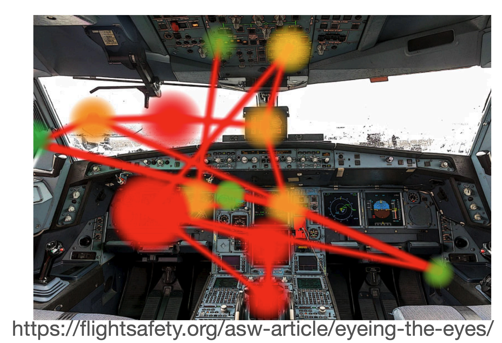

# Week 9 Markov Decision Processes
## 动机问题
某病症Q的患病率是1%
如果患病，那么检测为阳性的概率为90%
如果没患病，仍有9%的假阳性概率
那么结果为阳性的时候，患病的概率为多少？
P(Q) = 0.01
P(阳|Q) = 0.9
P(阳|非Q) = 0.09
$$P(Q\mid+)=\frac{P(+\mid Q)P(Q)}{P(+\mid Q)P(Q)+P(+\mid\neg Q)P(\neg Q)}=\frac{0.9\times0.01}{0.9\times0.01+0.09\times0.99}=\frac{0.009}{0.009+0.0891}\approx0.0917$$
那么医疗建议部门应该给出什么建议呢？
这几个哪个对？
- The probability that they have disease Q is about 8\%
	- 错了，上面计算
- Out of 10 people with a positive test, about 9\% have disease Q.
	- 也不对，首先没有0.9个人
- Out of 10 people with a positive test, about 1 has Q.
	- 这个就对了。如果1000人筛查，那么会有1000 \* 0.01 \* 0.9 + 1000 \* 0.99 \* 0.09 = 98,  其中9真阳，89假阳
	- 其实上面已经算好概率了，就是9.2\%的患病率。
- The probability that they have Q is about 1%
	- 错上加错

但是上面这些都是真实人类说出来的话。所以我们知道，人在概率推理上往往表现很差，需要一个真实的场景（Natural Frequencies）才能正确表述出来。
启示：用Natural Frequencies替代概率为人们展示信息。

## 贝叶斯定理
$$p\left(\theta\mid D\right)=\frac{p\left(D\mid\theta\right)p\left(\theta\right)}{p(D)}.$$
$$\mathrm{posterior}=\frac{\text{likelihood}\times\mathrm{prior}}{\text{marginal likelihood}}.$$
## 马尔可夫链
我们曾在 [11 - Language Modeling](../32167-neural-computation/11%20-%20Language%20Modeling.md) 中提到过马尔可夫过程，一阶的马尔可夫就是说忽略前置一切状态，只根据当前的状态就能预测下一状态。核心特点就是 **“无后效性”**（Markov 性）：下一时刻的状态只依赖于当前状态，而与更久远的历史无关。状态无关。
$$\boxed{P(w_n\mid w_1,\ldots,w_{n-1})\mathrm{~}\approx\mathrm{~}P(w_n\mid w_{n-1})}$$
实际上，马尔可夫链依旧是有限状态机。有一系列节点，是状态集合S，只不过，把原来确定性的状态转移方程，变成了转移概率分布P(s_new|s)。

这个玩意描述了一个随机走动，或者布朗运动，每一步在当前值基础上加一个均值 0、方差sigma2的高斯噪音。下一步的增量只依赖于当前状态，符合马尔可夫性。

这个就很好理解，是一个气候的马尔可夫链。

这个是一个生病头疼的马尔可夫链。

这是一个涉及Action的马尔可夫链
其中红色的是Action，**动作的选择**是由“策略”决定。这个图怎么看？headache的情况下，如果选择服用medicine，那么有0.7的概率获得正奖励（r = +1），变为不头疼，但是也有0.3的概率得到负奖励，也就是继续头疼或者出现副作用。如果不头疼的情况下吃药，那么0.9的概率获得0奖励，也就是继续不头疼，还有0.1的概率获得负奖励(r = -1)，变为头疼。
在 MDP 中，我们要做的不只是**预测状态**，更要**选择动作**以**最大化累计奖励**。
𝑃 ( 𝑠 ′ ∣ 𝑠 , 𝑎 )告诉你“不同行动下会如何转移”， 𝑟 ( 𝑠 , 𝑎 , 𝑠 ′ )告诉你“这次转移值不值得”。

马尔可夫链的形式化定义：
- 状态集S
- 动作集A
- 转移函数 p(s_new | s, a)：在s状态下采取动作a后转移到s_new的概率
- 奖励函数r = R(s'|s)，转移所获得的标量奖励。

## 代理-环境框架

代理在上一个State的影响下选择Actions，影响新环境，得到Reward。
一个人，推荐系统在上一个state的基础上推荐采取一个action，得到新环境，以及根据主管效用 / 前景理论获得的Reward。

## 一个策略例子 - 贝尔曼方程

动作是**随机的**：
即使你指定的策略是向上，那0.8的概率朝上，但仍有10%的概率朝左朝右，这是为了模拟真实场景，比如说有风。
每跨一步 r -= 0.01

那么我们可以给出最优policy pi_star：

我们如何计算在最优策略π下的最优Value是多少呢？可以用最优贝尔曼方程来建模：

对于这个例子，就是（V和U混用了，应该用V）：

## 确定最优策略的算法
- Value iteration ：一会讲
- Policy iteration：**评估阶段**：给定策略pi，用**贝尔曼期望方程**算Vpi，**改进阶段**：用Vpi算出贪心策略pi_new，再回去评估，循环往复。
- Q-learning：一种经典的**无模型（model-free）离线**强化学习算法，通过与环境交互直接学习动作—价值函数Q(s,a), 无需事先知道状态转移方程P以及及时奖励R。
	- $$Q(s,a)\leftarrow Q(s,a)+\alpha{\left[r+\gamma\max_{a^{\prime}}Q(s^{\prime},a^{\prime})-Q(s,a)\right]}$$
- Reinforcement Learning (RL)，广义范畴，指所有通过与环境反复交互、试错学习最优策略以最大化长期累积奖励的方法。Q-learning、蒙特卡洛方法、时序差分（TD）学习、策略梯度等。
- Deep Reinforcement Learning (DRL)，在强化学习框架下，用**深度神经网络**来近似状态值函数V(s)，动作值函数Q(s,a)或策略pi(a|s)，如DQN、Deep Deterministic Policy Gradient (DDPG)、A3C/A2C、PPO。
- Proximal Policy Optimisation (PPO)：把「最大化期望累积回报」写成一个可微的目标函数，通过梯度上升（或近似信赖域方法）直接优化策略参数。

## Value Iteration

这个事Value Iteration的函数签名。
它的输入为：
常见的mdp，以及discount gamma，**ε**：允许的最大误差阈值，用来控制收敛条件。
本地变量：U, U', 长度为S的向量，分别存储“上一次”和“本次”对每个状态的估计效用（utility），初始都设为 0。
δ：记录每轮迭代中任意状态效用更新的最大变化量（max change）。

过程，先将所有格子都设为0，然后对每个点进行一次bellman 备份迭代（这并不是贝尔曼方程！不递归！）：
$$U_{k+1}(s)=R(s)+\gamma\max_a\sum_{s^{\prime}}P(s^{\prime}\mid s,a)U_k(s^{\prime})$$
然后计算变化量 |U'(s) - U(s)|，delta，则更新若大于当前。
整轮过后，若**最大变化量** δ小于收敛阈值，则循环结束。
我们是在用bellman 备份迭代，去逼近bellman最优方程！这用到了不动点定理，是一个数学证明，反正是可以逼近的。

## 总结
- 马尔可夫链仅仅描述了随机过程，并没有建模决策。如果要建模人类决策过程，可以用MDP。
- MDP用S，A，P，R来定义决策问题
- 动作的选择代表着意图，意图的结果可能不确定
- 贝尔曼方程通过及时奖励和未来奖励的综合来定义决策价值
- 价值迭代算法可以用来找到最优策略
- 最优策略有可能反直觉
## MDP的应用
首先回顾MDP的组成：

贝尔曼方程

### 肝移植MDP
14 种不同的肝源类型，18 个病人健康状态，30 个器官质量排名级别。
如果不用MDP而用决策树，就会有18 × 14 × 30 = **7,560** 个节点的决策树。
权衡：
**等待带来的风险**：病人可能在等待过程中病情恶化（MELD 分数 ↑）或好转（MELD 分数 ↓），也可能直接死亡。
**过早接受移植带来的代价**：虽然能避免“等待死亡”的风险，但术后肝脏的使用寿命有限（通常 10–20 年），而且手术风险和术后并发症也与患者当前健康状态密切相关。

横向的是健康状态，上面是接受供肝后的状态，下面是等待过程中因病逝世的终止状态。
W是等待，T代表移植，LE代表预期寿命。每个健康状态下“等待”与“接受供肝”两条主要策略分支，以及它们各自的转移概率和获益（生存期）。

### 糖尿病MDP
对于状态空间，里面有：
$$S^t=\left(S_{Chronic}^t,S_{Acute}^t,S_{Risk}^t,S_{Period}^t,S_{FPG}^t\right)\quad\mathfrak{t}=1,\ldots,\mathrm{T}$$
分别为：慢性并发症，急性并发症，严重风险标志，已确诊糖尿病年份，等。

对于行为空间，里面有：

对于状态转移函数，这是由真实数据决定的。清洗后 69 000 名真实患者的年度随访轨迹，之后进行了归一化。

对于Reward，采用了QALY（质量调整生命年），每年获得的健康效用减去用药成本

$$R(a,s^{\prime})=R^{\mathrm{WTP}}\left(1-d^{\mathrm{Chronic}}(s^{\prime})\right)\left(1-d^{\mathrm{Acute}}(s^{\prime})\right)\left(1-d^{\mathrm{Risk}}(s^{\prime})\right)\left(1-d^{\mathrm{Period}}(s^{\prime})\right)\mathrm{~-~}C^{\mathrm{MED}}(a)$$
前半项：折算后的 QALY（考虑四类健康折减）× 社会支付意愿，后半项：该药物组合的直接成本 + 副作用等额外损失。

结果：

### 情景感知MDP
情境感知（Situation Awareness, SA）各种因素如何共同作用，影响飞行机组（Crew）的决策和操作（Crew Actions）。有各种各样的影响。

飞行员飞行中必须保持情境意识的关键要素：
- 飞行状态（Status），包括飞机的空速、飞行高度、航向、燃油剩余量
- 地形（Terrain）
- 天气（Weather）
- 空中交通（Air Traffic）
- 导航（Navigation）
- 飞行计划，人为因素，飞机和机组能力（Aircraft and crew capabilities）

传统中，飞行员根据眼动来维持情景意识，优秀机师通过合理分配注视时间和扫描路径，来不断地从多个视野（外部与多套仪表）中收集信息，从而维持高水平的情境意识。

我们希望有一个模型，预测最佳的眼动模式，帮飞行员维持高的情景意识，用于飞行员的训练，以及飞机设计等。
我们希望用MDP建模，有两个假设：
- 假设 1：眼动是一个不确定环境下的多阶段决策过程
- 假设 2：有经验的操作者会遵循“最优策略”规划眼动序列
核心概念：
- AOI（Area Of Interest，兴趣区）：驾驶舱内被划分出的若干功能区／注视区，例如，飞行显示器（PFD），多功能显示器（MFD），油门杆与发动机状态指示区。
- Fixations（注视）
- Value of an AOI（AOI 的价值），该 AOI 在当前时间点对完成整体子任务（Subtask）的 **情境感知收益**：比如从 PFD 上读取空速能帮助维持高度控制，从外部视野观察跑道能辅助进近判断。
- Subtasks（子任务）：飞行过程可拆分为若干具体操作目标，如，**Check speed**：监控与保持目标空速，**Check heading**：确认与修正航向。
- Relevance of AOIs to Subtasks（AOI 与子任务的关联度），不同 AOI 对不同子任务的重要性是不同的，对“Check speed”而言，PFD 上的空速表高度相关（高关联度），对“Answer ATC”而言，外部视野或听觉类 AOI（如抬头听话筒）更关键。模型里用 **关联矩阵** 或 **概率权重** 来量化。
- Bandwidth BW of each AOI（兴趣区带宽），类比通信系统的带宽，指从该 AOI 中接收新信息的“速率”或“容量”。带宽高的 AOI（如电子地图、雷达）能快速提供大量动态信息；带宽低的 AOI（如指针仪表）信息更新较慢。

Subtask子任务，V是其对应的AOI价值，Subtask被拆解为不同AOI的关联度，而不同AOI有着不同的带宽。
当视线从一个 AOI 转向下一个 AOI 时（动作 aₜ），各 AOI 会根据其带宽产生随机的信息更新量 u。
- 状态 State：包括当前注视所在的 AOI、各子任务未满足的信息量，以及各 AOI 最新的可用信息不确定度。
- 动作 Action：在时刻 t，选择将视线转移到哪一个 AOI 并进行一次注视（fixation）。
- 转移概率 P(sₜ₊₁ | sₜ, aₜ)：给定当前状态和注视动作，不同 AOI 的带宽决定了注视后信息更新的随机分布，从而使系统转移到下一个状态。
- 奖励 Reward r(sₜ, aₜ)：定义为一次注视带来的 SA（情境意识）增益。
工作流：
- 定义 MDP
- 求解最优策略 π*
- 用 π* 和信息更新函数 u 生成序列。**信息更新函数 u** 描述了当视线从一个 AOI 转到下一个 AOI 时，每个 AOI 中的信息不确定度如何按其带宽 BW 随机变化。按照 π* 给出的动作选择，从初始状态出发，迭代地应用 “选动作→注视→信息更新”，即可得到一系列状态 s₀→s₁→…→sₙ 以及对应的注视序列 a₀→a₁→…→aₙ。
- 状态 s 对应的 SA 水平。在任一时刻，状态 s（包含了对各 AOI 信息的掌握与否）就可以视作被试（操作员）对当前情境的整体感知程度。
- 状态的向量表示，将状态写成二元向量形式：
$$s=(i_1,i_2,\ldots,i_k,\ldots,i_n)$$
这里 n 是 AOI 的总数，每个分量 i_k 表示对第 k 个 AOI 信息的“知觉”情况。ik是二值化的，**iₖ = 0**：表示对第 k 个 AOI 中必要信息**未**获得（“unconscious”），即该区域的信息不确定度仍存在。**iₖ = 1**：表示对第 k 个 AOI 中必要信息已获得（“conscious”），该区域在当前时刻的信息需求被满足。

奖励：把飞行任务的重要性映射到奖励函数里。
- 任务价值（Value of a task），每个子任务（Sub-task）都有一个“先天价值”或“固有重要性”ViV_iVi​，用来度量该子任务对整体安全／成功的贡献。比如“保持飞行姿态”比“调节客舱温度”更重要，所以前者的价值 VVV 应该更大。
- 子任务重要性层级（Importance hierarchy）不同子任务并不是平级的，而是存在“优先级顺序”——我们把更重要的任务放在奖励函数里权重更高的位置。
- 航空领域的 ANCS 层级：在飞行操作里，通常采用一个公认的任务优先级框架——**ANCS**。
- 其他领域的类比：**车道保持（lane keeping）** 和 **道路危害检测（hazard detection）** 的重要性高于**导航设定（setting GPS）** 或 **车内娱乐系统操作**。奖励函数同样要根据这些领域特有的优先级来分配注视收益。

## MDP思考问题
### MDP被视为推荐系统，优势和劣势是什么？
优点：
- 建模长期影响。能考虑**状态转移和长期奖励**，不像传统推荐系统仅基于用户当前偏好。
- 提供解释性（Explainability）：比协同过滤好。
- 可以学习最优策略（Learn optimal policies）
- 用于复杂决策场景

缺点：
- 模型复杂度高：状态数可能达到数千或上万，计算优化困难。
- 奖励函数设计困难
- 数据需求极高：即使有数千万条原始数据，能清洗出来用于建模的可能只剩几万条
- 对人的非理性行为不敏感

其他风险：
- **伦理风险**：用 MDP 推荐高风险治疗（如手术、化疗）时，缺乏人类参与可能引发信任危机。
- **责任归属模糊**：如果算法建议出现问题，责任落在医生、系统设计者还是机构？
- **低质量数据带来误导**：特别是在 NLP 清洗医疗文本等场景，错误或歧义可能导致推荐偏差。

### MDP如何用于半自动驾驶？
- 划分汽车驾驶舱的AOI
- 定义子任务与关联度，划分层级
- MDP建模：
	- **状态** sss：当前注视所在AOI + 各子任务信息“已知/未知”（用二值向量表示）
	- 动作：转移AOI
	- 转移概率：基于各AOI的“带宽”，模拟不同视线停留后获得信息量的随机性
	- 奖励：每次注视带来的“情境感知增益”，并按子任务优先级（如车道保持＞前车距离＞导航设定）加权。

还可以：
- **注意力监测与干预**：系统实时评估司机当前注视模式与最优策略的偏差，若偏离过大（如长时间只盯屏幕），则发出语音或振动提醒，防止“监控疲劳”
- **自适应显示**：当系统检测到司机对某些AOI获取信息不足时，可临时高亮HUD或语音播报关键信息（如车距、盲区来车）
- **培训与评价**：通过比较新手/老手司机的注视策略与MDP最优策略，量化驾驶训练效果，并调整模拟器场景

其他场景：
其他领域如医疗、交通管制、工业监控等，也都存在“多源信息→多子任务→有限注意力”这一共性，均能通过SA-MDP模型设计“最优注视/监控策略”，提升整体情境感知与决策效率。

