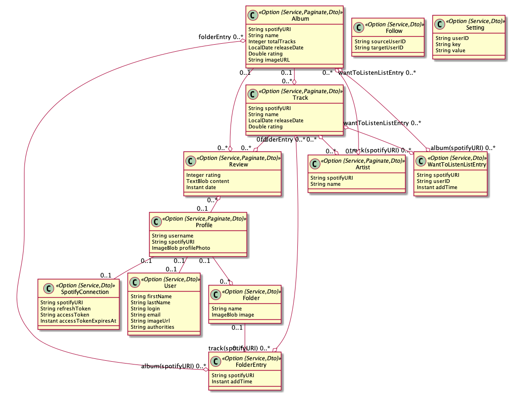

# First Meeting

## Team
- Have you met before this meeting?
- Did you know each other before?

## Topic
- have you come up with some project ideas?
- all of the provided ideas is on Canvas. We are not permitted to provide more.
- My project: An enhanced website for Spotify
	- We can connect to Spotify using spotify web api
	- We can review / rate albums / song on our website
	- We have a Leaderboard, which can show users the hit song
	- Automatically fetch new songs into database
	- create Love List on website and can be synced to Spotify
	- A user system that can bind Spotify Account
- project need to be split into 8 entities.

## Entity
- Same with the UML in SE

## JDL
- Just use online tools

- a new example
```java
entity Track {
    @Id spotifyURI String required
    name String required
    releaseDate LocalDate required
    rating Double required
}

entity Album {
    @Id spotifyURI String required
    name String required
    totalTracks Integer required
    releaseDate LocalDate required
    rating Double required
    imageURL String required
}

entity Review {
    rating Integer required min(1) max(5)
    content TextBlob
    date Instant required
}

entity Artist {
    @Id spotifyURI String required
    name String required
}

entity WantToListenListEntry {
    spotifyURI String required
    userID String required
    addTime Instant required
}

entity Folder {
    name String required
    image ImageBlob
}

entity FolderEntry {
    spotifyURI String required
    addTime Instant required
}

entity Profile {
    username String required
    spotifyURI String required
    profilePhoto ImageBlob
}

// entity User

entity SpotifyConnection {
    @Id spotifyURI String required
    refreshToken String required
    accessToken String required
    accessTokenExpiresAt Instant required
}

entity Follow {
    sourceUserID String required
    targetUserID String required
}

entity Setting {
    userID String required
    key String required
    value String required
}

relationship OneToMany {
    Track to Review
    Album to Track
    Album to Review
    Folder to FolderEntry
    Profile to Folder
}

relationship ManyToMany {
    Track to Artist
    Track{folderEntry} to FolderEntry{track(spotifyURI)}
    Track{wantToListenListEntry} to WantToListenListEntry{track(spotifyURI)}
    Album to Artist
    Album{folderEntry} to FolderEntry{album(spotifyURI)}
    Album{wantToListenListEntry} to WantToListenListEntry{album(spotifyURI)}
}

relationship ManyToOne {
    Review to Profile
}

relationship OneToOne {
    Profile to User
    Profile to SpotifyConnection
}

paginate Album, Artist, Track, Review, Profile with pagination
service all with serviceImpl
dto * with mapstruct
```
****

- Simple Example
```java
entity VendingMachine {
  id Long,
  name String required,            
  inventory Integer,             
  balance BigDecimal,              
  manufactureDate Instant        
}

entity Product {
  id Long,
  name String required,           
  category String,                
  price BigDecimal required,        
  manufactureDate Instant,          
  expirationDate Instant            
}

relationship ManyToMany {
  VendingMachine{products} to Product{vendingMachines}
}

//generate data transfer object, Help you decouple the actual operational objects of Spring Boot from the database objects.
dto VendingMachine, Product with mapstruct 

// generate service layer code automatically.
service VendingMachine, Product with serviceClass

// enable paginate query for Commodity
paginate Product with pagination
```


## Git
- Have you all been added to your group's GitHub repository?
- Learn git with Youtube video.
```bash
git add
git commit 
git push
git pull
git merge
git rebase
```

- Set up ssh key. Makes you can access your repository without provide username and password.

## Mockup
- Use Balsemiq, don't use slides
- https://docs.google.com/document/d/1cBI8kI-NNFkphKcexTC1nsdDrAc0k9JmcLhz6l5HUv4/edit?tab=t.0#heading=h.bg0rhuabsrsm

## Kanban
- Use GitHub issues, or whatever kanban tools you want to use, like Notion
- 3 lanes. Undo, Doing and Done.
-  for each card, title, ddl, description, attendee.
- at least 1 for each team member


## Unassessed
- teamwork policy proposals + reasoning: IDK what that is.
- tech stack change proposal: do not do that.
	- CI/CD pipeline is hard to build on your own, at least time wasting.
		- CICD means continuous integration and continuous delivery, automatically compile, test, package, deploy your code using a University provided server once you push a new change to your code.
		- Vital to showcase your code to Professor and TAs
	- Get less learning resources and tech assistance
	- My observation: team changed tech stack got lower score, due to many reasons.
	- springboot is heavy, angular is unpopular. I know you guys want to use sth like React, Vue, Django, Fastapi, Golang...... Think about your teammates!
- time sheets and meeting diary: do it! Last year is mandatory. Madesur was quite conflicted when discussing the time sheets and diary with us.

## S1 ranking
- It's just an internal benchmark. Even if you come in last place, as long as you've done some work, it won't affect your final score.


## Sophisticated Project
- can read / write data from dataset on your website