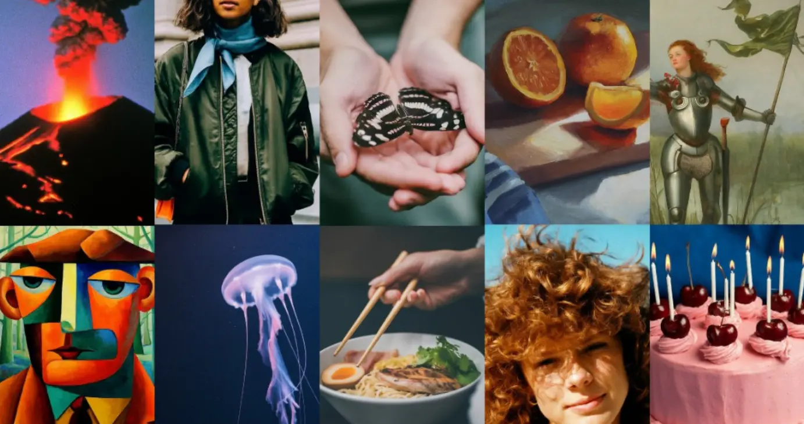
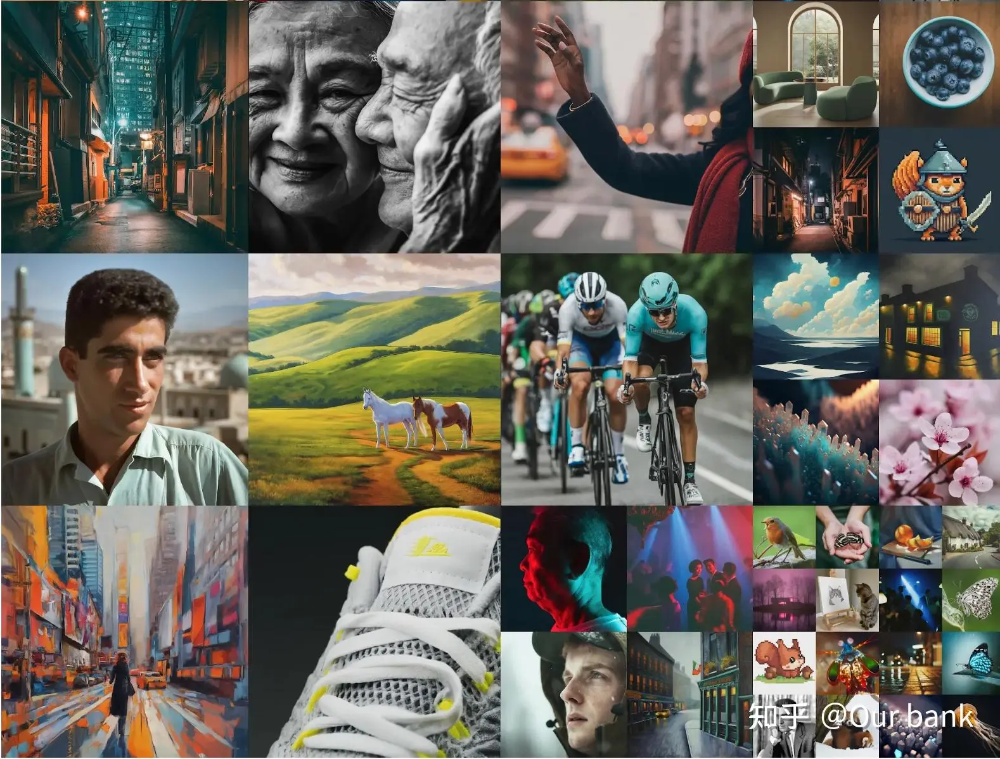

---
tags:
  - AI
  - 生成式
  - DL
  - ML
---
# Diffusion model｜扩散模型的历史

| Archive 自 | Archive 创建于      | 分类  | 原始作者     | 原始地址                                         | 原始资源创建时间         | 原始资源更新时间         |
| --------- | ---------------- | --- | -------- | -------------------------------------------- | ---------------- | ---------------- |
| 知乎        | 2024-11-26 08:56 | 分类  | Our bank | [链接](https://zhuanlan.zhihu.com/p/672700039) | 2023-12-17 09:04 | 2023-12-17 11:12 |

最近两年文生图模型越来越火，迭代速度越来越快，生成图片的效果也越来越好。像OpenAI的DALLE系列、Google的Imagen系列以及StableDiffusion等。每一次迭代都解决了之前图像生成的经典问题，像之前生成人物的图像中很难生成正确的手指数量，现在以及可以正确生成并且人物生成的效果也越来越逼真。这些目前最火的文生图方法大部分都是基于扩散模型改进而来的，今天给大家介绍扩散模型的发展历史以便可以更加全面的理解Diffusion Model。

*Imagen2 图像生成示例*

扩散模型最早由文章**[Deep unsupervised learning using nonequilibrium thermodynamics](https://arxiv.org/abs/1503.03585)** 在2015年提出，**其目的是消除对训练图像连续应用的高斯噪声** ，可以将其视为一系列**去噪自编码器** 。该文章基于马尔可夫链将一个分布变成另外一个分布，从而可以从一个已知的分布（高斯分布，基于此分布可以得到噪声的图片）得到一个目标分布（基于此分布可以得到目标图像）。达到这一目标，需要一个前向过程，对图片不断的加噪声，最终得到噪声图片（对应的分布，高斯分布），这一过程也是训练模型对分布进行估计的过程；后项过程，不断对噪声进行估计，从而从初始结果中减去噪声，从而得到干净的图片。

在2020年提出的**[Denoising Diffusion Probabilistic Models](https://arxiv.org/abs/2006.11239)** 让用扩散模型进行图像生成开始变成主流。大家通常说的扩散模型也就是这个DDPM。由于在从噪声恢复到目标图像的过程中，特征维度是一致的，在DDPM中采用的是U-Net的结构，在T步的反向过程中，U-Net模型是参数共享的，为了能告知U-Net模型现在是反向传播的第几步，在每一步反向传播时会增加一个**time embedding** ，其实现和transformer中的position embedding相似。

2020年还提出了**[Denoising Diffusion Implicit Models](https://arxiv.org/abs/2010.02502)，** 对于扩散模型来说，一个最大的缺点是需要设置较长的扩散步数才能得到好的效果，这导致了**生成样本的速度较慢** ，比如扩散步数为1000的话，那么生成一个样本就要模型推理1000次，**DDIM和DDPM有相同的训练目标** ，但是它不再限制扩散过程必须是一个马尔卡夫链，这使得DDIM可以**采用更小的采样步数来加速生成过程** ，DDIM的另外是一个特点是从一个随机噪音**生成样本的过程是一个确定的过程** 。目前在image translation任务中，很多工作都通过DDIM inverison来实现将输入图像反转的模型的输出域，进而得到可以用来表示参考图像特征信息的数据，从而更好的实现图像编辑任务，像**[Null-text inverison](https://null-text-inversion.github.io/)** 以及**[Zero-shot image to image translation](https://pix2pixzero.github.io/)** 等。

2021年提出了**[Improved Denoising Diffusion Probabilistic Models](https://arxiv.org/abs/2102.09672)** 对DDPM做了改进。将DDPM中用常数指代的方差用模型学习了。将添加噪声的schedule改了，从线性的改成了余弦的 作者发现DDPM中线性的噪声schedule在高分辨率的图像生成中表现较好，但对于分辨率比较低的，例如64*64*和*32*32的图像任务中表现的不那么好。特别是在扩散过程的后期，最后的几步噪声过大，对样本质量的贡献不大。

2021年提出的**[Diffusion models beat GAN on image Synthesis](https://arxiv.org/abs/2105.05233)** 首次提出了classifier guidance diffusion，额外训练一个分类器来指导扩散模型生成图像。在扩散模型的生成过程中的中间的latend code会通过分类器计算得到一个梯度，该梯度会指导扩散模型的迭代过程。分类器能更好的告诉U-Net的模型在反向过程生成新图片的时候，当前图片有多像需要生成的物体。此外本文从GAN的实验中得到启发，对扩散模型进行了大量的消融实验，找到了更好的架构更深更宽的模型。

2021年底**[《More Control for Free! Image Synthesis with Semantic Diffusion Guidance》](https://arxiv.org/abs/2112.05744)** 推广了“Classifier”的概念，使得它也可以按图、按文来生成。

2022年提出了**[Classifier-Free Diffusion Guidance](https://arxiv.org/abs/2207.12598)** 提出无需训练分类器，也可以用生成模型自己做引导，所以起名叫“Classifier-Free Diffusion Guidance”。具体来说在该方法中联合训练了conditional和unconditional的扩散模型，并且结合了两个模型的score estimates，以实现样本质量和多样性之间的均衡。最终的输出为有条件生成的输出减去无条件生成的输出，可以将无条件生成的输出看作是偏差，用正常训练的网络减去有偏差的网络能得到想要的输出。回到这篇论文的思路，有条件生成的可以看作是用了和图片匹配的文本对c，而无条件生成将其中的文本对c置为了空集。

Openai 2021年提出了**[GLIDE: Towards Photorealistic Image Generation and Editing with Text-Guided Diffusion Models](https://arxiv.org/abs/2112.10741)** 在前面扩散模型的一系列进展之后，尤其是当guidance技术之后证明扩散模型也能生成高质量的图像后。Openai开始探索文本条件下的图像生成，并在这篇论文里对比了两种不同的guidance策略，分别是通过CLIP引导和classifier-free的引导。验证了classifier-free的方式生成的图片更真实，与提示的文本有更好的相关性。并且使用classifier-free的引导的GLIDE模型在35亿参数的情况下优于120亿参数的DALL-E模型。**GLIDE最大的贡献是开始用文本作为条件引导图像的生成。** 

Openai 2022年提出了[dalle2](https://cdn.openai.com/papers/dall-e-2.pdf)如果说前面所提到的方法将扩散模型优化到比同期gan模型指标还要好，让研究人员看到了扩散模型在生成领域的前景，那么Dalle2则将扩散模型引入了公众视野。在GLIDE取得成功之后，Openai又进一步在GLIDE上加了一些track，成为了Dalle2。

dalle2提出之后，图片生成工作迎来了大爆发，google提出了[Imagen](https://arxiv.org/abs/2205.11487)以及[Imagen2](https://deepmind.google/technologies/imagen-2/)，stability AI提出了[stable diffusion](https://arxiv.org/abs/2112.10752)以及前段时间火爆全网的[Midjourney](https://www.midjourney.com/home/?callbackUrl=/app/)。

最近基于扩散模型的工作已经开始向3D以及视频生成，发展速度相当快。

