---
tags:
  - LLM
  - AI
  - DL
  - ML
---
| Archive 自 | Archive 创建于      | 分类  | 原始作者   | 原始地址                                         | 原始资源创建时间         | 原始资源更新时间         |
| --------- | ---------------- | --- | ------ | -------------------------------------------- | ---------------- | ---------------- |
| 知乎        | 2024-11-18 01:26 | 分类  | 密排六方橘子 | [链接](https://zhuanlan.zhihu.com/p/669193585) | 2023-12-05 06:45 | 2024-01-08 07:21 |

LLM入门指南

## 目录

1. 从Scaling Law说起
2. 数据集
    1. 训练数据集（天工）
    2. 评价数据集
3. 关于位置编码
    1. Sinusoidal位置编码
    2. RoPE位置编码
    3. NTK(Neural Tangent Kernel)
4. Act / Norm / Bias
    1. SwiGLU
    2. RMS Norm
    3. Bias
5. Training
6. Flash Attention
    1. 速度瓶颈
    2. 分块attention
    3. 前向计算
    4. 反向传播
7. 人类对齐
    1. 一些牢骚
    2. SFT
    3. RLHF
    4. Reward / Critic model
    5. Actor / Reference model
8. RWKV
    1. AFT
    2. RWKV的线性attention
    3. 评价

前情提要：本人是学CV的，然后公司梭哈LLM，直接被拉去充了壮丁……

本文并不是从0开始学NLP，所以有些基础知识可能需要自己去了解一下，比如transformer结构之类的。

那么本文主要关注的是昆仑天工和阿里通义千问（2023.11），至于为什么是这俩……天工是因为他们的开源号称是最有诚意的，阿里的千问则是因为他们的效果目前看起来是最好的。

文章内容似乎有点多，可以参照目录自行查阅需要的内容。


## 从Scaling Law说起

众所周知，根据OpenAI的scaling圣经（[https://arxiv.org/pdf/2001.08361.pdf](https://arxiv.org/pdf/2001.08361.pdf)）有一些简单的结论，比如：

C ≈ 6NBS，或者写成C ≈ 6ND

其中C代表计算量（单位PF-days），N代表模型参数量（需要去掉PE和词表），D代表数据集大小（单位token），你自然可以把D换成BS（即batchsize*step），因为大模型pretrain一般也不会有第二个epoch，所以这两个东西基本上是等价的。

于是我们只要预设一个计算量（你能负担得起的时间和显卡成本），以及你需要的模型规模，就可以大致推算出你的数据集得要多大的；反过来也是可以的。

根据原文，天工13B用512张A800训了39天，我们假定它打满了算力峰值（实际根据文章中是56.5%），可以直接计算出总算力是 $512\times312\times39\times86400\approx5.38\times10^{11}$TFlops，也就是大概5e23的计算量，其中312是A800的TF16算力（尽管天工用的是BF16，不过根据论文里的一些佐证，这个数应该是对的）。

考虑到算力的损失，天工总共花了3e23左右的算力，去做一个13B（1.3e10）模型，需要的数据量差不多就是4e12，也就是4TB token左右的数据，而摘要的第一句就说了天工使用了超过3.2T的token，说明天工整体依然是按照scaling law来做的，并没有在这种经验规律上搞什么花活儿。

以上就是scaling law的第一个小功能：**在一定的算力/模型规模/数据规模的预算下，如何去确定你的最优训练策略** ，或者说是某种经验主义的“最优配比”。

Scaling law的另一个结论如下：

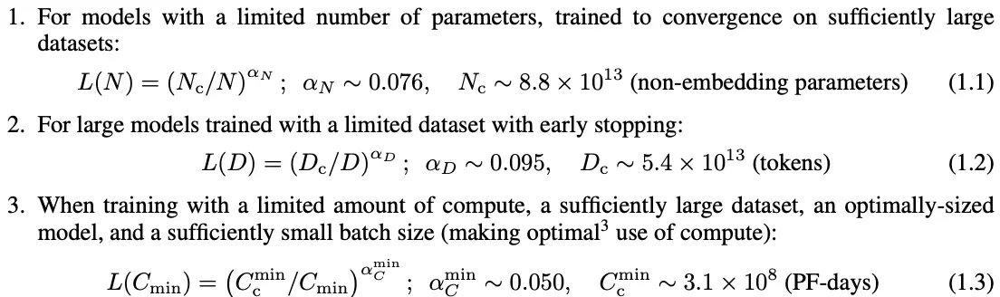

这三个式子反映的是CND在两者固定的情况下，单独调整某一个变量对模型loss带来的影响。除此之外还有一些公式，因为理解起来有点麻烦就不放在这了。

PS：我们知道了C ≈ 6ND，可以来看一下这三个式子是什么情况。1 PF-day = 8.64e19Flops，于是我们全用这边的基数做计算，那么6ND大概是2.85e28，C大概是2.68e28，能对上，没毛病。

然后你发现，根据C ≈ 6ND计算最优配比之后，如果实际情况稍有区别（比如我的算力有限导致模型未能完全收敛），这时候根据（1.3）就可以立即知道在你的算力条件下，loss能达到多少；当然更极端一点说，如果所有的模型都忠实地按照scaling law来走（不仅是幂律，包括参数的数值），模型在出生之前就已经决定结果了（比如无限算力+无限数据，根据1.1式，模型Loss只跟网络规模有关），你所能做的无非是让数据集更加贴近测试指标……

于是这就是scaling law的第二个功能了：**你可以在跑实验之前使用scaling law直接预测其他模型的表现** 。因为大模型训练成本实在是太高了，很难支持“跑多次实验“这样的鬼故事。

当然实际情况下，这个幂次的具体数值不一定能直接套用到你的模型结构上，因为模型之间亦有差距。因此可以参考[cingti：介绍一些Scaling Laws](https://zhuanlan.zhihu.com/p/631357320)里详细描述的内容（本质是上面的1.1式），也就是我们可以先跑几个小模型，然后画多条损失-计算量曲线（L-C，一个模型画一条），如下图所示：

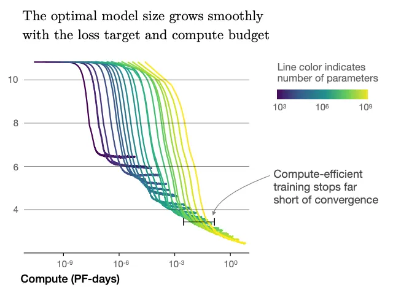

从图上可以看出，收敛的拐点在对数图上连起来差不多是一条直线，这样实际上你可以知道多个小模型收敛时CND各是多少，这样就能估计大模型的表现。


题外话：

在这两年经过大家的反复验证之后，大家逐渐发现scaling law甚至像物理定律一样准确。这时候你突然意识到一个有些严重的问题，就是如果这玩意真这么准的话，那么……

**大模型在出生之前，它的性能就已经决定了。** 

以前主流的AI research的范式都是改网络结构，或者改一些细节（比如RoPE，激活函数等等），你能见到不少闪光的思路。而著名的国产大模型在llama2出来之后很多都沿用了llama（或者说transformer decoder），能改的也就是网络深度宽度这种不涉及结构变化的东西……但是这其实也是scaling law的预言，因为它专门在文中提了一句说**模型收敛时的损失跟网络规模的关系很大，而跟网络结构的关系很小** ……

再直白一点说，如果scaling law存在，那么最近所有国产大模型的提升都来源于数据的增加（数量或者质量），**能提多少完全取决于你用的训练集跟CEVAL和MMLU这种数据集有多少的domain gap，** 至于模型本身的能力完全是换汤不换药式的提升，scaling law就是站在那里的一堵高墙，除非你能越过它，否则就是在折腾CND，仅此而已。

如果说以前刷榜好歹是提出了一些新方法（哪怕它并不实用），但是现在甚至退化了，只是折腾折腾数据去刷SOTA……意义在哪里呢？甚至不如搞VLM和RLHF更有创意，而实际上GPT4V也在走VLM的道路。

当然我并不是要说最近的大模型一无是处，毕竟我只是评价冰箱制不制冷。实际做的时候肯定有诸多细节只有踩一遍坑才知道，哪怕理论创新有限，能从头到尾实现一遍也是不可多得的经验，至少比我这种只会口嗨的强多了。


## 数据集

### 训练数据集（天工）

天工开源了一个150B的数据集（SkyPile），当然他们自家的数据集是6T的，这只是其中非常小的一部分。这150B的数据显然是不够训一个完整的LLM的，所以我们只是介绍一下清洗数据的过程。

在这里我要点名表扬一下天工的GRE选手，请品鉴：

In the pursuit of cultivating a profoundly adeptLLM, the model’s exposure must encompass a diverse array of content spanning an extensive spectrum of domains. Prior endeavors within the field have entailed the task of assigning categoricallabels to each individual document or webpage, thereby manually dictating the composition of the training corpus. However, we posit that the corpus employed for LLM training has burgeoned to such an extent that the knowledge it encapsulates can not be compartmentalized discretely. Consequently, eschewing a label-centric approach, our methodologycenters on benchmarking the semantic affinities existing between textual segments, thereby identifying and omitting those text blocks characterized by an exceedingly high recurrence rate.

我觉得你们要是之后打算投稿也就算了……要是只是作为造福社区的技术报告，我建议还是稍微user friendly一些，毕竟隔壁qwen，llama乃至scaling law也没见谁把论文写成这样吧。

当然我也没什么资格说，毕竟开源代码是我当伸手党……

总之数据清洗大致可以分为以下四个部分：

1. 结构化过滤：因为训练数据主要来源于网页，所以需要去掉一些没用的东西（比如导航条，网页上的联系方式等等）
2. 分布过滤：没太看懂什么意思。大致是说其他工作一般都会给文本分一个标签，但是这里认为文本涉及的内容可能很丰富（包含不止一个标签），所以不是按标签，而是测试“文本之间的亲和力”从而去掉一些过于重复的语段，但是这个semantic affinitiy到底是什么东西好像也没说，全文就提过一次affinity，说好最有诚意的开源呢（恼）。千问在去重这方面说得更清楚一些，大致是用MinHash和LSH来做模糊匹配来筛掉重复内容，之后还有一些精确匹配进一步去重。
3. 去重：总而言之是分布过滤的一部分。
4. 质量过滤：用了CCNet模型来判断 1）质量低的文本 2）中英文以外的语言。除此之外还训练了一个二分类器（是否适合放进维基百科），通过这个分类器筛选出一部分高质量文本专门放到high quality groups里。

其他还有一些细节但是还挺重要的东西（比如说构建了一个完全平行的中英文语料库放进整个数据集里，还有就是保留了一部分带格式的数据，比如xml和json等等）。

最后的数据构成（整个6T数据集，不是150B的）如下图所示：

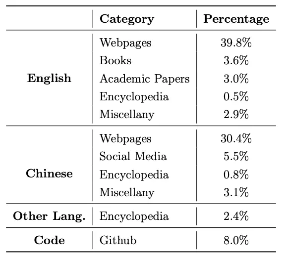

注意对于一些高质量的语料（比维基百科）可以在数据集里多重复几遍，但是根据某些论文里的经验，最好不要超过5遍。

### 评价数据集

评价数据集也是数据集，就放在这里一块说了。

常见的数据集如下：

**MMLU：** 多任务语言理解（包括STEM和社科之类的内容），形式为选择题。

**C-Eval：** 中文知识问答，选择题。

**GSM8K：** 数学题，一般回答形式是problem-solution-final answer，最后根据答案判定是否做对。

**MATH：** 数学题，但是格式是latex。

**HumanEval：** 代码生成，包含功能描述和输入输出样例。这里的评价指标包含pass@1和pass@x，pass@1表示根据greedy生成的通过率，pass@x代表多写几次去测，当然pass@x的效果还是要高很多的……

**MBPP：** 跟HumaEval差不多，也是代码生成。

**BBH：** 跟MMLU差不多，纯英文，选择题。

**CMMLU：** 看名字就知道是中文的一个评价基准，跟C-Eval差不多。

以下为私货。

我去看了一眼这几个数据集，**中文数据集都有一个毛病，就是偏向于“知识问答”** ，问题很直球，回答也很直球。

MMLU和BBH有一些问题像英语听力阅读理解，相比而言更难一些。还有一些问题搞得更加花里胡哨，比如说“which of the following is a humorous edit of this artist of movie name”，要求模型有更深的语言理解能力，甚至还有一些脑洞大开的测试，有兴趣可以自己去hugging face的BBH看一下。

CMMLU只有在涉及modern Chinese的时候才会偶尔出现这种需要动下脑子的题目，可惜的是整个数据集加起来也没多少条，C-Eval里也是寥寥无几。

这就带来一个问题，就是在一些情况下**对语言的理解能力需求远远高于对领域知识的需求** （比如长文本summary或者写小说），因此我的建议是**不要迷信评价指标** ，尤其是C-Eval这种纯知识问答类的评价指标。

这还只是评价数据集本身的问题，更不要说在训练时有可能出现的数据泄露。因为现在的pretrain数据集很多都是来源于网页，但是有一些测试集里面的题目你在网上能搜到原题。


## 关于位置编码

这部分我的建议是看苏剑林（苏神）的两个博客（[Transformer升级之路：1、Sinusoidal位置编码追根溯源 - 科学空间|Scientific Spaces](https://kexue.fm/archives/8231)和[Transformer升级之路：2、博采众长的旋转式位置编码 - 科学空间|Scientific Spaces](https://kexue.fm/archives/8265))。

不过大家来都来了，我就用更加容易理解的说法来介绍一下位置编码。

位置编码的主要目的是给transformer（attention）掺入位置信息，因为**attention本身并不包含位置信息** （你任意调换一个句子中两个字的位置，对attention结果是没有影响的，比如说“我吃饭”和“饭吃我”这两个东西显然不应该是同一个概率），因此一个好办法是**在embedding/encoding的时候在每个位置的输入上都掺一个东西** ，让这种对称性被破坏掉，这样attention的时候就会带着这个位置信息，网络就能学得更好。

然后问题就来了，位置信息应该怎么掺。一种思路是把**绝对位置** 直接塞进去，另一种显然就是使用**相对位置** 。但是无论是绝对还是相对位置，最好**需要保持一定的外推能力** ，否则只能处理特定长度以内的文本，因为超过预设长度的embedding/encoding网络在训练的时候是没见过的，测试阶段如果超了长度就变成了一个OOD样本，你不知道他会输出什么东西。

至于相对位置和绝对位置到底哪个更好，尽管没有明确定论，但是在LLM大行其道的年代，谁能更方便地外推谁就是大哥。

### Sinusoidal位置编码

经典的绝对位置编码，来源于Transformer原始论文，这里简单做一个解释。

我们把attention看作函数 $f$，于是对于位置 $m$和 $n$，我们有这两个位置的输入 $x_{m}$和 $x_{n}$以及他们的位置编码 $p_{m}$和 $p_{n}$。**位置编码可以视作一个小量** ，对于相加式的的位置编码（比如说$x_{m}$变成$x_{m}+p_{m}$）可以直接对 $f$做泰勒展开。这里我连展开公式都不用贴，稍微想一下你就知道**一阶项只会跟单一位置有关，某个二阶项才会涉及到两个位置的交互** ，也就是跟**相对位置** 有关。

而我们其实是**希望这个二阶项能够表达相对位置的信息，或者说能找到一个函数g，这个g(m-n)=这个二阶项，** 这样m-n的信息就能够体现在attention里了。

这个二阶项大概长这样： $p_{m}^{T}Hp_{n}$，其中$H = \frac{\partial^{2}f}{\partial x_{m}\partial x_{n}}$。直接解释H似乎有点困难，但是你可以大致想一下对于一个attention map而言，这一项实际意味着**任意两个位置的$x_{m}$和 $x_{n}$的变动对attention的影响（或者说贡献）是否相同** ，以及他俩之间**是否有相关性** 。

理想情况下就是**任意两个位置的输入对于attention的贡献相同且互相解耦，此时H直接就是单位阵** ，我们接下来也会基于这一假设去进一步介绍后面的内容；**退一步说** ，如果他们对attention的贡献不同，但是**仍然是互相独立的情况下，H会变成一个对角阵** ，此时仍然能够保留一些不错的性质；那么**最坏的情况下H是一个普通矩阵** ，这时候我们下面提到的一切性质都不成立。幸运的是，苏神自己check了一下这个矩阵的权重，发现至少在embedding层，把H当成一个对角阵还是合理的，有兴趣可以自己去看一下他的博客。

好，那我们现在假定H就是单位阵，此时 $p_{m}^{T}Hp_{n}$直接退化成 $p_{m}^{T}p_{n}$，**注意这里的p其实都是向量** ，所以它其实就是两个向量的内积。根据某些我已经忘得差不多了的知识，对于一个二维向量，也可以用复平面上的向量来表示；因此我们干脆再简化一点，就假定p也是二维的，于是此时 $p_{m}^{T}p_{n}=Re[p_{m}p_{n}^{*}]$，其中 $p_{n}^{*}$代表 $p_{n}$的共轭，Re代表实部。

于是现在的目标变成了：找到一个复数 $g$，使得 $p_{m}p_{n}^{*}=g(m-n)$。

那么接下来的事情就非常简单了，我们不妨把它写成复数的指数形式，即：

$p_{m}=r_{m}e^{i\phi_{m}}$, $p_{n}=r_{n}e^{-i\phi_{n}}$, $g(m-n)=R_{m-n}e^{i\Phi_{m-n}}$

于是很显然，要让他们相等就必然有（模长相等，辐角相等）：

$r_{m}r_{n}=R_{m-n}$, $\phi_{m}-\phi_{n}=\Phi_{m-n}$

对第一个式子令m=n立刻得到 $r_{m}^{2}=R_{0}$，也就是说 $r_{m}$是个常数，方便起见直接令他等于1就行。

对第二个式子我们一眼就能看出令 $\Phi_{m}=\phi_{m}=m\theta$就是一个解，也就是说反正是等差数列就完事。

也就是说我们已经找到了这个式子的一个解了，有没有其他解不重要，反正这个能用。

回到我们之前说的，我们想要求解这个式子，**本质是想找到一个函数g作为位置编码，使得g(m-n)恰好等于f泰勒展开的二阶项，如果找到了，那么f里就会自然而然地带上相对位置信息。** 

而现在这个g恰好能用，也就是说对于一个二维向量 $x_{m}$，你只需要给他加上一个形如 $p_{m}=e^{im\theta}$的向量作为位置编码即可。进一步地，只要这个向量是偶数维，你就每两维（第2i和2i+1维）给他安排一个 $sin(m\theta_{i})$和 $cos(m\theta_{i})$即可。

我们回头来看transformer论文里写的PE：

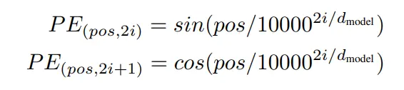

很显然，我们的结果已经跟他非常像了。这两个式子里的pos对应于我们的m，而唯一的区别就是**我们的 $\theta_{i}$实际上是随机的，你想让他是多少就可以是多少，但是transformer里给它特意加了一个数值** $10000^{2i/d}$。

这个值的意义在何处呢？

在于他有一个非常好的性质，就是**随着m-n（也就是相对距离）的增大， $p_{m}^{T}p_{n}$的结果会逐渐减小** ，反映在transformer里就是两个输入距离越远，相关性越小，这其实是非常符合直觉的。至于为什么会出现这个现象，其实你硬算一下就知道了，在d足够大的时候可以把求和近似转化为震荡积分（或者可以直接画一下图），篇幅所限，这里就不折腾了。至于到底是1w还是1k，似乎并没有太大所谓。

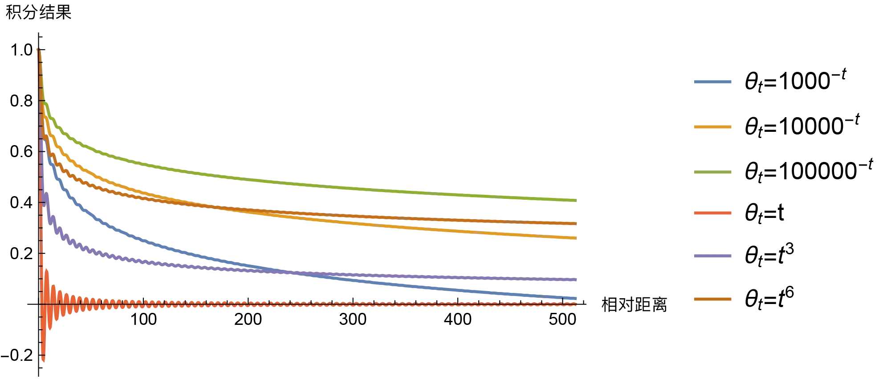

*来源：https://kexue.fm/archives/8231*

于是我们来对这部分做个总结：

**由于attention机制本身并不带有位置信息，所以我们希望在embedding的时候添加位置编码，使得两个输入的相对位置信息能够体现在attention里。落实下来就是通过构造正余弦的位置编码，使得相对位置信息能够体现在attention的二阶展开项中，并且加上一些特殊的设计使得该项能够随着距离而衰减。** 

### RoPE位置编码

上面我们已经说了，如果**使用“相加式”的位置编码** ，通过泰勒展开加上一些假设（位置编码是相对小量，二阶交叉项中H是单位阵）那么可以得到PE的一个解是 $p_{m}=e^{im\theta}$。由于我们是用泰勒展开做的，所以没有对代表attention的函数 $f$做任何限制，也就是说无论是什么 $f$（哪怕它不是QKV的形式），这个编码都是可用的。

但是这似乎不是最优的假设，因为我们已经明确知道 $f$的形式，而且也不复杂，不用起来有些说不过去；另一方面“相加式”和泰勒展开的假设又有些太强了。

那么如果我们**只考虑transformer QK情况下的** $f$，换句话说 $f$就是向量内积的形式；**而对输入 $x_{m}$和 $p_{m}$的关系不做要求** （不预设它是相加还是相乘等形式，而是等之后求解），情况是不是会有所不同呢？

这里我们干脆把加了位置编码的向量记为 $h(\textbf{q},m)$和 $h(\textbf{k},n)$，其中**加粗的代表输入向量，而没加粗的m和n代表位置** 。（注意，如果你沿用之前的 $x_{m}$作为 $\textbf{q}$的记号可能会有一些小问题。因为 $x_{m}$实际上是任意的，跟m没有直接联系，但是这个记号跟m没有完全解耦，导致有些东西推不出来）

我们不妨回头看看前面的目标： $p_{m}p_{n}^{*}=g(m-n)$

巧的是，现在等式左边仍然是向量内积的形式（QK），只不过此时的内积不只是跟位置编码 $p_{m}$有关，而是跟输入的向量也有关。因此我们需要换成上面的写法，即左边写成 $h(\textbf{q},m)h^{*}(\textbf{k},n)$；至于等式右边大概率也要跟qk有关系了，所以我们这里稍微改改就变成了新的目标：

$h(\textbf{q},m)h^{*}(\textbf{k},n)=g(\textbf{q}, \textbf{k}, m-n)$

我们继续接着前面的推理逻辑依葫芦画瓢，同样设为二维向量，同样写成复数的指数形式，同样令模长和辐角都相等，于是就有：

$R_{h}(\textbf{q},m)R_{h}(\textbf{k},n)=R_{g}(\textbf{q},\textbf{k}, m-n)$

$\Theta_{h}(\textbf{q},m)-\Theta_{h}(\textbf{k},n)=\Theta_{g}(\textbf{q},\textbf{k}, m-n)$

先看第一个式子。我们令m=n立即有 $R_{h}(\textbf{q},m)R_{h}(\textbf{k},m)=R_{g}(\textbf{q},\textbf{k}, 0)$，也就是说 $R_{h}(\textbf{q},m)$和m无关。简单起见，我们直接令 $R_{h}(\textbf{q},m)=|| \textbf{q} ||$就结束战斗了。

对第二个式子，同样令m=n，有 $\Theta_{h}(\textbf{q},m)-\Theta_{h}(\textbf{k},m)=\Theta_{g}(\textbf{q},\textbf{k}, 0)=\Theta_{h}(\textbf{q},0)-\Theta_{h}(\textbf{k},0)$。

于是我们可以知道 $\Theta_{h}(\textbf{q},m)$和qk似乎也没什么关系，因为简单移一下项就可以得到。

$\Theta_{h}(\textbf{q},m)-\Theta_{h}(\textbf{q},0)=\Theta_{h}(\textbf{k},m)-\Theta_{h}(\textbf{k},0)$

可以看出它只跟m有关，通过简单的求解（比如令n=m-1）就可以知道，它又是一个等差数列，我们可以把它写成

$\Theta_{h}(\textbf{q},m)=\Theta_{h}(\textbf{q})+m\theta$

于是把他俩都带入回原来的复数形式，我们有：

$h(\textbf{q},m)=||\textbf{q}||e^{i(\Theta_{h}(\textbf{q})+m\theta)}$

注意到上面的 $\Theta_{h}(\textbf{q})$其实就是向量q的辐角，可以直接拿下来变成：

$h(\textbf{q},m)=\textbf{q}e^{im\theta}$

**这个东西等价于把原始向量q旋转一个 $m\theta$角，这也是旋转位置编码（RoPE）名字的由来** 。

之后的事情就不用多说了，直接参照sinusoidal的后续流程，每两维添加一次位置编码即可，只不过sinusoidal是直接加在输入向量上，而RoPE是转了一下。 $\theta_{i}$的取值也可以取 $10000^{2i/d}$，同样可以实现很好的远程衰减特性。

我们来对RoPE做个总结。

不同于Sinusoidal的推导方式，**我们专门针对attention的QK内积形式（而不是任意函数），并且放宽了对位置编码和输入向量的关系约束（不要求是相加），希望直接求解一个位置编码方式能够反映相对位置。最后推导的结果显示旋转位置编码可以满足这一条件。** 所以从某种角度上说，RoPE比Sinusoidal好的原因主要是它更适配attention的计算方式，并且“强假设”少了很多。

### NTK(Neural Tangent Kernel)

这个名字有点抽象，不过也没必要去抠那么细节，篇幅所限，这里就简单说一下。

尽管RoPE相对而言有不少优势，不过它依然没解决“测试时文本长度大于训练时文本长度”的情况，比方说你训练时最大长度是1k，测试时是2k长度的文本。

很显然如果直接把现有编码方法外推到2k长度会出现模型没见过的输入，这时候结果不见得好；另一个想法是内插，就是把2k的位置编码对应到1k，相当于整体放缩一下，但是这样也有个问题，就是如果你放缩太多了会导致编码过分拥挤，相邻两个位置的差异会变得很小。

于是你只需要稍微动一下脑筋就可以想到……**对于长距离的两个字，他们之间的注意力可能没那么重要，毕竟都到1k这个距离了，大部分时候也很难有什么关联；对于很近的两个字，我们最好能忠实地使用训练时的位置编码，这样能够让最重要的attention不受影响。** 

那么一个直觉的想法就出来了：**“非线性缩放”，换句话说叫高频外推，低频内插。** 

至于为什么叫高频和低频，可以回到RoPE的编码方式：

$h(\textbf{q},m)=\textbf{q}e^{im\theta}$，其中 $\theta=10000^{-2i/d}$。可以看到频率主要由 $i$决定，由于前面有个负号，所以越大的 $i$代表频率越低（注意区分这里的 $i$和代表复数的 $i$），也就是说前面的维度“转”得快一些，后面的“转”得慢。从直觉上说（其实从前面的推导过程也很容易看出来），**转得快的高频分量显然会对近距离更敏感** ，因为只要位置m稍有变化， $m\theta$角度就会转很多；低频分量则是对远距离较为敏感。

所以一种可以采用的形式是，**让转的最快的 $\theta$转速保持不变，对于转的最慢的 $\theta$转速变为原来的1/8，至于中间的维度就按照比例（ $8^{-\frac{2i}{d-2}}$）来就行** 。

或者我们用一个形象一点的总结，你对于近处的物体可能会对一两米的距离锱铢必较，但是对于远处的物体，它到底距离你50米还是100米并其实不那么重要，大多数时候你只要知道有这么个东西存在就差不多了。

**通过NTK，我们可以在测试时接受超过训练时的文本长度** 。尽管性能相比直接在长文本上训练有差距，但是也比不做NTK要强不少。


## Act / Norm / Bias

### SwiGLU

需要重点提示CV选手们，这里用的激活跟CV里的激活方法稍微有点区别。

常见的激活函数（ReLU，SiLU，Swish）之类的其实拿着一个输入就行了，但是在现在主流的大模型里稍复杂一些，因为多了一个叫GLU的东西（gated linear unit），简单起见我们直接看代码。

```python3
class FeedForward(nn.Module):
    def __init__(self, dim: int, hidden_dim: int, multiple_of: int, dropout: float):
        super().__init__()
        hidden_dim = multiple_of * ((2 * hidden_dim // 3 + multiple_of - 1) // multiple_of)
        self.w1 = nn.Linear(dim, hidden_dim)
        self.w2 = nn.Linear(hidden_dim, dim)
        self.w3 = nn.Linear(dim, hidden_dim)
        self.dropout = nn.Dropout(dropout)

    def forward(self, x: torch.Tensor) -> torch.Tensor:
        return self.dropout(self.w2(F.silu(self.w1(x)) * self.w3(x)))
```

对正常的CV选手来说这样才是正常的形式：

```text
self.w2(F.silu(self.w1(x))
```

也就是说不知道从哪里多出来一个w3。

GLU认为silu（或者sigmoid）作为激活函数本质上是“决定保留多少信息”，因此干脆只是把激活函数当作一个门控机制，再额外添加一支作为主要的信息通路，**相当于变成了（信息支+门控支）两支通路** 。因为多加了一个w3导致网络参数量会增加，所以需要对维度数做一些削减以保持参数量与原来一致。

### RMS Norm

众所周知norm就是归一化均值和方差。BN/LN/GN没有本质上的区别，只是拿来norm的维度不一样而已。

RMS（Root Mean Square）norm认为归一化均值没什么用，主要是方差比较重要，因此干脆把“减均值”这个操作给去了，直接计算RMS然后做norm就行了。

### Bias

专门提一句，就是千问说他们在大部分层把bias删了，但是在**QKV层里加bias反而对模型外推能力是有帮助的** ，大致是因为bias这项加入之后会有一项随着相对位置增加而递减，从而变相增强了局部注意力。

这里就不细说了，有兴趣的可以看这篇：[Bias项的神奇作用：RoPE + Bias = 更好的长度外推性](https://spaces.ac.cn/archives/9577)。


## Training

先说天工的训练。

天工的表示一开始只打算用2T token去训，但是训完2T之后发现还有提升空间，于是又补了1.2T的token继续训。可能是一开始没做好训练规划？或者是一边训一边做的数据集，总之能出现这种失误还挺神奇的……

然后文章里表示后面加的这些数据跟2T数据的分布有一些小区别，所以很小心谨慎地tune了几个学习率，最后总之是定下来了，然后把后加的1T多的数据又喂进去了。

接下来是二阶段的pretrain。二阶段的pretrain主要是为了做STEM题（就是理工科那些）。训练方法就是把专门用于STEM的Skypile-STEM和整个数据集Skypile-Main两个掺在一起训（比例为2:8，总共130B左右token），并且实际操作的时候还有一些特别的trick：**在训练的过程中逐渐添加STEM数据集所占的比例，** 比如说一开始只占10%，到训练结束的时候可能占40%。

然后再来简单提一下千问。

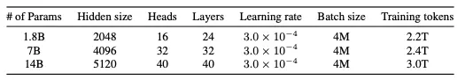

整体的数据集规模差不多，参数设置基本都和LLAMA2保持一致，而天工会略有区别：

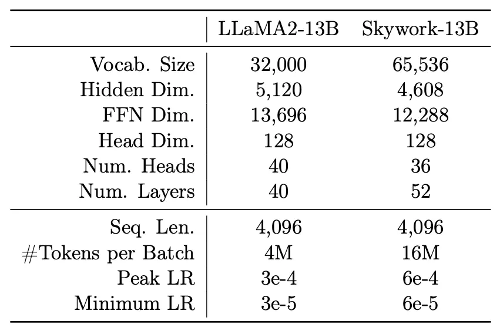

千问的训练就正常多了，他也没特地强调训练时有什么花活儿。需要强调的是，训练时采用的都是BF16（和FP32能够表示同样的range，但是精度缩减了）。


## Flash Attention

主要功能是给attention加速。

由于具体内容实在过于复杂，完全搞懂需要大量时间，因此我对这部分做了大量删减，只留下一些定性的结论给大家。我的建议是有兴趣的（尤其是做cuda加速的）仔细阅读这篇：[FlashAttention 的速度优化原理是怎样的？](https://www.zhihu.com/question/611236756/answer/3310819022)，里面讲得非常清楚，我就不画蛇添足了。

### 速度瓶颈

传统attention流程如下：

**从显存中取QK计算->将结果S写回显存->从显存读S计算softmax->将结果P写回显存->从显存读取P和V进行计算->将结果O写回显存。** 

由此可见整个attention过程中多次进行显存读写，而众所周知大模型的速度瓶颈其实很多时候并不在于计算速度，而在于显存读写，因此如何去减少显存读写次数是至关重要的。另一个众所周知的事情是，**离CPU/GPU越近，缓存速度就越快，在GPU上的速度是L1>L2>显存，但是容量上L1<L2<显存** 。

因此，为了减少显存的读写，一个好的办法是**进行分块计算。** 如果我的数据量足够小，我就能**全塞到L1缓存上** （比如说A100的L1只有192KB）进行计算了，这样**由于L1的读写速度远高于显存，就实现了加速** 。

*PS：此处可能涉及一些硬件相关的知识，建议自行查阅。比如GPU的基本架构以及SRAM/DRAM，还有roofline图等等。由于本人之前已经略有了解，在此就不做说明了。*

*PPS：虽然我上面说的是显存（FlashAttention里用的也是HBM），但是也有部分文章里计算时采用的是L2缓存带宽而不是显存带宽。这个……我只能说还是得上手实操，这里我们就先当它是显存。*

### 分块attention

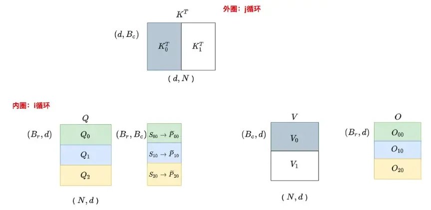

以上是分块attention示意图，我们以N为句子长度，d为特征维数。

正常的attention是直接计算 $QK^{T}$，但是这里改成分块进行，比如图上是把Q分了3块，Q分了两块。

我们注意**分块和传统attention实际上并不一致** 。

首先是这个O的内容和正常的attention有区别。正常情况下在P×V这一步应该是 $(B_{r},N)\times(N,d)$得到 $(B_{r},d)$的一个矩阵。**现在虽然形状还是 $(B_{r},d)$，但是由于KV都是分了块的，所以在算结果的时候就有一部分没参与运算，只计算了前** $B_{c}$**个数的结果，相当于结果是错的** 。

但是问题也不止出在这，因为你往前推一步就会发现，前面的softmax也不对。**正常的softmax是一整行做softmax，但是这边只有一部分。** 但是相比后面的output错的没那么离谱，因为这儿只不过切成了两块罢了，做softmax之前是每个数还是正确的。

### 前向计算

我们直接来看算法流程图。

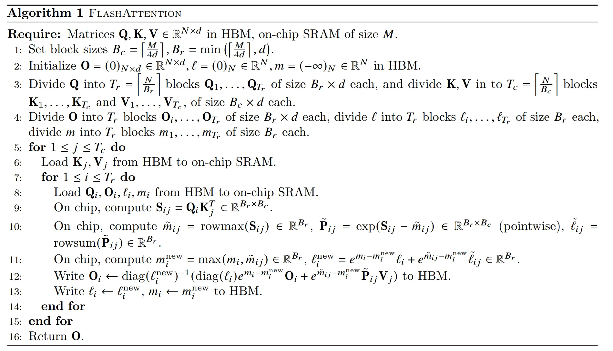

关注5-15行这个循环即可。这个循环的意思大致是，on chip地遍历每一个分块（只读写L1而不是显存，因此速度很快），然后你需要存下来的东西是**当前状态下的O矩阵，以及当前状态下的 $l$和 $m$** （即每行的和以及每行的最大值），你就可以计算出跟传统attention一模一样的结果。

至于为什么这两种计算方法是一样的，由于太复杂了这里就不做赘述了，建议去看本章开头推荐的文章。不过如果你喜欢一些定性的描述，大概可以这么理解：我们前面说了，最大的问题是P×V=O这一步算出来的O只有一部分（本来应该拿N列进行计算，现在只拿了 $B_{c}$列），**由于我们的分块其实是线性可加的，因此你可以迭代计算O的数值然后原地加到上一轮的数值上即可，只不过每次更新的时候需要考虑softmax带来的变化，最终这样更新出来的O和标准attention的O数学上严格等价** 。

总之，相比原始attention对HBM的大规模读写（QKSPV），Flash Attention有很大区别，因为它把内层循环跑完只需要在HBM上写**一个完整的O矩阵，加上多次l和m（纯数字）。** 相当于不用写SP这些中间矩阵，但是需要循环地写很多次O。

考虑复杂度，l和m的复杂度只有O(N)，而Q/K/O的复杂度是O(Nd)，S和P的复杂度是O(N^2)，因此传统attention的复杂度大概是 $O(Nd + N^2)$，FlashAttention的复杂度大概是 $O(T_{c}Nd)$，其中 $T_{c}$是上面算法流程里的外层循环次数。在正常情况下 $T_{c}d$并不会很大，相比O(N^2)还是省了不少复杂度的。

### 反向传播

因为分块attention没有存储S和P两个矩阵，所以反向传播的时候需要先on chip地把SP算出来（当然不是整个算出来，而是只算那一小块），之后的反向传播过程和正常的attention一致，只不过是分块的。

至于计算量其实稍微脑测一下也大致有数，尽管迭代了多次，但是总计算量的量级应该不会有太大区别。我之前觉得Flash Attention的计算量好像变大了，因为直觉上多次更新softmax会带来计算量的增加，但是跟O的计算比起来似乎不是大头。

**我们总结一下Flash Attention。** 

**正常情况下的attention涉及到显存的多次读写导致速度较慢。Flash Attention通过将矩阵分块，可以把一些中间矩阵（如S和P）的计算全都放在L1缓存上，从而避免多次显存读写实现了加速。** 


## 人类对齐

天工在report里似乎没怎么提这个事，千问说的比较多。人类对齐的主要作用是让模型“说话”的风格符合人类习惯，一般经过人类对齐的模型主要是用来当聊天机器人的，所以你看各个团队发布的模型一般都会有base模型和chat模型。

众所周知，对齐最常用的也就两种：Supervised Finetune（SFT）和Reinforcement Learning with Human Feedback（RLHF）。

### 一些牢骚

我们先说一些天工在论文里发的牢骚，虽然跟human alignment无关，但是因为涉及到SFT所以还是放在这里。

天工提到了一些很有意思的事情：大家做LLM的传统思路是无监督pretrain+有监督finetune，但是实际上你可以用一些投机取巧的办法，尤其是在GPT-4这种东西出来之后**获得有监督和高质量数据变得非常容易** 。

6月份有个很有名的论文叫textbooks are all you need，用了7B token做pretrain加200M做finetune就训了一个非常好的coding模型出来，而且这个模型还很小（1.3B）。但是如果你从头看到这里，想到scaling law就知道事出反常必有妖。实际上在这篇论文里是先使用GPT-4筛选出一些高质量的code来训一个“判断代码质量高低”的分类器，然后那些pretrain和finetune用的“教科书级的代码”都是用GPT-3.5生成的。

也就是说，无论是pretrain还是finetune的数据都集中在coding这个领域，并且数据质量极高，这使得模型在coding方面有极度出众的能力，但是这其实稍稍违背了做大模型的初衷。

如果你只是想在某个特定任务上刷榜，你甚至可以在pretrain的时候就选in-domain的数据，比如说做coding就直接全用代码数据就完了，没必要像通用LLM一样用一大堆无关数据来做pretrain再用领域数据做finetune。或者反过来说，**尽管大量无监督数据带来了LLM的通用能力，但是如果你只需要在某些特定task上的优秀表现，全程使用高质量的in-domain数据+小模型可能反而比大模型还强** 。

但是你仔细一想，这不是又退化成了传统deep learning了吗……

### SFT

没什么特别好说的，千问在论文里着重强调了**内容安全性** ，也就是对暴力/偏见/色情之类的话题做了很多标注数据，尽量减少模型在聊天的时候口出狂言。

此外就是SFT时的格式参照了OpenAI的ChatML，也就是指定角色（system/user/assistant等）的json格式，这样使得模型可以区分消息来源，从而让模型能够分析更复杂的会话数据。

### RLHF

对强化学习以及PPO不了解的同学建议阅读我很久以前写的文章：[密排六方橘子：强化学习：PPO(Proximal Policy Optimization)在谈恋爱中的应用](https://zhuanlan.zhihu.com/p/341561826)，私以为写得还是很清楚的，但是你如果懒得看，我们这里也可以用几句话简单描述一下强化学习（这里指PPO）的基本流程：

强化学习的基本思想是“**模型在和环境的互动中学到知识** ”，因此你的模型主要功能是“做出动作”，或者叫它**actor** 。在我们的场景下，LLM就是这个actor，LLM的输出的内容就是“动作“，然后我们对输出的评价其实就是“环境”，因为我们需要告诉actor它的动作是好是坏。**此时LLM的参数更新方法和传统的梯度更新一样** ，也就是你把reference当作gt，然后根据每个act的输出概率做梯度下降即可。

上述过程在传统RL中叫做Policy Gradient（PG，策略梯度），在此基础上做一些优化之后就变成了PPO。但是这种基于梯度下降的方法也有缺陷，比如说由于有时决策序列很长，因为PG是基于采样的（每次采样的是一个决策序列，搜索空间是指数增长的），所以这种情况下**训练稳定性非常差** 。**因此我们可以再添加一个模型来“估计当前状态是好是坏”** （有兴趣的可以查一下“优势函数”），这两个模型一起训练，这样actor的训练就会稳定很多，**我们管它叫actor-critic方法** 。

*PS：我觉得应该还挺好理解的？看一遍可能有点懵，多看两遍应该就很清晰了。*

在RLHF中有四个模型，**分别是actor，reference，reward和critic。** 这四个模型的作用大致如下：

actor：负责输出结果

critic：辅助actor估计当前状态

reference：base模型，负责约束actor的输出不要跟base模型差太远

reward：用于自动评价输出的结果好坏

### Reward / Critic model

为训练Reward model，我们需要先训一个**偏好模型** （preference model，注意区分一下reference……），这个模型的作用顾名思义，就是判断回答的好坏。具体来说就是对同一个prompt有两个回答（一个pair），然后模型负责判断哪一个比较好。

实际上偏好模型也不止这一种，比如instruct GPT是拿了9个回复一起排序；llama2虽然也只用了2个回复，但是在标注的时候还添加了标注人员对自己标注的置信度，以及回复的安全性。总之模型设计上还算比较自由，具体怎么操作可以自己开脑洞。

偏好模型的训练也分两步，pretrain和finetune，pretrain这一步可以简称PMP。这两个步骤只是数据稍微有点区别，finetune阶段的数据质量要高一些。不过文章里并没有介绍pretrain用的数据集有多大……

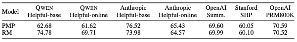

实际上finetune之后的模型（RM）和只用pretrain的（PMP）主要是在千问自己的数据集上提升比较大（应该是针对性地构造了一些数据），但是在其他数据集上提升并不明显。

至于**preference model本身结构，就直接沿用了千问base模型，然后用上面说的数据进行PMP之后再finetune，finetune之后的模型就是reward model了，注意这个权重也被拿来初始化critic model。** 

### Actor / Reference model

这两个模型均使用base模型初始化，区别在于reference是不会变的，actor是不断更新的。

训练流程如下图所示：

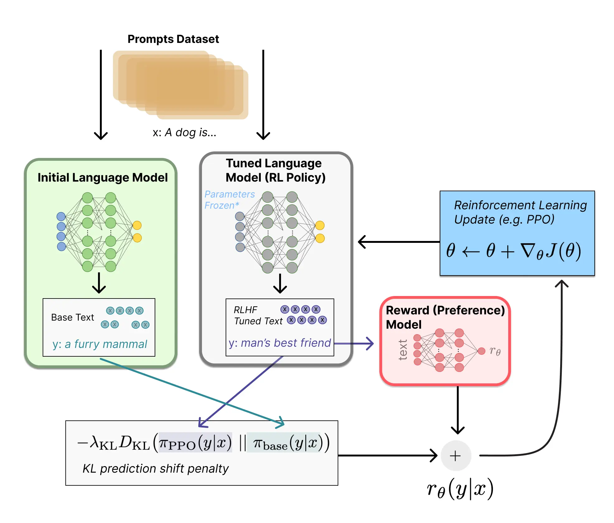

图中可以看到三个模块，其中initial language model就是reference model，中间的tuned language model就是我们之前说的actor-critic，最后右边红色框里的reward model。

训练流程也一目了然，reward model负责给模型的输出打分，reference model负责和模型输出计算KL散度（不能偏得太夸张），之后这两个合起来作为reward来给actor-critic更新梯度。

## RWKV

线性attention的变种，提这篇文章是为了给LLM学习者们提供一些额外的知识，毕竟基于线性attention的工作相比传统attention少很多，总之就算看到了也不必大惊小怪。

### AFT

讲RWKV之前我们需要先说AFT。

众所周知，传统Attention定义了QK的相似度： $sim(Q_{i},K_{j})=exp(\frac{Q_{i}K_{j}^{T}}{\sqrt{D}})$，可以把V写成这样：

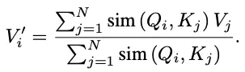

这就带来了一个问题，计算的复杂度是随着序列长度平方增长 $O(N^{2})$的。所以一个直觉的想法是把QK相乘这个东西换掉，比如说它能不能是一次的，而不是二次的。

题外话：

*如果你是学CV的，看到这个东西立刻会有至少两个deja vu的想法：*

*一个是比较古老的**Deformable DETR** ，这个东西里面的attention不是正常的QK相乘，而是直接用query挂了个linear和softmax预测出来的。*

*另一个是非常古老的**squeeze-and-excitation** ，也是某种attention，但是它也跟QK无关。*

*换句话说，attention绝对不止“QK相似度”这一种，只要你胆子够大，linear+softmax就是attention，乘回原始value上就完事了，这种attention不仅是CNN时代最常见的操作，而且复杂度还是一次的……*

回到正题，我们考虑一次复杂度（线性attention）的QKV应该如何交互。

这里不妨先瞅一眼AFT的decoder形式（因为是decoder所以只能看到左边的）：

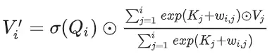

其中 $\sigma(Q_{i})$是取sigmoid，右边分数里面的 $w_{i,j}$是可学习项。

也就是说，左边这个 $\sigma(Q_{i})$相当于把Q当成了一个门控函数，而右边的 $K_{j}$和 $w_{i,j}$刚好是wx+b形式的一个值，它是一个自己冒出来的attention值（只通过K而不需要QK交互，和Deformable DETR非常像），突出一个简单粗暴。

可以想见这种形式的attention大概率还是能work的（我们前面已经铺垫很多次了），只不过没有传统attention复杂而已。

我们仔细琢磨一下上面那个公式的形式。

在正常的attention里 $Q_{i}$是放在求和项里面的，并且拿不出来（因为跟 $Q_{i}$确实有关系），每来一个 $Q_{i}$就要重新计算一遍所有QK attention的内容。

但是AFT里求和项里不包含 $Q_{i}$，这时候我们就可以把**i-1位置的K和V之类的东西都存起来** ，在i位置可以直接复用这一结果，相当于迭代更新右边的求和项，这个形式跟RNN就非常像了，因此**可以实现和RNN类似的sequential decoding** 。

但是另一方面AFT也有个问题，就是它仍然是 $O(N^{2})$的，因为求和项内部还是有个跟 $i$相关的 $w_{i,j}$，导致虽然你能sequential decoding，但是**每一步迭代新增的计算量是** $O(N)$，最终复杂度还是 $O(N^{2})$。

### RWKV的线性attention

我们前面说了由于 $w_{i,j}$的存在，AFT的计算量仍然没能缩到O(N)，于是有了如下改进方案：

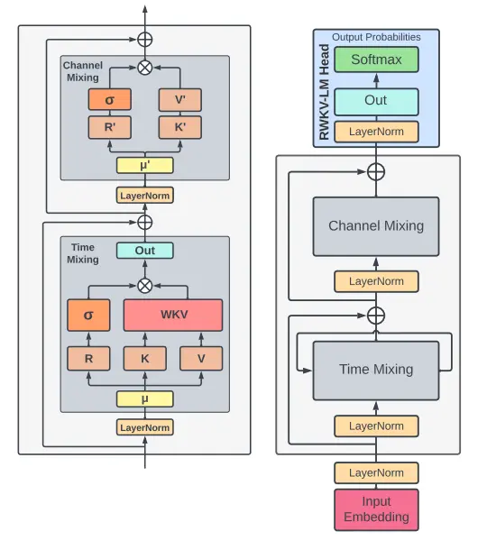

左边的是细节图，右边的是整体框架。

**我们先来看下半的time mixing部分** 。RKV就是transformer里的QKV，黄色框里的 $\mu$是一个混合用的参数，具体作用就是把上一时刻的输出和这一时刻做一个混合：

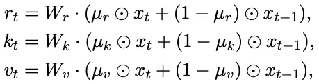

有LSTM那个味儿了。

R一支自然没什么好说的，跟AFT一样，而WKV模块长这样：

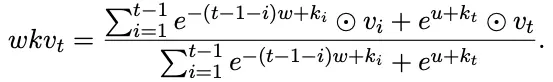

可以看到分子分母都是两项，前一项是求和，与前t-1项相关，后一项就是当前t时刻的值。

前一项求和明显是设计过的，很容易发现 $w$前面的系数 $-(t-1-i)$是随着i的增加而增加的并且一直小于0，也就是说离当前t的相对位置越远，对当前的影响就越小（文中叫decay），这也是符合直觉的设计。

后一项里有一个从没见过的东西是 $u$，作者表示 $w$在一些情况下可能出现退化（比如说是0），所以这里干脆用一个新的独立参数来防止这个问题。

对照一下前面的AFT，可以发现RWKV这里就是改了一下 $w$和 $u$，这样保留了sequential decoding的优势，同时也把计算复杂度降下来了，可以参考作者在原文里的公式：

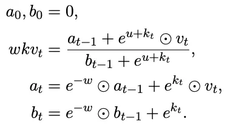

显然当前时刻t的结果可以由**上一时刻的结果+一些和序列长度无关的O(1)计算** 得出，因此整体复杂度是O(N)，非常环保。

然后再来看**channel mixing模块** 。

这里的R'K'V'都是带撇的，显然意思是值跟前面的RKV不一样，重新算了一下。同样对于左边R一支没什么好说的，右边一支的计算方法显得很莫名其妙：

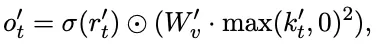

相当于把 $k_{t}'$先做一个squared ReLU，然后再把 $W_{v}'$乘上去。

首先是这个squared ReLU就显得很怪异，它未免比ReLU高明到哪里去，可能实验结果好一点所以用了。

再者就是把 $W_{v}'$乘到 $k_{t}'$上，也就是这里把k当成和v一个东西，我觉得有些抽象……看作者的意思是这个思路也取材于两三年前的MLP-Mixer（我当时看过这篇文章，不过忘了咋回事了）有空的读者大概可以去瞅一眼。

总之这里我看不出有什么理由一定要是这种形式，不过炼丹本来就是先有结果然后往上凑理由，可能作者比较耿直，懒得写理由了……

### 评价

对RWKV的评价，我觉得参考这个问题里各路大哥的评价即可。

[如何评价最新的RWKV论文 (arXiv 2305.13048)？](https://www.zhihu.com/question/602564718)

以及RWKV虽然长得像RNN，但是可以进行并行训练。这里就不细说了，同样可以参照上面问题的回答。


以上便是本文全部内容，日后可能会有不定时勘误和内容补充，不过基本算是完工了……要去码下一篇文了。