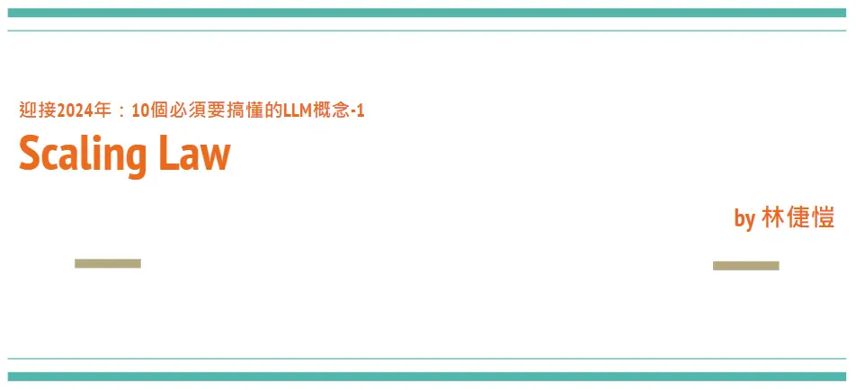
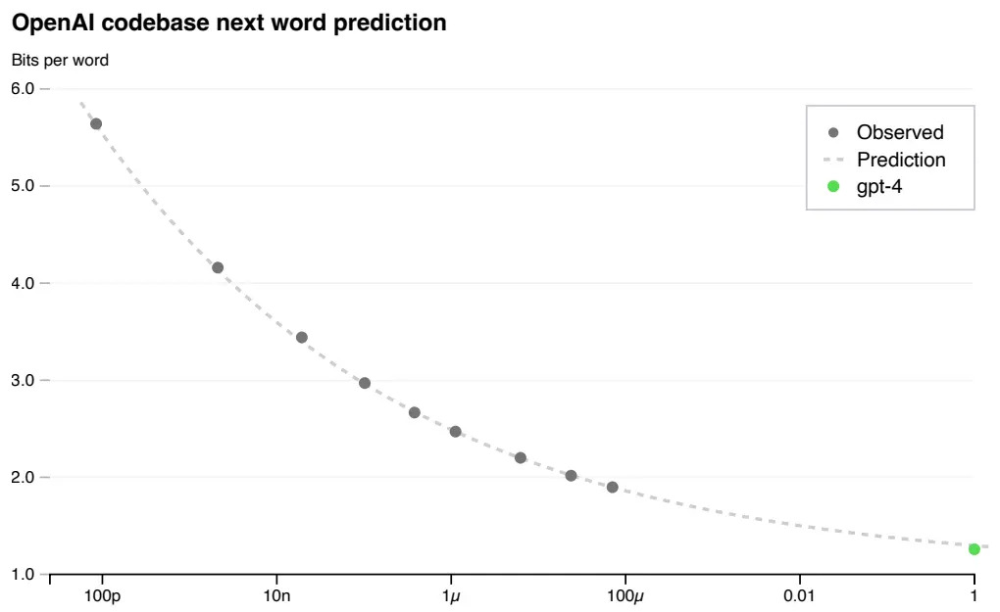
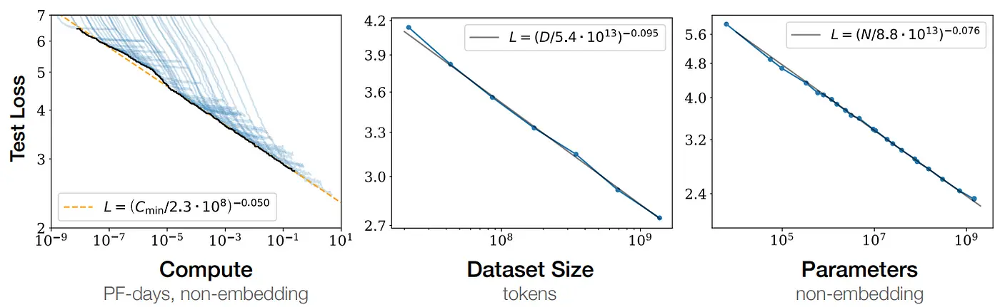
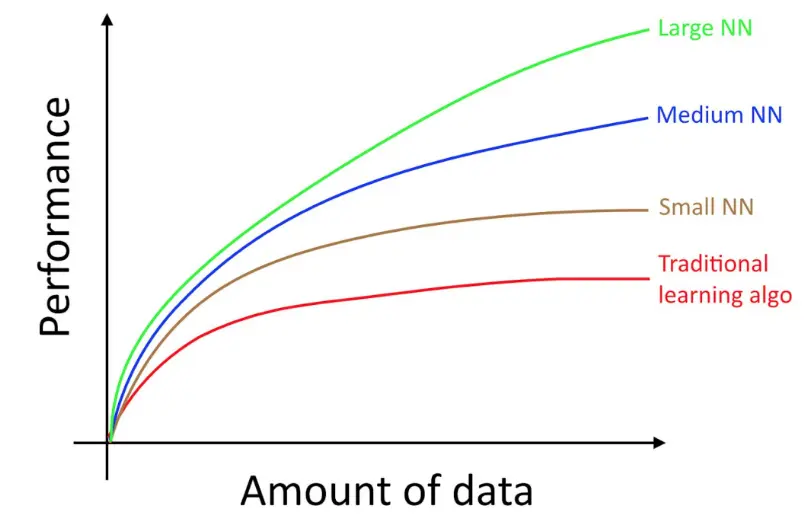
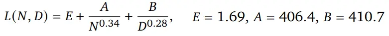
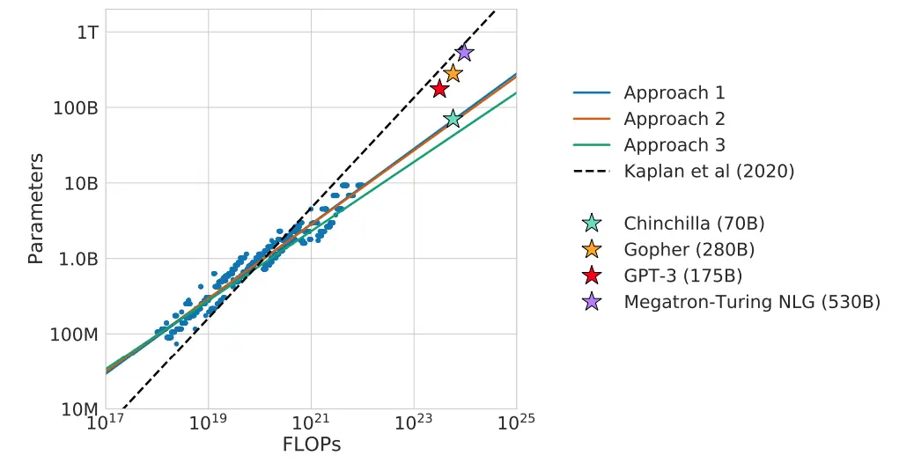
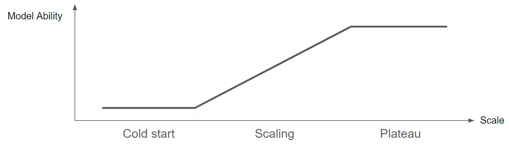
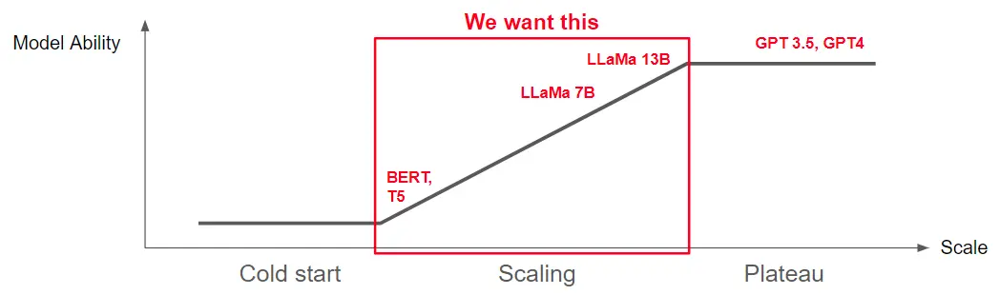
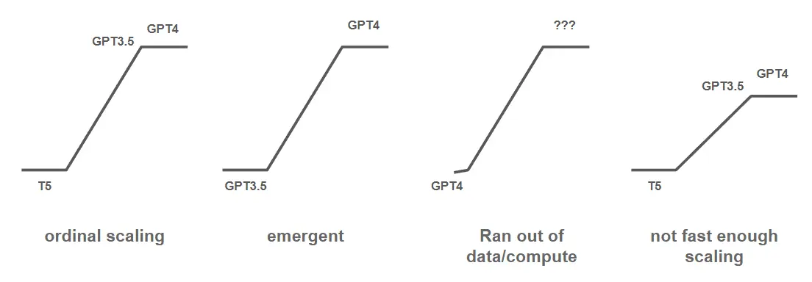

# 【LLM 10 大观念-1】缩放定律
  迎接 2024 年：10 个必须要搞懂的LLM概念-1
  [倢愷 Oscar](https://axk51013.medium.com/?source=post_page---byline--5f6a409d35c5--------------------------------)
  [文章原链接](https://axk51013.medium.com/llm%E5%B0%88%E6%AC%84-%E8%BF%8E%E6%8E%A52024%E5%B9%B4-10%E5%80%8B%E5%BF%85%E9%A0%88%E8%A6%81%E6%90%9E%E6%87%82%E7%9A%84llm%E6%A6%82%E5%BF%B5-1-scaling-law-5f6a409d35c5)

  
2023 年即将划下句点，然而，在这整年中，LLM论文、产品和技术的创新源源不绝，这是一个充满机遇和挑战的年份。这一年我也是放下过去的经验，从 0 重新学习关于LLM的各种知识。

  
在 2023 年底与 2024 年初，我希望把我的学习笔记提供给大家，整理 10 个我认为对于想要使用LLM的从业者、科技公司、创业者，最重要必须搞懂观念。

**  
今天来讲第一个重点：Scaling Law。搞懂 Scaling Law 能够帮助我们在训练前预测模型能力。**

本篇涵蓋關於Scaling Law的三大重點：  
1. 什麼是Scaling law？  
2. Chinchilla Scaling Law: 對LLM最重要的Scaling Law  
3. 因應Scaling Law，我們要如何改變我們的工作模式與思考方式？  
4. 2024年以前最重要的幾個Scaling Law

#  1. 什么是 Scaling Law

>   
> 在训练之前了解模型的能力可以改善关于对齐、安全性和部署的决策。  
>  — GPT-4 技术报告

  
来自 OpenAI GPT4 技术报告的图表。从此图可以看出他们在训练 GPT4 之前，就已经完美地预测到了 GPT4 的能力水平。

**  
Scaling Law 定义：我们可以用模型大小、数据集大小、总计算量，来预测模型最终能力。（通常以相对简单的函数形态，例如：线性关系）**

  
图表来自 OpenAI <神经语言模型的扩展法则>

  
其实在过去，DL 的研究者、从业者应该多多少少就会从两个方面听过 Scaling Law。

**  
第一、很多论文在各种 DL 领域早就提出了 Scaling Law：**

1.   
    Hestness 等人在 2017 年发现，在机器翻译、语言建模、语音识别和图像分类中都出现了扩展定律。
2.   
    OpenAI Kaplan 等人在 2020 年从计算量、数据集大小和参数量分别讨论了 Scaling Law。
3.   
    Rosenfeld 等人在 2021 年发表了关于 Scaling Law 的综述论文。在各种架构中进一步验证了 Scaling Law 的普适性。

  
除了以上论文，即便在过去没有关注到 Scaling Law 的研究发展，DL 研究者、从业者也一定知道第二点（或是说具备代表性的图）。

**  
第二、Scaling Behavior 早就隐藏在研究员的潜意识中。**

  
Andrew Ng 早在 2016、2017 就在各种场合画出过以下这张图，在 Deep Learning.ai 的课程中也时常出现，这张图原本是用来说明 NN 跟传统 ML 的适用时机，但却也显现出，对于研究员而言，早就具备一些关于 Scaling 的直觉。像是：Model 越大、Data 越多，performance 都会随之提升

 来自 Andrew Ng 的图

  
如果你还是第一次接触这个概念，就拿摩尔定律来当类比，摩尔定律我们知道：晶片性能跟时间会呈现某种可预测关系（更精确的讲是电晶体密度会随时间成倍数增长）。

  
DL 的 Scaling Law 说的就是，模型的性能会跟：1. 模型参数、2. Dataset 大小、3. 训练计算量，呈现某种可预测的关系。

#   
2. Chinchilla 缩放定律：对LLM最重要的缩放定律

  
接下来我们来讲在LLM时代你必须要搞懂的最重要的 Scaling Law: Chinchilla Scaling Law [3]

  
如果我们接受原本 Scaling Law 的定义（模型性能可藉由参数量、Dataset 大小、计算量预测），马上就会衍生出两个很重要的问题。

1.   
    Return（收益）：在固定的训练计算量之下，我们所能得到的最好性能是多好？
2.   
    Allocation（分配）：我们要怎么分配我们的模型参数量跟 Dataset 大小。  
      
    （假设计算量 = 参数量 * Dataset size，我们要大模型 * 少量 data、中模型 * 中量 data、还是小模型 * 大量 data）

  
2022 年 DeepMind 提出 Chinchilla Scaling Law，同时解决了这两个问题，并且依此改善了当时其他大模型的训练方式。

  
他们基于三种方式来找到训练LLM的 Scaling Law：

1.  固定模型大小，变化训练数据数量。
2.  固定计算量（浮点运算），变化模型大小。
3.  For all experimental results, directly fit the parameterized loss function.

  
For specific experimental details, I recommend reading the entire paper. I will directly state the conclusion: the Chinchilla Scaling Law proposes a complete scaling formula for the Return problem as follows.

  
方法 3 的结果来自 Chinchilla 缩放定律，N 是模型参数量、D 是数据量，其他都是系数

  
LLM最终的损失（困惑度），会随着模型放大、数据量增加而下降，并且与它们呈现指数映射后的线性关系。

  
这就像是开头 OpenAI 的图，找到了一个预估训练LLM回报的公式，依此，我们不用拿超大的模型跟数据，用几个月甚至几年的时间慢慢做实验，只要在小模型、小数据下验证、确认我们的公式，就可以设计一个更大型的训练，大幅度减少了实验成本。

  
Chinchilla 最大的贡献更是在解决 Allocation 的问题，他们发现

1. **  
    数据量（Tokens 数）应该要约等于模型参数量的 20 倍**
2.   
    并且数据量跟模型参数量要同比放大（例如：模型放大一倍，数据也要跟着增加一倍）

**  
Based on this conclusion, they found that many public large models at the time only considered increasing the number of parameters without providing a sufficient amount of data. Under the same computational load, Chinchilla reduced the model size but added more data, immediately training a model that outperformed other models at the time.**

#   
3. 根据缩放定律，我们要如何改变我们的工作模式与思考方式？

  
In the previous two paragraphs, I hope everyone has understood and accepted the Scaling Law and also discovered the various advantages brought by the Scaling Law.

  
接下来我想用一个小段落快速分享一下这一年，因应 Scaling Law，我的工作模式与思考方式的改变。

  
Scaling Law 的本质是：模型最终效能可以藉由模型参数量、Dataset 大小、训练计算量来预测。因此我们可以藉由小模型、少量 Data 的训练，来快速验证我们的想法。

  
但是即便只是这一个简单的 idea，背后最少也隐藏着 3 个重点。

## **  
A. 要能 Scaling，意味着组织必须能够支持持续扩大（Scale）模型的基础设施和 GPU 资源分配模式。**

  
首先，我们来说基础设施，以 7B 模型而言，粗估要占用 15GB~20GB 的 GPU 内存，也就是说如果你全参数训练，一张 A100（80GB GPU 内存）只能开 Batch = 4，如果你想要 Batch = 64, 128，那么必须先进行跨卡和跨机的训练环境设置。

  
同时为了加速训练，让内存使用率变得更高，每一两个月几乎就有新的技术、python 包出来，例如：Flash Attention 2, Zero 3, Vllm, Gradient Checkpoint, CPU offloading 等，随时追踪最新的训练优化技术，并且保持组织的服务器要能够高频率做改变，如果一个组织对服务器里面 pip 版本更新、各种包更新的周期都是以月为单位，注定会在基础设施层面落后全世界半年到一年。

  
接着讲 GPU 的资源分配模式，传统实验室、公司的 GPU 资源模式不外乎两种：

1.  平均分摊 GPU 给每个人
2.   
    因应 Project 去申请更大型的 GPU cluster

  
这两种模式在 Scaling 时代都有明显的弊端，平均分摊 GPU 会让公司不具备跑真正大型实验的能力，因应 Project 去申请则容易导致 GPU 资源过度浪费。例如：具备 16 张 A100 的团队大可以每个实验都直接跑 7B 的 level，不必去验证 3B、1B 的可行性。

  
A better approach would be to ensure that each project has the capability to conduct proof of concept on models below 3B, and to design a formal scaling check mechanism. Only teams that pass the scaling check can use larger GPU clusters "by experiments".

  
The scaling check mechanism mentioned here is crucial. When we want to run 7B or even 13B models, it is best to have consistent scaling behavior on models below 3B. It is preferable to conduct proof of concept on both BERT and T5 models of this size first.

  
如果在 2023 年，没有解决 infra 问题，也没有调整出适合LLM scaling 的资源分配模式，很有可能在 2024 年会连其他公司车尾灯都看不到。

##   
B. 思考、实验、讨论都要把 Scaling 当作核心

  
承接第一点以及原本对 Scaling 的理解，一个好的团队，在做跟 Large XXX model 相关专案时，一定要把 Scaling 当作一切的核心。

  
但 Scaling 其实也是一个复杂的过程，其中最少都会包含三个阶段：

1.   
    冷启动：一开始模型太小、数据不够、问题太难时，会呈现怎么训练都没有帮助，好几个不同大小的模型、数据集训练出来的结果都差不多差，看不出扩展的时期。
2.  扩展：正常的扩展时期。
3.   
    平台：撞到了某个隐形的天花板，可能是数据集质量带来的天花板、本身任务的不可约误差、架构的能力天花板。

  
我们心中希望的其实是处理中间这段，但是实际上遇到的问题可能复杂很多。

  
而这就必须要辨识出几种 Scaling 常见的 Patterns（如下图）

 4 种常见的扩展模式

1.   
    Ordinal Scaling：这是我们最理想的情况，从 BERT base 或是 T5 small 开始，随着模型变大，效果显著上升，因此我们可以画出一条很漂亮的 Scaling Law，可以每天准时下班，晚上做梦都会笑。
2.   
    涌现能力：专指那些只有参数量到一定大小（例如：GPT4）后才能做得好的任务，比如在 2023 年中普遍认为推理和编码至少需要 30B 才能做好。涌现能力我会在之后再更详细提。
3.   
    数据/计算资源耗尽：确实出现了扩展的情况，但是目前连 GPT4 都做不好。
4.   
    缓慢扩展（不够快）：确实出现了扩展的情况，但是增长速度明显过慢。

  
四种模式分别都有不同的实验方法、改进方法可以做，不过因应篇幅过长，我留到之后再详细说明我现在的扩展流程，不过重点只是先放在，实验、思考都要时常思考扩展。

##   
C. 一个好的 idea，一定要具备 Scale 的潜能

  
这就又提到第三个重点，我们要依照「一个 idea 是否具备 Scale 的潜能」来找出能够长期执行的 idea、判断实验的重要性。

  
举个例子，以大部分公司而言，常见的 Data 来源会有下面几种：

1.   
    人工 Label：依照任务难易度而变，很多 NLP 任务在公司能够 Label 的 scale 都在 1,000 上下，这显然就不是好的 scale idea。
2.   
    Crowd Source：依照我的经验，NLP 的题目，Crowd Source 普遍可以在一定的预算内做到 10k~100k 这个 level，如果你的 project scaling law 在这个范围内是可行、可接受的那可以考虑。
3.   
    无监督学习：如果公司有整理好的文本数据的话，可以快速估计一下文本的 Scale，并且依照公司文本快速去画出 Scaling law，判断公司内这个领域的文本数量是否足够。
4.   
    从 GPT3.5 或 GPT4 提炼：使用 GPT3.5 和 GPT4 生成合成数据，并快速绘制该项目的 Scaling law，预估最多需要多少 token GPT4 的请求才能成为一个好的项目，从而进行成本和时间控制。（提炼将在我后面的其他部分占非常大的篇幅，之后会详细讨论。）

  
对于研究机构，也可以基于 Scaling 快速评估一个想法是否有可能持续做大做强，以下就举一个例子（RLHF vs DPO）：

1.   
    RLHF（来自人类反馈的强化学习）：理论上可以无限扩展，因为当我们奖励模型训练完后，我们可以让LLM与奖励模型自我对弈，所以关键是解决 RL 的不稳定性和人类偏好的噪声。其中不稳定性又牵涉到需要多少人类偏好数据，其实还是会回到数据扩展的问题。
2.   
    DPO（直接偏好优化）：将 RL 从 RLHF 中移除，变得更稳定的优化，但也移除了自我对弈的优点，必须要回头考虑人类偏好数据的可扩展性问题。

  
从这个角度就可以看出来，如果是可以快速收取人类偏好数据的公司（有庞大的用户基础，例如：谷歌、苹果、脸书），大可考虑 DPO，但如果公司没办法快速扩展人类偏好，还是要回头思考 RLHF 的各种问题，借由LLM和奖励模型的自我博弈来扩展。

#   
4. 2024 年以前最重要的几个缩放定律

1.   
    预训练的扩展法则：本篇重点的内容，必须要详读 OpenAI 的扩展法则 [2]和 DeepMind 的 Chinchilla 扩展法则 [3]。
2.   
    过度训练预训练的缩放法则：主要由 LLaMa [4]提出，Chinchilla 找到的是计算最优，意思是在固定运算量下最好的配比。但是我们只有在训练超大模型才会考虑计算的限制，而像是 7B, 13B 这种级别，我们就要思考如何把它们做得越强越好，所以大可以过度训练它们，用更多的数据训练小模型，让它们比预期的更好，典型例子是 LLaMa 1 和 LLaMa 2 [5]。
3.   
    藉由数据质量提升缩放定律斜率：典型是微软的 phi 系列 [6, 7]，通过更好的数据，使模型在相同大小参数、数据集的情况下获得更好的效果，最终他们推出 phi-2，用 2.7B 模型胜过大量 7B, 13B 模型。
4.   
    指令微调的缩放定律：由谷歌提出，指令微调阶段也有缩放定律，因此指令微调的数据数量仍然是一个简单且重要的考量依据。[8]
5.   
    下游性能与LLM损失的缩放定律：阿里巴巴发现模型的 SFT 分数与 ICL 分数，与原始损失也有缩放关系，也就是说我们甚至在微调前也可以一定程度预判最终下游能力。[9]
6.   
    专家混合语言模型的缩放定律：由 DeepMind 提出，语言模型如果做了 MoE 后，专家数量也会与损失呈现缩放关系，其中发现当我们有 8 个专家的时候，一个模型大概可以与两倍大小的模型有差不多的性能。[10]
7.   
    Context Length 的 Scaling Law：今年，还有部分团队开发把重点放在加长LLM的 context length，意思是可以看、生成更多 token，LongLLaMa [11], LongLora [12]和 LightSeq [13] 都试图提出针对 context length 的不同 scaling law。
8.   
    Data Repeat 带来的不同 Scaling Law：2023 另一个大议题就是在可见的未来，网络上可见的 Data 数量可能会不够了，因此研究 Data Repeatition 就变得很重要，AI2 发现 repeat 4 次都还可以给 LM 带来有效的 improve [14]，新加坡国立大学跟爱丁堡大学的研究者则提出 11 个针对 data repeatition 的 insight [15]，非常建议把这篇论文重复详读多次。
9.   
    RLHF 中奖励模型的扩展法则：OpenAI 讨论了在 RLHF 中奖励模型的扩展以及使用代理奖励模型对扩展的帮助。[16]

#  结语

  
Scaling 是LLM之所以能够成功的最重要因素之一，因此从目前重要LLM玩家（例如：OpenAI, Google, Meta, …）对 Scaling Law 的理解学习，并把 Scaling 的概念带到日常工作、实验跟思考，是要跟上这波LLM发展的重大关键之一。

  
希望我这篇文章能够帮助大家更清晰理解 Scaling Law，如果有相关问题也欢迎随时回复跟我讨论。同时我也持续有在接家教、演讲跟顾问，今年会加入很多LLM的新知识，也欢迎到我主页用 email 跟我联系。

#  Scaling Law 必看学习清单：

1.   
    斯坦福 cs224n 课程视频：扩展语言模型
2.   
    斯坦福 cs324 课程中 scaling law 的幻灯片
3.   
    Chinchilla Scaling Law 的论文
4.  OpenAI 关于 Scaling Law 的论文
5.   
    [进阶] Sasha Rush 在 Simon Institute 的演讲： 数据受限语言模型的扩展
6.   
    [进阶] Go smol or go home，这篇博客讨论了 Chinchilla 的局限。
7.   
    [进阶] Yasaman Bahri 在 Simon Institute 的演讲： 理解神经扩展定律的起源和分类

#  参考文献

1.   
    GPT-4 技术报告。OpenAI。2023 https://arxiv.org/pdf/2303.08774.pdf
2.   
    Kaplan, Jared, 等人。“神经语言模型的扩展法则。”arXiv 预印本 arXiv:2001.08361 (2020)。
3.   
    Hoffmann, Jordan, 等人。“训练计算最优的大型语言模型。” arXiv 预印本 arXiv:2203.15556 (2022)。
4.   
    Touvron, Hugo, 等人。“Llama: 开放且高效的基础语言模型。” arXiv 预印本 arXiv:2302.13971 (2023)。
5.   
    Touvron, Hugo, et al. “Llama 2: 开放基础和微调聊天模型。” arXiv 预印本 arXiv:2307.09288 (2023).
6.   
    Gunasekar, Suriya, et al. “教科书是你所需的一切。” arXiv 预印本 arXiv:2306.11644 (2023).
7.   
    李元志等人。“教科书是你所需要的一切 ii: phi-1.5 技术报告。”arXiv 预印本 arXiv:2309.05463 (2023)。
8.   
    Chung, Hyung Won 等人。“扩展指令微调语言模型。”arXiv 预印本 arXiv:2210.11416 (2022)。
9.   
    袁正等人。“使用大型语言模型学习数学推理的缩放关系。” arXiv 预印本 arXiv:2308.01825 (2023).
10.   
    克拉克，艾丹等人。“路由语言模型的统一缩放定律。” 国际机器学习会议。PMLR, 2022.
11. Tworkowski, Szymon, et al. “Focused transformer: Contrastive training for context scaling.” arXiv preprint arXiv:2307.03170 (2023).
12. Chen, Yukang, et al. “Longlora: Efficient fine-tuning of long-context large language models.” arXiv preprint arXiv:2309.12307 (2023).
13.   
    李大成等人。“LightSeq: 长上下文 Transformer 的分布式训练的序列级并行性。”arXiv 预印本 arXiv:2310.03294 (2023)。
14.   
    Muennighoff, Niklas 等人。“扩展数据受限的语言模型。”arXiv 预印本 arXiv:2305.16264 (2023)。
15.   
    薛福兆等人。“重复还是不重复：在代币危机下扩展LLM的见解。” arXiv 预印本 arXiv:2305.13230 (2023).
16.   
    高磊、约翰·舒尔曼和雅各布·希尔顿。“奖励模型过度优化的扩展法则。” 国际机器学习会议。PMLR, 2023.