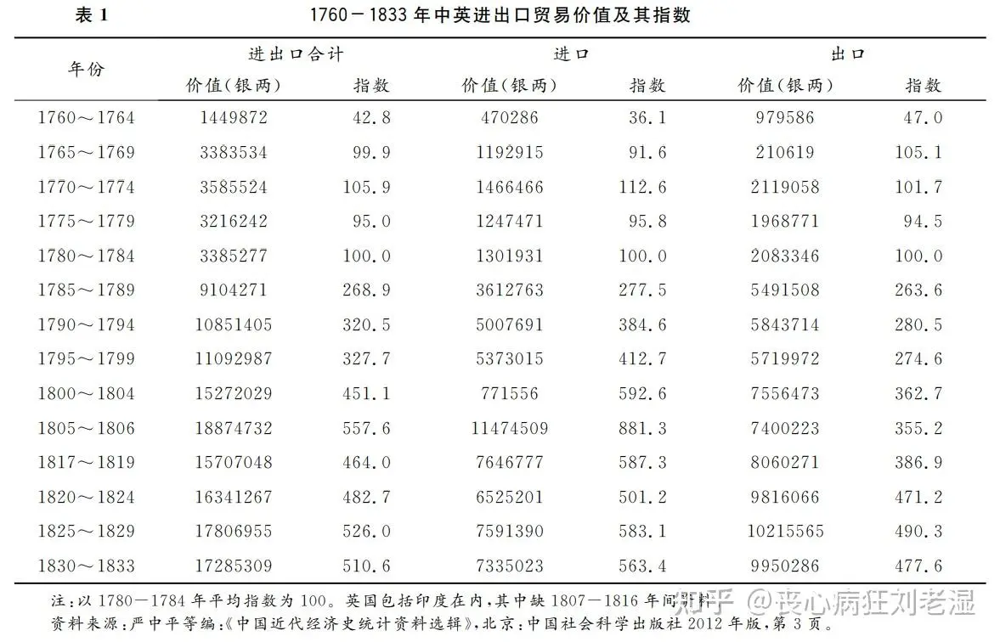
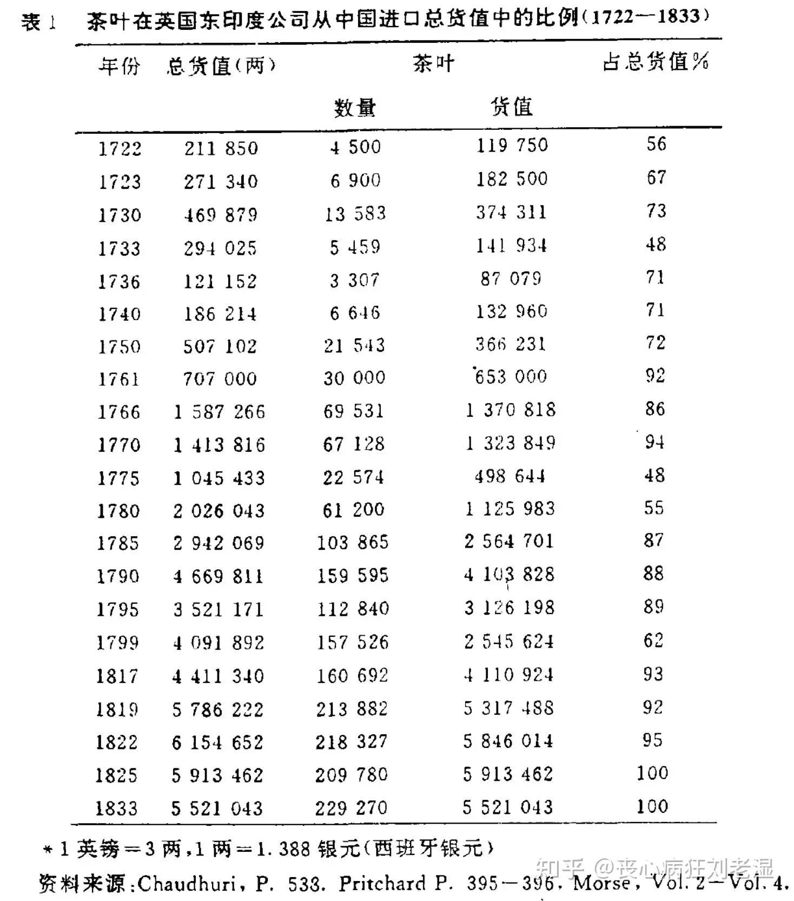
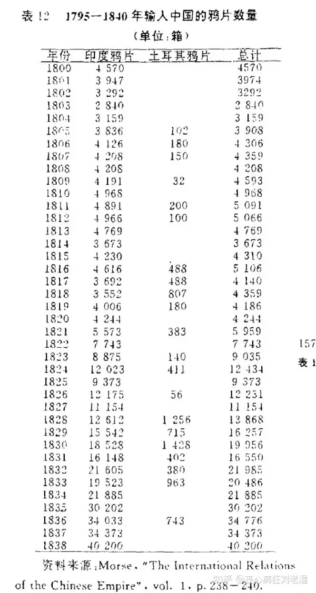

# 为何英国人当年要来中国倾销鸦片？
|Archive 自|Archive 创建于|分类|原始作者|原始地址|原始资源创建时间|原始资源更新时间|
|-|-|-|-|-|-|-|
|知乎|2024-11-28 05:50|分类|丧心病狂刘老湿|[链接](https://www.zhihu.com/question/627096046/answer/3618540832)|2024-09-07 07:30|2024-09-07 07:30|

为何英国人当年要来中国倾销鸦片？

我好喜欢这个调调啊。

首先中英贸易逆差这事你不用自己费劲洗了，公认的一个基本事实是中国在鸦片战争以前，大部分时间里中国对西方都是贸易顺差的。你有没有想过为什么宋朝统计财赋的时候用的是“贯、石、匹、两、束”，而到了明代就可以搞一条鞭法，用白银作为本位货币了？

因为大航海时代来了，西班牙人在南美发现了波托西银矿，天量的白银在贸易中流入中国。洋带人解决贸易逆差的办法简单粗暴，就是一船一船运着鹰洋来中国直接交换货物。

> 1751年，四艘自英赴华船只就带了值11万9千镑的银子，而货物则只不过值10842镑，白银价值大于货物十倍多[[1]](#ref_1)

荒唐的地方在于这种贸易对东方和西方都是有利的，因为对欧洲人来说银子是从地里（南美的矿山）长出来的，大量白银真的全运回欧洲显然会导致货币超发，引起通胀；对中国来说，大一统农耕帝国所伴生的一个巨大问题就是货币供给量常年不足，北宋小平钱是严禁外流的，川陕地区长期只能使用极不方便的铁钱，由此甚至催生出了世界上最早的货币交子，大量白银流入使得明代之后中国终于可以拿白银来做本位货币了。

> 肖努曾经估计，美洲白银的1／3最终流入中国，另有1／3流入印度和奥斯曼帝国（转引自Adshead1993）。魏斐德（1986：3）认为，可能有一半美洲白银最终流入中国。[[2]](#ref_2)

那么谁在这个过程中受伤了呢……

美洲原住民：微笑，保持微笑。

所以题主所脑补出来的第一个观点就是错误的：

> 只有买错的顾客，没有卖错的商家，没有人风里雨里、历尽艰险、万里迢迢跑到你这里和你做赔本买卖的！

如果你不认为白银是一种货物的话，那么你就会发现欧洲人一直都这么缺心眼，他们一直都在干“万里迢迢跑到你这里和你做赔本买卖”这种事。

但是为什么到1840年前后这种赔本买卖做不下去了呢……

因为19世纪初南美开始闹革命搞独立了。

1810-1819 年，墨西哥的银币铸造量下降到此前的40%左右，到1840年铸币量虽然恢复了一些，但是铸币质量大不如前，这种银币在流入中国时是被大幅“折价”使用的。同时英国人自己的海外贸易也不顺利，1802年英国的对外出口总额是45102330英镑，1819年——注意此时第七次反法同盟已经把拿破仑打败了——出口总额跌落到了35208321英镑。而且最关键的地方是1784年英国把从中国进口茶叶的关税降低从110%降低到了10%，使得茶叶贸易已经扩大到了一个极为可观的地步，如果因为没有足够的白银到中国来换茶叶，你让伦敦的老爷们怎么办？

这里要说明的是题主的另外一个观点也非常荒谬：

> 没有糖，英国人不会从中国进口茶叶

实际上从18世纪20年代开始茶叶就在东西方贸易中占据极为重要的地位：

> 茶叶是上帝，在它面前其他都可以牺牲[[3]](#ref_3)

而在英国，茶是在打败了咖啡之后成为英国国饮的，因为在大英帝国茶叶最初的形象是“上流社会的奢侈品”：1662年查理二世迎娶凯瑟琳，后者将茶叶作为嫁妆带到英国王室，并在王室带动了宫廷饮茶的习惯，进而将这个习惯扩大到了整个英国贵族圈子，最后才普及到民间的，所以在英国，茶实际上是一种兼具功能性饮料和文化符号的奇妙饮品。

所以题主对“糖”在英式茶中所起到的作用理解完全错误，给茶里加糖最初是因为这俩都是奢侈品，一起喝那就是富贵无边。有意思的是等到茶叶贸易日趋发达、下层人也开始喝得起茶的时候恰好美洲甘蔗种植园发达了，蔗糖进口量也扩大了，因此这两者始终相伴成为了好搭子。而英国政府非常乐于看到茶的普及，因为一方面能从中征到巨额进口关税，另一方面工业革命之后劳工确实需要一种饮料来代替酒：你酒喝高了上机床是™真的出事，茶喝多了顶天尿个裤子，当然这里的一个小插曲是英国人最初盯上的是咖啡，但是咖啡真的没有茶好入口……

这导致了两个极其严重的后果，一是茶叶逐渐成为东印度公司从中国进口的最大宗货物，而且没有之一；同时茶叶税也成为了英国本土的一大税源，我要是没记错的话在1820年前后能占到总税收的1/12。

来，你现在穿越到1800年，去伦敦找汤姆爵士，跟他说咱别喝茶了，把茶叶贸易给断了，你看他什么反应。

如果有别的办法，英国人也不希望用鸦片来作为白银的替代物来继续茶叶贸易，因为这玩意本身是把双刃剑。但是没有办法，中国的农业经济韧性太强了——下面我们就要说说题主的第三个错误认知了

洋布对土布有优势

> 中国传统的“男耕女织”的自给自足的自然经济下，一个农村家庭的主妇，在其他什么种地的活都不做，除了基本的家务劳动外，只日日夜夜专门坐在家里，用一架纺织机织布做衣服，那么，如果她给自己的丈夫做一套衣服（包括上衣和裤子，当然肯定是麻布，不可能是丝绸），从麻从田地里被收割（这个田地收割工作也由丈夫来完成）来，她开始捣烂处理这些麻，到把这些麻变成已经完全做好的一套可以穿的衣服，前前后后要日日夜夜辛苦工作一年半的时间！

工业化生产确实有优势，有些地方农妇做麻衣也确实可能需要一年半的时间，然而只要你稍稍动动脑子，就能想到一个问题，那就是……

明清开始，就有棉布了。

> （松江府）农暇之时，所出布匹日以万计。 以织助耕，女红有力焉。 [[4]](#ref_4)

我再强调一遍，一般人对大一统农耕帝国的规模效应是缺乏直观认识的。工业革命早期的机织布对手工业棉布并没有决定性的优势，而且就算你长途海运+工业化生产到港棉布价格还能控制在合理范围之内，但是到港之后呢？往内地运输不要运费的吗？所以在18世纪末19世纪初，英国对中国的布匹出口只有几十万两白银的规模，指望用这点玩意填茶叶的逆差那真的是天方夜谭

> 1770年代，中国发生饥馑，政府鼓励种植粮食，导致对进口棉的需求加大，1775-1779年，在广州贸易的主要输入品中，印棉的价额是年均288334银两，首次超过英国毛织品的输入价额(年均277671银两)，定位在英国输华第一大货品的位置。此局面延续到1819年。[[5]](#ref_5)

需要强调的是，茶叶与棉布也一直是中国对俄贸易的大宗商品，有些人所臆想出来的“茶叶不重要”、“土布远不如洋布”属于真空中的球形幻想。要知道中俄贸易那可真的是长途跋涉的艰苦旅程，运茶砖要把茶从产地运到张家口，然后由张家口运到恰克图，整个水路运输过程近万公里，路上要走4个月，然后俄国商队再从恰克图把茶运回莫斯科。1798年中俄茶叶贸易大概是1. 3 万担，到1839年达到了54486担——作为对比，1799年东印度公司从中国进口茶叶大概是15.7万担。那么没有巨额利润，你肯跋涉万里花上这么久时间来搞贸易吗？

这些因素决定了英国只能用鸦片来填贸易逆差的口子，而东印度公司最初对鸦片贸易是持有戒备心理的——因为正常人都知道这种贸易并不光彩。问题是不卖鸦片真的没有别的办法填贸易逆差，而且印度本身还挺适合种植鸦片的，所以从1820年之后这运往中国的鸦片就打着滚送了过来。

另外有些人所幻想的“一口通商所以鸦片贸易都是官老爷自己在倾销”更是无稽之谈，大部分的鸦片贸易都是通过走私来完成的，其间的利益关系之错综复杂令人咋舌：东印度公司为了避免麻烦，所以采用的是鸦片专卖制度，通过拍卖的方式出售提炼后的鸦片。然后“港脚商”会拍下鸦片，将其运输到中国附近的海上，此后大批走私商将这些鸦片吃下，秘密运输到内地，在这个过程中会党——也就是传统意义上“反清复明”的三合会等等会负责为鸦片保驾护航，贸易过程中需要的大批银两则由山西票号私下帮助周转。而为了让官府睁一眼闭一眼，这些人当然还要给官老爷们一分孝敬。

1834年之后，东印度公司的特权被废，导致鸦片贸易规模迅速不受控制地扩大了。从1832年到1838年，输入到中国的鸦片数量增长了一倍，这意味着海量的白银外流。而当时大清完税要用白银、小民日常交易用铜钱更多，所以白银外流就意味着银贵铜贱，一两白银从兑换1000枚铜钱上涨到鸦片战争前夕的1600枚铜钱，等于老百姓在家什么都没干税负就涨了60%。而对于大英帝国来说，他们跟中国做了这么多年生意，竟然在19世纪之后见到了回头钱！靠着鸦片贸易开始从远东运输白银回大不列颠了，你这边要禁烟，我大英帝国日子还怎么过？

干吧，阁下！

## 参考

1. [^](#ref_1_0)牟安世．鸦片战争［M ］．上海：上海人民出版社， 1982．
2. [^](#ref_2_0)安德烈.贡德.弗兰克.白银资本:重视经济全球化中的东方[M].中央编译出版社,2000.
3. [^](#ref_3_0)Pritchard, E. H. (1970). The Crucial Years of Early Anglo-Chinese Relations, 1750-1800. United States: Octagon Books.
4. [^](#ref_4_0)松江府志
5. [^](#ref_5_0)王建朗,黄克武.两岸新编中国近代史? 晚清卷(上,下)[M].社会科学文献出版社,2016.