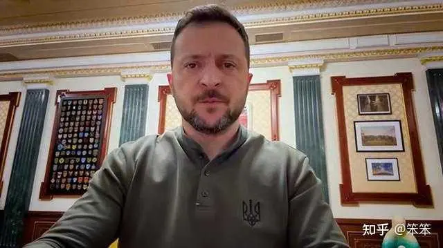

| Archive 自 | Archive 创建于      | 分类  | 原始作者 | 原始地址                                                              | 原始资源创建时间         | 原始资源更新时间         |
| --------- | ---------------- | --- | ---- | ----------------------------------------------------------------- | ---------------- | ---------------- |
| 知乎        | 2024-11-18 01:35 | 分类  | 笨笨   | [链接](https://www.zhihu.com/question/645251998/answer/33003089864) | 2024-11-16 09:24 | 2024-11-16 09:24 |

假如泽连斯基去世了，战争会不会立即结束？

我算发现了，国人对西方总统的认识，依然还停留在秦始皇、汉武大帝、康熙大帝、雍正王朝、三国演义这个层面，把西方国家的民选总统，都当成千古一帝来看。

美国是市自治、州自治。总统管不了州长、州长管不了市长。这个市的事情，这个市的人说了算，州长管不了。这个州的事，这个州的人说了算，总统管不了。

中央的立法、司法，总统管不了。收税、印钞，管不了。对外关系、打仗、条约这些重大事件还得议会批准。

美国背地里还有另外一套。当年尼克松受到弹劾，情绪很不稳定，国防部长立即给部队下令：不许执行总统的任何命令。特朗普后期比较乱套，参谋长联席会议主席也给中国打过电话：放心，不会打仗。明面上国防部长要听命于总统，实际上国防部长对总统也有监控的作用。中情局这些部门都能掣肘总统。

**但美国总统在西方国家里，权力已经算是非常大了。** 

西方大体分总统议会制、议会总统制、半总统半议会制。

美国是总统议会制，意思是总统的权力最大，但最大也只能大到上面这样。半总统半议会，总统跟议会的权力差不多。

**乌克兰是议会总统制！总统的权力就更小了。乌克兰拉达的权力在总统之上。** 

西方的很多国王、总统、总理在本质上是：国家的形象代言人。实际权力极小。啥事都不让管，工作量也小。所以这些领导人假期非常多，整天游手好闲。

**泽连斯基是乌克兰总统，是乌克兰国家的形象代言人。** 

战争最危急的时候，盟友都劝赶紧跑的时候，很多人都等着看乌克兰垮台的时候，泽连斯基没跑。乌克兰国家的形象没倒。这就是他作为总统的任务和意义。然后他经常去前线转转，慰问部队。再跑到国外演讲，拉赞助。干的都是形象代言人的工作。

美国的市下面还有社区，社区自治。每个区都把自己管好，市长也没啥事可干。

形象代言人，对职业、出身没啥要求，但对形象有要求。毕竟要代表国家，不能长得太丑，要能在大庭广众之下滔滔不绝的讲。得结婚、有孩子，显得身心健康，有福气。

**都2024年底了，相当一部分人还以为总统就是皇上呢。** 

他们的思维还是必须有千古一帝的英明领导，一切都得由皇上来管理，皇上掌握一切权力，皇上指导一切。一切成绩都是皇上圣明的结果，没有皇上，他们就完了，没有皇上，就活不下去了。

面对天下大事，他们再把皇上套在外国的总统身上。

从根上讲，他们以为总统大权独揽、说一不二，想跟谁好就跟谁好，想打谁就打谁，想征税就征税、想印钱就印钱。

然后他们再站在这个基础上评价总统。

芬兰上一任的85后女总理很活泼，参加派对跳热舞。文盲们又开始套：牝鸡司晨、芬兰完了，哈哈哈，真开心。他们以为芬兰需要伟大总理日理万机、指导一切、呕心沥血的英明领导。

网上还流传着一段丹麦议会研究救助马戏团大象，女总理笑场停不下来的视频。这也必然要遭到一些人的嘲讽。首先，救助动物，善恶的问题，在丹麦人眼里不是小事。但说句实话，他们也确实没啥大事可干。老百姓不需要他们的英明领导。

**乌克兰跟不跟俄罗斯好，向不向西方靠拢，泽连斯基说了不算。** 

他是民选总统，是老百姓都讨厌俄罗斯，才能选出个讨厌俄罗斯的总统。跟不跟俄罗斯好，向不向西方靠拢，是多数群众、各个州、议会说了算。

然后他们选出泽连斯基当个整体的代言人。

所以打起来以后，乌克兰上上下下才能这么团结。如果只是泽连斯基讨厌俄罗斯，乌克兰各界喜欢俄罗斯，俄军一打过来，不是立马崩盘了嘛。

很多人首先是以为泽连斯基是乌克兰的皇上，然后再推导出：泽连斯基把乌克兰带进了灾难。

然而实际上是底层、各界想往哪个方向走，总统跟着走。他只是代表大家出来说个话。

**更离谱的是居然有很多专家说泽连斯基指挥军队的水平不行，这话毫无任何常识。** 

总统不能指挥军队作战，这都是最基本的小常识。专家教授说的话匪夷所思。西方国家的国防部长都不能指挥打仗。指挥打仗的最高级武官是参谋长。总统还只是个形象代言人。议会、国防部研究好要打谁，总统最后签个字，任务就完成了。具体怎么打，总统管不了。国防部长是文官，相当于大管家的角色。

但总统可以不签字，不让你打。也可以撤掉将军的职务。各个机构之间是制衡的关系。

俄乌战场上的事，泽连斯基只是个看客。他不能指挥打仗，哪来的指挥水平不行的问题？

所以说有没有泽连斯基，乌克兰都是一个样的。各界都不喜欢俄罗斯、都想向西方靠拢，没有泽连斯基，也会选出另外一个代言人。不过泽连斯基把总统、形象代言人的工作完成得极其出色。如果当初选的是别人，俄军打过来，总统跑了，情况恐怕会大不一样。

**这种情况下，俄罗斯也不能暗杀泽连斯基，如果俄国人思维正常的话。** 

他活着是英雄，死了得成神。为国牺牲，境界又上了个大大的台阶，会被后代敬仰千年。他没实权，死了对乌克兰没实质影响，再选个新总统还是一样。反倒更悲壮，更容易让人同仇敌忾。