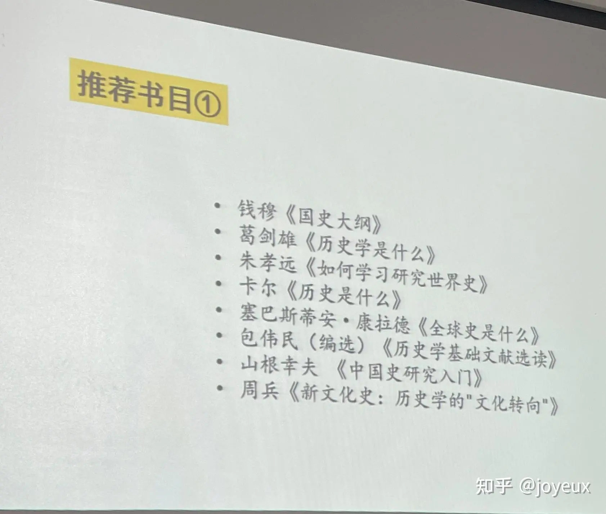
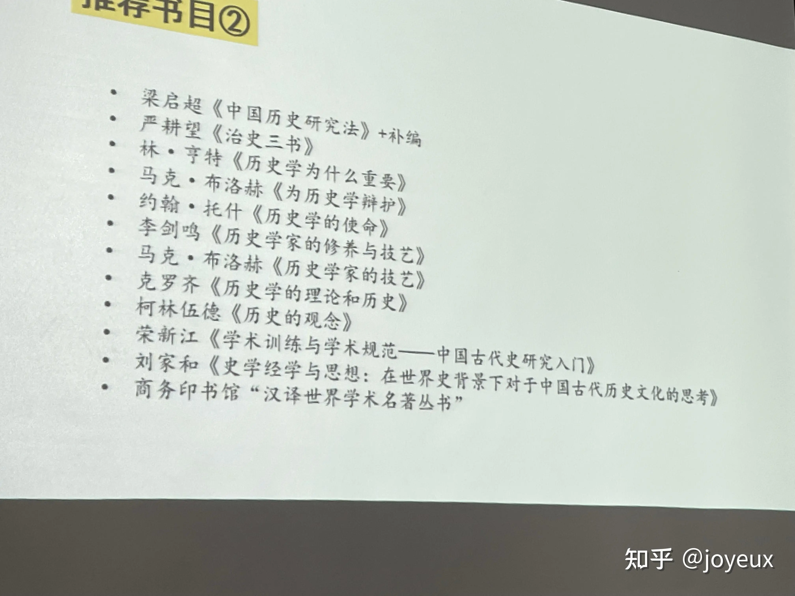
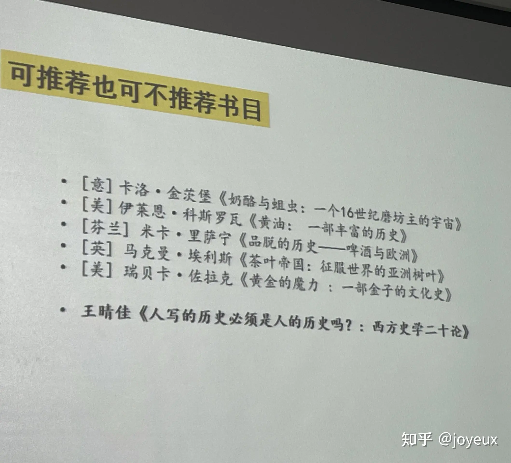
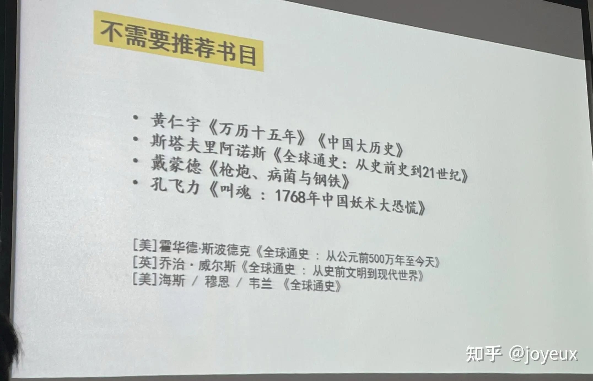
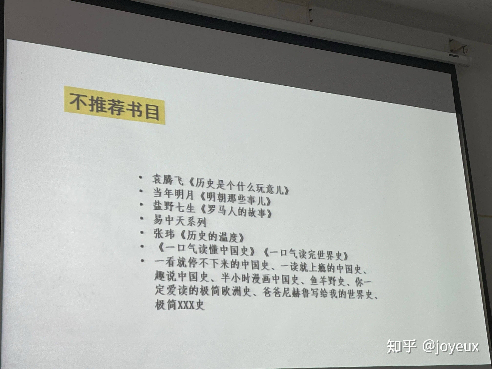

---
tags:
  - jz
  - 历史
---
# 有什么不错的历史书籍推荐？

| Archive 自 | Archive 创建于      | 分类    | 原始作者   | 原始地址                                                             | 原始资源创建时间         | 原始资源更新时间         |
| --------- | ---------------- | ----- | ------ | ---------------------------------------------------------------- | ---------------- | ---------------- |
| 知乎        | 2024-11-19 01:55 | jz 历史 | joyeux | [链接](https://www.zhihu.com/question/485546594/answer/2206470100) | 2021-11-04 10:55 | 2021-11-07 14:37 |

某历史学大一新生上课时老师的推荐

不推荐的：

