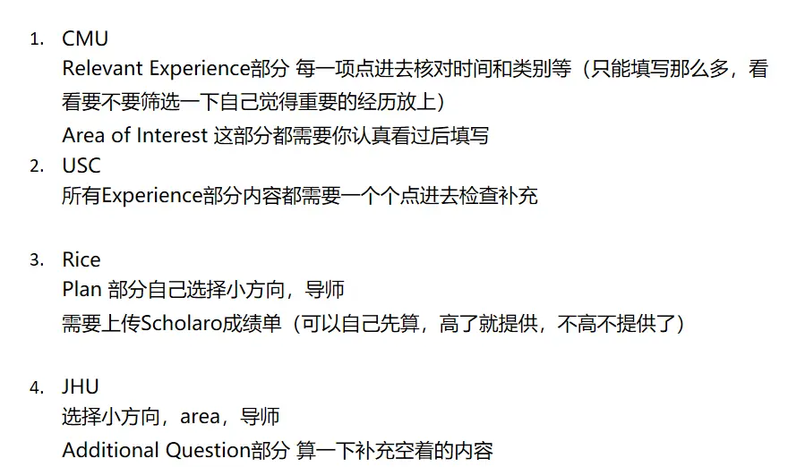

# 学校网申链接
其中，
JHU---免
Cornell---免
Rice---免
4. CMU---不免
5. USC---不免

|                                                               |               |                                                                 |                       |      |                                                                                   |                   |                                                                                                                  |
| ------------------------------------------------------------- | ------------- | --------------------------------------------------------------- | --------------------- | ---- | --------------------------------------------------------------------------------- | ----------------- | ---------------------------------------------------------------------------------------------------------------- |
| 学校/项目                                                         | ddl           | 语言要求                                                            | GRE                   | 申请费  | 申请链接                                                                              | 推荐信               | 联系方式                                                                                                             |
| **JHU MSE in Electrical and Computer Engineering**            | 10.1          | TOEFL 100 / IELTS 7.0  Waive                              | Optional, Waive       | Free | [Apply](https://applygrad.jhu.edu/apply/?sr=a2ae7785-6082-475c-8418-33159161cba3) | 3RL, WES Optional | Email: ecegrad@jhu.edu / WSEGrad-Admissions@jhu.edu   Address: 3400 North Charles Street, Baltimore, MD 21218 |
| **Cornell M.Eng. in Electrical and Computer Engineering**     | 10.15         | TOEFL (S22, R20, L15, W20) / IELTS 7.0  Waive             | Not Required, Waive   | $105 | [Apply](https://gradschool.cornell.edu/admissions/application-steps/apply-now/)   | 3RL, 2 Academic   | Director: Joe Skovira (jfs9@cornell.edu)                                                                         |
| **Rice Master of Electrical and Computer Engineering (MECE)** | 10.2 (2周内出结果) | TOEFL 90 / IELTS 7.0  Waive                               | Optional, Recommended | $85  | [Apply](https://gradapply.rice.edu/)                                              | 3RL               | Email: ecemece@rice.edu                                                                                          |
| **CMU ECE - Software Engineering**                            | 8.31          | TOEFL 86 (R&L&W 22, S20) / IELTS 7 (R&L6.5, S&W6)  不Waive | Optional              | $75  | [Apply](https://gradadmissions.engineering.cmu.edu/apply/)                        | 3RL + Video       | Email: apps@ece.cmu.edu / Phone: 412-268-4786                                                                    |
| **USC (CS-AI / MS ECE-ML&DS / CS General)**                   | 9.1           | TOEFL 90 (20+) / IELTS 6.5  不Waive                        | Not Required          | $90  | [Apply](https://usc.cas.myliaison.com/applicant-ux/#/login)                       | RL Optional       | —                                                                                                                |

