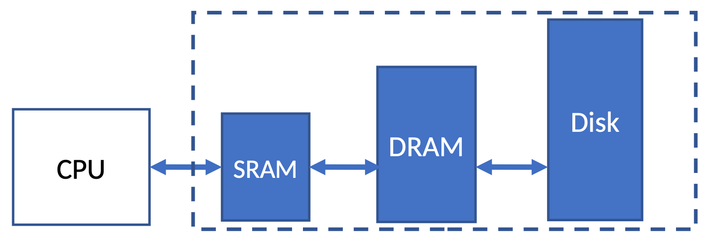
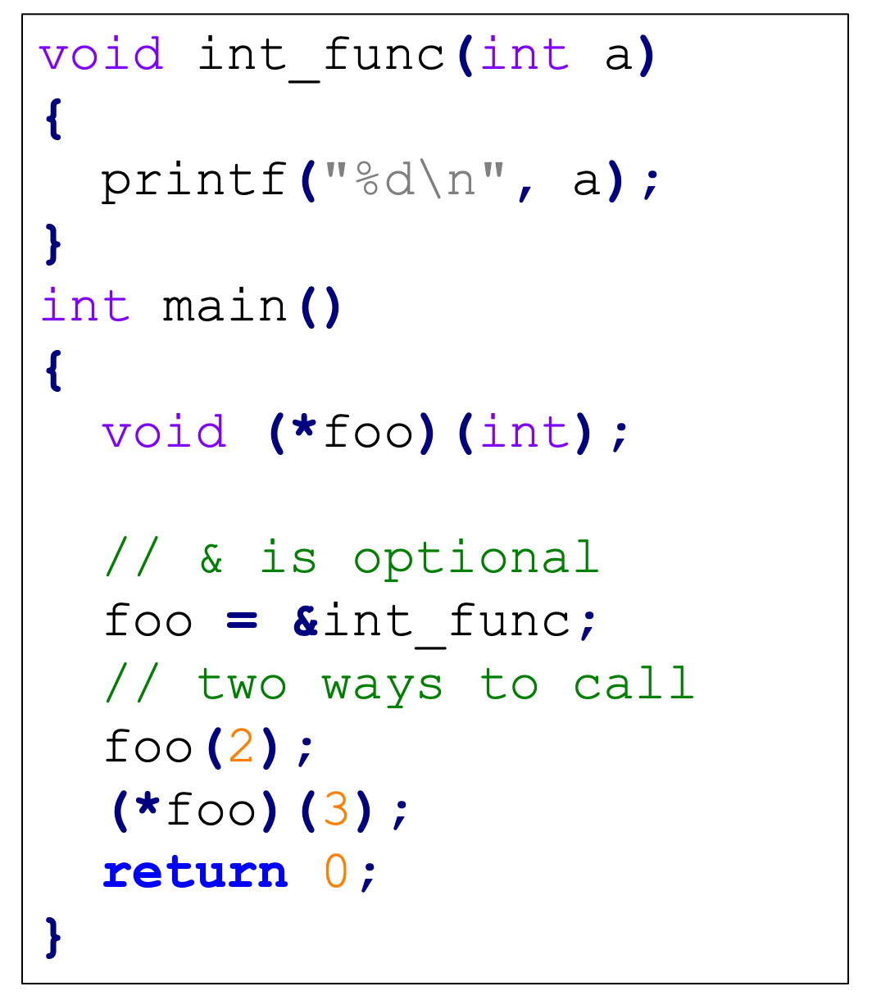
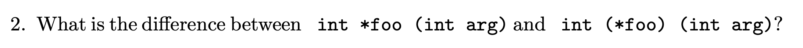
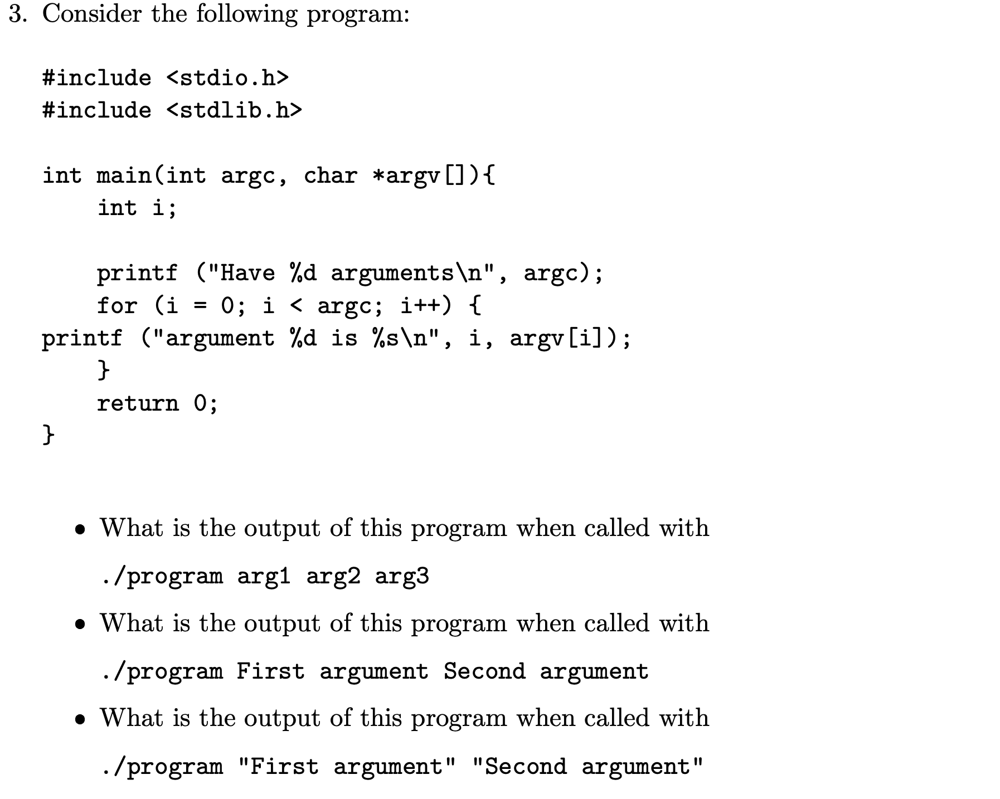
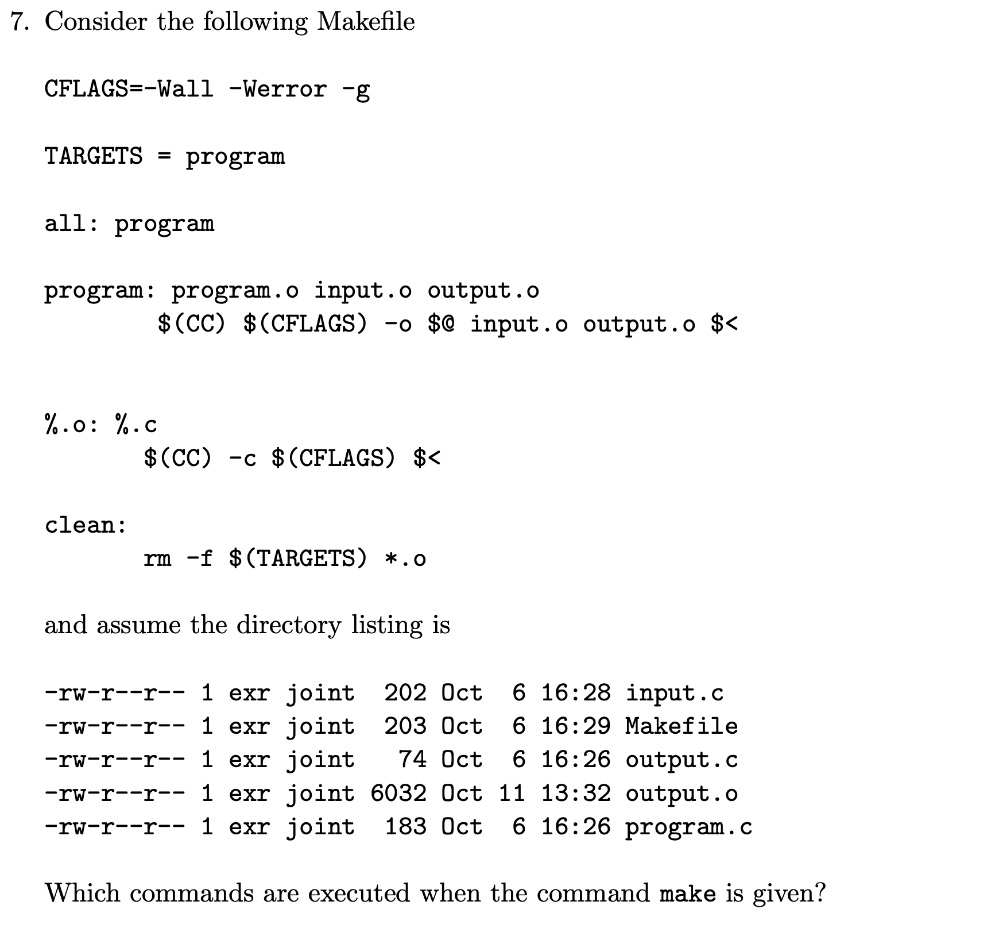

# Week 3 - File, Function & Compile

### Why should I use pointers when I can access objects directly?

因为pass-by-pointer is more efficient and space saving for large data objects, you don't make a copy of the large data, but the small pointer.

***

单字母IO

<figure><figcaption></figcaption></figure>

***

单行IO

```c
 int main(){
 ​
   char *str = NULL;
   size_t n;
   int res;
   printf("Enter a string: ");
   res = getline (&str, &n, stdin);
   if (res != -1) {
     printf ("%s", str);
   }
 ​
   return 0;
 }
```

***

文件IO

示意图



```c
 FILE *fp; /*variable fp is pointer to type FILE*/
 fp = fopen("filename","mode");
 /*opens file with name filename , assigns identifier to fp */
 ...
 fclose(fp)
```

mode：

r: 如果文件存在就打开，指针指向第一个character，其他情况报错。

w: 如果文件已经存在那么就会被重写，其他情况就会创建一个对应名字的文件

a: 如果已经存在就打开，其他情况会创建一个新文件，指针指向最后一个字符，文字会被追加。

r+:读写通道都打开，不会删除现有内容

w+:读写通道都打开，覆盖写

a+:读写通道都打开，指向最后一个字符。

***

文件IO函数 getc puts

```c
 printf("%c", ch); // Displays on screen
 putc(ch, fp1); // writes to second file
 ch = getc(fp0); // reads another char from first file
```

Fscanf, fprintf

```c
 fp0=fopen("some_file", "r");
 fscanf(fp0, "%d", &i);
 ​
 fp1=fopen("some_file", "w");
 fprintf(f1, "%d", i);
```

getline()

```c
 while((res = getline(&line, &n, fp0)) != -1) {
   fprintf (fp1, "%s", line);
 }
```

feof()

```c
 if(feof(fp)){
   printf("End of file\n");
 }
```

ferror()

```c
 if(ferror(fp) !=0)
   printf("An error has occurred\n");
```

随机读写

fseek(file-pointer, offset, position);

position: 0 (beginning), 1 (current), 2 (end)

offset: number of locations to move from specified position

ftell(fp) returns current byte position in file

rewind(fp) resets position to start of file

***

命令行参数

<figure><figcaption></figcaption></figure>

***

Void pointer 不能用来访问数据，只能用来存储对象地址，且可以被转换成任意类型的种类。

void \*pointer\_name;

***

函数指针，必须加括号，不然变成了返回int\*指针

int (\*foo)(int)

使用方法：



***

有用的Macro

<figure><figcaption></figcaption></figure>

***

### Compile

大的程序可以被分为多个程序

可以先这样分别编译：

```bash
 gcc -Wall -Werror -c <filename>.c
```

然后link起来成为程序

```bash
 gcc -Wall -Werror -o <filename> <filename1>.o <filename2>.o ..
```

如果一个文件中定义了函数或变量，并在另一个文件中使用，则需要在其他文件中对这些函数或变量进行extern声明

***

创建动态链接库

```bash
 gcc -Wall -Werror -shared -fPIC -o lib<library>.so <filename1>.o ..
```

***

include files地址

/usr/local/include, /usr/include and compiler-specific directories for include-files

C-compiler searches /lib and /usr/lib (this 2 are standard location) plus compiler-specific directories for libraries Any other directories must be specified with -L-option. Have environment variable LD\_LIBRARY\_PATH to specify additional directories

export LD\_LIBRARY\_PATH= for one additional directory, and export LD\_LIBRARY\_PATH=: ... for several directories

Option -l specifies all libraries which are to be used.

**`-L`选项**：用于指定链接器搜索库文件的目录。当你使用了`-l`选项来链接一个库，但该库不在标准库路径中时，你可以使用`-L`选项来添加额外的搜索路径。

***

正确编译顺序

<figure><figcaption></figcaption></figure>

```
 gcc -Wall -Werror -g -fPIC -shared -o libinput.so input.o
```

* `-g`: 生成调试信息。
* `-shared`: 生成共享库文件。
* `-o libinput.so`: 指定输出文件名`libinput.so`，这就是最终的动态库文件。
* `input.o`: 输入的目标文件。
* \-I添加include文件搜索目录，-L添加库文件搜索目录。

***

使用makefile编译

.c 源码

.h include file，提供函数原型，接口，宏等，避免多次编译

.o 目标文件，汇编代码of .c文件

.so 共享库文件，several programs的汇编。

$(NAME)：使用名为NAME的参数。

```
 <target>: <file1> ... <filen>
     <command>
```

If file target does not exist or any of file1. . .filen are newer than target, the command command is executed

$@表示target

$<表示file1

```
 %.o: %.c
     <command>
```

means that every file ending in .o depends on the corresponding file ending in .c and may be created via command.

makefile例子

```makefile
 CFLAGS=-Wall -Werror -g 
 INCLUDEDIRS=../include
 LIBDIRS=../lib
 LIBS=input
 TARGETS = program
 ​
 all: program
 ​
 program: program.o output.o
   $(CC) $(CFLAGS)  -L$(LIBDIRS)   -o $@ output.o $< -l$(LIBS)
 ​
 ​
 %.o: %.c
   $(CC)  $(CFLAGS) -I$(INCLUDEDIRS) -c $<
 ​
 clean:
   rm -f $(TARGETS) *.o
 ​
 ​
```

***

### Practice Problems


> A function pointer is is a pointer to a C function. They are used to pass functions as arguments.



> 1st is a function takes an int arg as input and returns an Integer pointer.
>
> 2nd is a function pointer that points an function which takes an int arg as parameter and returns an integer.



> *   Argument 0 is ./program
>
>     Argument 1 is arg1
>
>     Argument 2 is arg2
>
>     Argument 3 is arg3
> *   Argument 0 is ./program
>
>     Argument 1 is First
>
>     Argument 2 is argument
>
>     Argument 3 is Second
>
>     Argument 4 is argument
> *   Argument 0 is ./program
>
>     Argument 1 is First argument
>
>     Argument 2 is Second argument


> Just store the address of any type. You need it when you need to store the address of any type, and cast it into different type of pointer when you want to access the data.


> Because the size of different objects are usually different. Without casting, the increase of pointer is unclear, so the accesss process may go wrong.


> Makefile specify what instructions and dependencies you need to use to compile a large / difficult project.



> 生成program的要运行
>
> cc -Wall -Werror -g -o program input.o output.o program.o
>
> 生成.o的要运行
>
> cc -Wall -Werror -g -c input.c
>
> cc -Wall -Werror -g -c program.c

\
