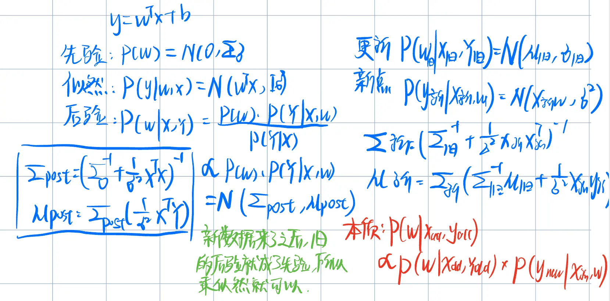

- 什么是监督学习？形式化表达
	- 25 mock 1（a）
- 什么是非线性变化？
	- 非线性特征转换是一个向量函数，它使用至少一个非线性函数来转换问题的输入空间。特别地，特征转换是一个向量函数Φ，它接收一个输入向量x，其中x∈Rd，d≥1是问题输入空间的维度。在非线性特征转换中，至少一个函数φ(x)i∈Φ(x)是一个非线性函数。
- 解释为什么用牛顿拉弗逊
- KKT条件有什么
	- 鞍点, 对w，松弛slack以及b都是0
	- af=0互补松弛
	- fx<=0 a>=0 可行性
		- 可能用到的：ay之和为0，如果是软SVM的话a是box constrain \[0,C\]，C是对slack的惩罚力度
- 牛顿拉弗逊Newton-Raphson 不适用于非凸目标函数，因为虽然它在凸函数中快速收敛到局部最小值，但在非凸设置中也可能收敛到局部最小值、鞍点甚至最大值。与梯度下降类似，当损失函数具有多个最小值或其他不规则性时，它容易受到这些问题的影响。
- 高斯分布？
	- $$f(x)=\frac{1}{\sigma\sqrt{2\pi}}e^{-\frac{1}{2}(\frac{x-\mu}{\sigma})^2}$$
- 
- Hypothesis set
	- **是学习算法可供选择的全部candidate函数/模型的集合**。
	- 举例：线性分类
- 为什么SVM要化成对偶问题？
	- 核trick
	- 可以用简单的SMO去优化，而不是Quadratic programming
	- 当训练样本数量N少于特征数量d时，对偶形式可能更具计算效率。
	- 可以根据ai的值识别SV
- Iteratively Reweighted Least Squares (IRLS)就是牛顿拉弗逊
- 为什么用牛顿而不用梯度下降？
	- 迭代重新加权最小二乘法可能更好。这是因为该算法使用二次Taylor polynomial来近似损失函数。然后通过将梯度设为零来获得泰勒多项式的最小值。由于这个损失函数是一个二次函数，这种近似是完美的。因此，泰勒多项式的最小值也是这个函数的最小值，该算法能够在一步中找到最优解。
		- Newton-Raphson was able to find this optimum in a single step because this function is quadratic. The quadratic approximation used by Newton-Raphson takes us directly to the optimum of the quadratic approximation by solving the equation shown in Slide 10. In the case of our function f(x)=x2, the quadratic approximation is the quadratic function itself.
	- 相比之下，梯度下降法在梯度最陡的方向更新权重。然而，由于这个函数是椭圆形的，这样的更新并不是直接朝向最优解的步骤。它们很可能会在w0轴的方向上超过最优解。即使梯度下降法最终会在使用合适的学习率时达到最优解，通常需要多个步骤（权重更新）才能实现。
- 牛顿拉弗逊的问题？
	- 只能在凸优化的时候得到最小值（Convex optimization）
- 核的传染法则：如果k1，k2都是有效核，那么核的传染性有：
	- 
- 逻辑回归似然函数推导
	- 
- 看看22-23的似然函数
- 贝叶斯回归，先验p(w)，后验p(w|X,Y)，似然p(Y| w,x)
	- 
- 一致性学习公式
	- $$\Pr\left(\exists h\in\mathcal{H}:E_{\mathrm{in}}(h)=0\wedge E_{\mathrm{out}}(h)>\epsilon\right)\mathrm{~\leq~}M\mathrm{~}e^{-\epsilon m}\mathrm{~\leq~}\delta.$$
	- $$M\mathrm{~}e^{-\epsilon m}\leq\delta\quad\Longrightarrow\quad-\epsilon\mathrm{~}m+\ln M\leq\ln\delta\quad\Longrightarrow\quad m\mathrm{~}\geq\mathrm{~}\frac{1}{\epsilon}{\left(\ln M+\ln\frac{1}{\delta}\right)}.$$
- 如何看协方差？
	- 
	- 一般xy等于yx，其中xx是主轴宽窄，yy是竖轴宽窄。xy表示相关性正负
- 核函数衡量了相似度
- 回归任务的定义只有输出是数值
- 交叉墒梯度
	- 
- 大和小的学习率的问题？
	- 学习率过大的值会导致更大的步长（w的变化更大）。这可能会导致更快地收敛到最优解，但也可能会通过跳过最优解而导致不稳定性。缺乏稳定性可能会阻碍收敛，不一定会增加收敛速度。
	- 学习率过小的值会导致更小的步长。这将导致更稳定，但收敛所需的时间更长。
- 解释为什么用了核函数就能二分类一个非线性问题了
	- 虽然只有线性的x
	- 但是用了非线性核，那么有一堆x以及一堆w
	- 它是二次的。因此，在更高维度嵌入中代表决策边界的超平面实际上是原始输入空间中的二次函数。

- 可不可分？嵌入之后可不可分？
	- 
- 删掉一个拉格朗日乘子为0的点后，为什么解仍然可行？
	- 
- 贝叶斯回归在数据少的时候更好用
- 什么时候正则失效？
	- w的平方为C，C无限大时，也就没了正则
	- 
- 正则化变大之后，deff(有效自由度)减少
- Ecv是留一loss。Leave-One-Out CV
- N/5的validation，那么一个超参数组的训练就是在4/5上训练的时间。记得最后+1
- 5-fold validation，一个超参数组的训练就是4/5上训练的时间再乘5.

- 软SVM为什么an在0到C的时候就是支撑向量，在an为C的时候就可能是可能不是？
	- 首先，互补松弛
		- $$a^{(n)}(1-\xi^{(n)}-y^{(n)}(\mathbf{w}^T\phi(\mathbf{x}^{(n)})+b))=0,\mathrm{~}\forall n\in\{1,2,\cdots,N\}$$
		- an目前大于0，而对slack的驻点，也就是求导为0，得到：
		- $$\frac{\partial L}{\partial \xi}=C-\alpha_{n}-\beta_n=0\Rightarrow\beta_{n}=C-a_{n}$$
		- 根据 beta也大于0，得到an的盒约束0到C
		- 而beta是用来约束slack的，也就是beta乘slack，互补松弛得到也为0。
		- 当an为0到C的时候，beta不为0，所以slack为0，而由于an不为0，slack不为0，所以yhx为0，所以是支撑向量，正好在边界上
		- 当an为C的时候，beta为0，所以slack可为0可不为0，所以可以不在边界上，也可以在。
- 
- Kernel内积计算 1+xTx
	- 什么是Kernel Function？

$$
\Pr\!\Bigl(\exists\,h\in\mathcal H:\;
       |E_{\text{in}}(h)-E_{\text{out}}(h)|>\epsilon\Bigr)
\;\le\;
2\,m_{\mathcal H}(N)\,
      \exp\!\bigl(-2\epsilon^{2}N\bigr).
$$
$$

\Pr\!\Bigl(\exists\,h\in\mathcal H:\;
       |E_{\text{in}}(h)-E_{\text{out}}(h)|>\epsilon\Bigr)
\;\le\;
4\,m_{\mathcal H}(2N)\,
      \exp\!\bigl(-\tfrac18\,\epsilon^{2}N\bigr).

$$
- 为什么用IRLS不用梯度下降？
	- (a) 迭代加权最小二乘法（IRLS）更好。因为该算法使用二阶泰勒多项式(Taylor polynomial of degree 2)来近似(approximate)损失函数。通过将泰勒多项式的梯度设为零，就可以得到它的极小值。由于原损失函数本身就是一个二次函数，这种近似是完全精确的。因此，泰勒多项式的极小值也就是原函数的极小值，算法能够在一步之内找到最优解。
	- 相比之下，梯度下降法沿着最陡下降方向更新权重。然而，由于该损失函数在参数空间中呈椭圆形，这样的更新步长并不会直接指向最优点。它们很可能在 w0 方向上越过最优值。尽管只要选择合适的学习率，梯度下降最终也能收敛到最优解，但通常需要多次迭代（权重更新）才能到达最优点。

