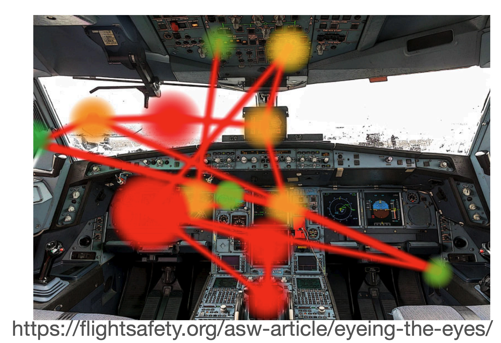

# Week 1 Intro & ResponsibleAI

### **1. 需要与人类合作或协作（That must cooperate or collaborate with humans.）**

- **智能交互系统** 不能独立存在，而是要能够与人类用户进行交互，帮助他们完成任务或提供有价值的信息。

---

### **2. 这种合作需要** **交互（interaction）和智能（intelligence）**

- 交互（Interaction）：系统应该能够与用户进行多层次的交互，比如响应指令、提供反馈、进行对话等。
- 智能（Intelligence）：系统应该具备 **学习、推理、预测、决策** 等能力，使其能更有效地辅助用户。

---

### **3. 交互可以发生在多个时间尺度（That interaction can occur on multiple time scales）**

- **感知-行动（Perception-Action）**：系统可以实时响应用户输入（如语音助手、手势控制）。
- **对话交互（Conversational）**：交互可以是短期的，例如人与聊天机器人之间的对话。
- **决策（Decision）**：系统可能涉及更长时间尺度的推理，例如 **个性化推荐** 或 **长期策略优化**。

---

### **4. 智能（Intelligence）是指利用可用数据进行学习和理性决策的能力**

- 这里的 **智能** 体现在：
    - **学习（Learning）**：从用户数据、环境反馈中学习模式和偏好。
    - **理性决策（Rational Choice）**：基于学习结果做出符合目标的决策，而不是随机响应。

---

### **5. 智能需要使用预测性、解释性和上下文一致的模型**

- **预测性（Predictive）**：模型需要能够**预测** 用户行为，如推荐系统预测用户喜好。
- **解释性（Explanatory）**：系统的决策需要**可解释**，例如提供推荐的理由，以提高用户信任度。
- **一致性（Consistent Across Contexts）**：智能系统在不同场景下（如 **不同设备、环境、任务**）仍然能保持稳定表现。

---

### **6. 智能交互系统需要通过行为推断（Inferring）用户的偏好和意图**

- **推断（Inferring）**：系统不能只是被动地等待指令，而是要**主动推测** 用户的需求和意图。
- **从行为中学习（Learning from Behaviour）**：通过分析用户的**鼠标点击、浏览记录、语音输入、眼动轨迹**等，系统可以理解用户的需求并进行优化。

## Responsible AI

### Bias
LLM从text中学习到含义，依赖于**大规模文本数据**进行训练，因此它们会反映和学习这些数据的**结构、模式和隐藏的偏见**。
- 许多文本数据会**编码社会文化规范**，比如性别歧视，社会阶层歧视，种族偏见等等。
- 话语主体可能被一部分人占领，某些观点和信息被**过度代表**，而其他观点被**低估或忽视**。

例子：德州奥斯汀以前用Ai筛选PhD申请，但由于其有bias，最终被放弃。

如何de-bias？

### Hallucinations
LLM是有幻觉的。福布斯新闻曾经报道，**一名律师** 在诉讼中使用 ChatGPT 来**准备法律文件**。**ChatGPT 编造了不存在的法庭案例**，律师没有核实，直接提交到了法庭。

如何去幻觉？可以用RAG。
让 LLM 结合 **传统的信息检索技术（如数据库、文档库、知识图谱）**，确保生成的文本**基于真实的外部信息**。

### Intellectual Property
- Jane Friedman 发现 Amazon 上有**多本署名她名字的书籍**，但**她本人从未写过这些书**。
- 这些书**可能是由 AI 生成**，并**冒用了她的名字**，企图利用她的声誉进行销售。
- 这标志着 **AI 生成内容被用于身份盗窃和知识产权侵权的新案例**。

### Adversarial Attacks
大多数LLM都通过以下的手段来规避坏的行为：
- RLHF
- 内容过滤
然而，有一些人可以用prompt来让llm jailbreak
- 用户利用**复杂的文本模式**（如**特殊符号、混淆句子结构**）绕过 LLM 的安全检测，使其提供 **如何制造炸弹的详细指南**。
黑客和ai开发者在进行军备竞赛，黑客不断绕过LLM的安全机制，利用ai生成有害信息，而ai开发者需要持续改进安全性。

### 如何做得更好？
审计
透明设计
重新思考溯源、知识和智能的问题
水印
新的内容商业模式 - 谁能拥有你的数据？
让 内容创作者和出版商 参与到 AI 生态系统中，而不是被 AI 替代
用户教育

# Week 2 Cooperation & Game Theory
## 例子 Cooperative Lane Changing Assistant
- **Zimmermann 等人（2018）** 使用 **博弈论（game theory）** 来奖励那些让其他车辆并道的司机。
- 在 **模拟实验（simulator study）** 中，该辅助系统**记录**了哪些司机愿意让其他车辆进入车道。
- 该系统**向其他司机提供这些记录**，以帮助他们进行决策。
- 司机可以选择**优先帮助**那些过去曾经帮助过他人的司机。

## 例子 Tragedy of the Commons
- 每位农民都在说 **“I want another cow!”（我想要再多一头牛！）**。
- 牧场上的牛正在吃草，暗示着草地是有限的资源。
- 如果每个农民都只考虑**自己的利益**，不断增加牛的数量，最终**牧场的草地将被过度放牧，导致整个生态系统崩溃**。

## **关键概念**

- **纯粹的自我利益 vs. 利他主义**（Pure self-interest versus altruism）
- **延迟自我利益**（Deferred self-interest）
- **亲属、群体和邻里利益**（Kin, group and neighbour interest）
- **合作 vs. 背叛**（Cooperation versus defection）
- **公地悲剧**（Tragedy of the commons）
- **非零和博弈**（Non zero-sum games）

## Cooperative AI
研究如何让人工智能帮助人类实现共同福利（joint welfare）。 **合作型 AI 旨在研究如何让 AI 在人与人、AI 与 AI 之间促进合作，而不仅仅是独立决策**。

它不同于**对齐 AI、可信 AI 或有益 AI**，因为它关注**如何优化集体利益**，而不是仅仅保证 AI 符合某一方的目标。对于**解决全球性问题（如环境保护、经济公平、国际协调）** 具有重要意义。
- **对齐 AI（Aligned AI）**：
    - 目标是让 AI **符合人类的目标和价值观**，防止 AI 偏离预期行为。
    - 重点在于**控制和约束 AI**，避免它带来负面影响。
- **可信 AI（Trustworthy AI）**：
    - 关注**安全性、可解释性、公平性和隐私保护**。
    - 目标是让 AI 的决策过程**透明、可靠且可验证**。
- **有益 AI（Beneficial AI）**：
    - 关注**AI 的长期影响**，确保 AI **整体上对社会有益**，而不仅仅是执行任务。
    - 例如，OpenAI 的目标是开发 **“造福全人类的 AI”**。

**合作的演化过程**：
1. **人类之间的合作**（最基本的形式）。
2. **借助工具促进合作**（技术增强合作能力）。
3. **人与 AI 之间的合作**（AI 作为协作伙伴）。
4. **社会级别的合作**（组织和社会如何整合 AI 进行大规模协作）。

## Game Theory
博弈论的基础假设如下：
- **决策者理性地** 追求明确的目标（如**偏好、奖励和效用**）。
	- 对于一件事，有一个行动集合A（如增税等），结果集合C（如短期财政收入增加，长期投资减少），以及结果函数g（社会运行机理），将A映射到C。每个决策者都会有自己的偏好关系，决策者会考虑g(A)是否达到了自己想要的偏好关系。
- **决策者会考虑** 其他决策者的行为（即他们的知识和预期）。
	- 换句话说，决策者会**战略性地思考**，以**最大化自身效用**。
- **博弈论并不是传统意义上的“游戏”**，而是一种**数学方法**，用于研究**合作和非合作行为的决策过程**。

博弈论可以用于存在不确定性的情况中，一般不确定性来自于以下几个方面：
- 对环境的客观了解不确定
- 对博弈中的事件信息不完全
- 对其他玩家的行动不确定
- 对其他玩家的推理方式不确定
而每个人都有一个Subjective Expected Utility，SEU，即主观期望效用，决策者会根据自己对不确定性事件的**主观概率估计**来做出选择，而不仅仅是客观数据。这意味着**即使没有确切信息**，玩家仍然可以基于**自身的信念和经验**进行策略决策。

### 例：囚徒困境
你和另一个人已经被判2年，但其实你们两个还犯了另一个案子。
- 如果你认罪，对方不认罪
	- 你只需要服刑1年，你作为污点证人，对方判10年
- 你不认罪，对方认罪
	- 你判10年，对方判1年
- 你们都认罪
	- 都只判3年
- 都不认罪
	- 只需要服刑原来的2年

这是Game Matrix，或者叫Payoff Matrix

可以看到，如果B认罪，那么A认罪最佳，B不认罪，A也是认罪最佳，对B也是一样。也就是说，对A和B来说，认罪都是理性选择。
那么这个game的纳什均衡就是双方都认罪。但是，其实最佳集体策略是双方都否认。
> 如果在某个策略组合下，没有玩家可以通过单方面改变自己的策略来获得更高收益，那么这个策略组合就是一个纳什均衡

### 例：协调博弈
有两个投资项目，A和B，如果公司X和公司Y都做A投资，那么双方都可以收获10，如果公司X和公司Y都做B投资，那么双方都可以收获5。但如果双方投资了不同项目，则无收益

这里，纳什均衡为AA或者BB。
分析：如果对方选A，那么我无法做出选A之外的其他更好决定，我选A，对方无法做出选A以外的更好决策，所以AA为纳什均衡，对BB也一样。如果是AB，那么单方面改选可以收获更多，所以不是纳什均衡。

我个人感觉纳什均衡有点像局部最优。

### 例：懦夫博弈（A Game of Chicken）
- **两名玩家** 从道路的**相对两端**向彼此驶来。
- **目标** 是**比对方更晚转向**。
- **如果一名玩家转向**，他们被认为是“懦夫”（"chicken"）。
- **如果双方都不转向**，他们会**相撞**。

Payoff Matrix

这个里面的纳什均衡是1 -1和-1 1
对于左下角，当我就是要直行的话，对方直行会从-1变成-100，所以对方无法单方面作出最好决策；当对方一定要转向的时候，我如果转向，收益就从1变成0了，所以我不转，所以是纳什均衡。

### 例：鹰-鸽博弈（Hawk/Dove Game）
- 在**鹰-鸽博弈**中，**两个玩家竞争有限的资源**。
- **如果双方都选择“鸽”策略**，那么**他们平分资源**。
- **竞争是有代价的**，它**消耗能量，并且不一定能成功**。
- **如果双方都选择“鹰”策略**，那么**竞争的能量消耗将抵消所有可能获得的资源收益**。
- **如果一个玩家选择“鹰”策略，而另一个玩家选择“鸽”策略**，那么 **“鹰”玩家获得大部分资源，而“鸽”玩家仅获得一小部分资源 **。

### 例：猎鹿博弈（Stag Hunt）
**两个猎人外出捕猎晚餐。**
- **在狩猎范围内有两只兔子和一只鹿**。
- **每个猎人只能携带捕猎特定猎物的装备**，即**他们必须决定是去猎兔子还是猎鹿**。
- **鹿的肉比两只兔子的总和还要多**，但是**必须两个猎人合作才能成功捕获鹿**。
- **如果选择猎兔子，每个猎人都可以单独行动并成功捕获猎物**。

### 练习：自动驾驶汽车博弈
- 在未来，**自动驾驶汽车（AVs）** 预计需要**最大限度地保护行人**——当存在碰撞危险时，它们应立即停车并保持高度可靠性。
- 然而，**如果AV每次遇到行人阻挡都会停车**，那么行人可能会习得**他们始终具有优先权**，导致**AV几乎无法正常行驶**。
- **用博弈论建模此情境，并推导其纳什均衡**。
- **提出一个解决方案，使AV能够正常行驶，同时增强对行人的保护**。

纳什均衡已用黄色标出。
解决方案：建立通信，车向人发送信号。
### 练习：性别战（The battle of the sexes）
了**一对情侣（Alice 和 Bob）要决定晚上去哪儿约会**的场景：
- **Alice** 想去看 **芭蕾舞**（Ballet）。
- **Bob** 想去看 **拳击比赛**（Boxing）。
- 但 **他们都更希望在一起，而不是各自单独去**。

#### **总结（Summary）**

- **智能交互系统** 需要与**人类**合作，同时也需要**促进人类与机器的沟通**，尤其是在由人类和机器共同组成的混合系统中。
- **合作可以提高交互效率**，例如在**半自动驾驶车辆**中的应用。
- **但合作是困难的**，因为有时**背叛（不合作）可能带来更大的短期利益**。
- **博弈论提供了一种框架**，用于**预测人类和机器何时会合作，何时会选择背叛**，这取决于任务的**激励结构**。
- **现实世界中的问题可以使用博弈论建模**，并且可以**通过合理的激励机制来促进合作**。

# Week 3 Cooperation
## 阿克塞尔罗德的计算机锦标赛
著名的博弈论实验，他邀请来自不同学科的研究者提交计算机程序，以竞争“囚徒困境”博弈的最佳策略。
 **友好策略（Nice Strategies，粉色区域）**
- 这些策略具有 **合作性（不主动背叛）**，并且整体得分很高。
- **“以牙还牙”（Tit for Tat）策略** 由 **Anatol Rapoport** 提交，在比赛中表现最佳。
- **这些策略的共同特征**：
    - **从不先背叛**（永远不会主动欺骗对方）
    - **回报合作**（如果对手合作，它们也会合作）
    - **简单而有效**（它们并不复杂，但表现优越）
**得分情况：**
- 这些策略得分都接近600，意味着它们在比赛中表现非常稳定，且能在合作中获得高分。
---
 **造王者（Kingmakers，黄色区域）**
- 这些策略（**Graaskamp 和 Downing**）的特点是它们可能不会自己赢得比赛，但**它们的策略会影响其他策略的排名**。
- 它们的得分变化较大，表明它们可能采取了**不稳定或更具攻击性的策略**，影响了博弈的平衡。
**得分情况：**
- 这些策略的得分波动很大，比如 **Downing 对不同策略的得分从202到625不等**，表明它们对不同对手采取了不同的策略。
---
 **随机策略（Random）**
- **最后一名（Random）** 是完全随机的策略，得分最低（仅442分），因为**随机策略不能形成稳定的合作**，容易被其他策略剥削。

## Axelrod的第二次实验
- 这次实验是对第一次比赛的后续测试，参赛者已经知道第一轮的结果。目标是测试**改进的策略**能否战胜之前的赢家（如 Tit-for-Tat）。
- 参赛者的程序被**随机匹配**，相互竞争。
- 比赛的回合次数是随机的，平均大约200轮。
	- 原因：
		- 这一设计使得策略无法依赖固定轮数（比如如果知道比赛是100轮，就可以在最后几轮背叛）。
		- **逼近现实**：现实世界中的合作往往**没有明确的终点**，所以策略应该适用于不确定的环境。
结果是Tit-for-Tat 仍然获胜。

## Tit-for-Tat告诉我们什么？
- **要友善！（Be Nice!）** - 先从合作开始。
- **要不容忍！（Be intolerant!）** - 如果对方无故背叛，立即进行背叛——展现惩罚的意愿。
- **要宽容！（Be forgiving!）** - 在对方背叛之后（惩罚一次后）重新合作。

## **Evolution of Cooperation（合作的演化）**

### **内容解析**

- 假设有一组智能体，每个都有**3步记忆**。
- 囚徒困境有**4种可能的结果**，因此有 4×4×4=64 4×4=64 种不同的历史状态。
- 一个策略可以被表示为**64维向量**，其中每个元素对应一个动作（合作或背叛）。
- 进化过程：
    1. 初始时，有**20个个体**，每个采用随机策略。
    2. 这些策略相互博弈**多轮**，计算平均得分。
    3. **淘汰最差的10个策略**。
    4. **从前10个策略中交叉“繁殖”**，生成新的策略。
    5. **重复该过程**，模拟策略的进化。
### **结论**
- 通过不断淘汰低效策略并让高得分策略“繁殖”，可以观察到合作策略的演化。

- **初始阶段（前10代）：平均得分下降**
    - 可能由于最初的策略大多是**随机的**，导致合作较少，整体收益低。
    - 也可能是许多**欺骗性策略**占优，使得个体间的信任崩溃，收益减少。
- **10代后：平均得分开始上升**
    - 说明合作策略开始出现，并在进化过程中**逐渐占据主导**。
    - 由于合作可以提高长期收益，这些策略获得更高得分，并在选择过程中存活下来。
- **25代左右：得分短暂下降**
    - 可能是由于新的、较具欺骗性的策略进入种群，导致合作再次受到挑战。
    - 但是这些策略可能**无法长久存活**，因为如果所有个体都开始背叛，整体收益会下降。
- **25代后：平均得分明显上升并趋于稳定**
    - **合作策略占据主导地位**，群体整体得分上升，表明合作是长期博弈中的优胜策略。
    - 这一趋势符合**“以牙还牙”（Tit-for-Tat）等合作策略的演化优势**。

## **Multi-agent Reinforcement Learning（多智能体强化学习）**

### **内容解析**

- 作为**进化算法**的替代方法，可以使用**强化学习（RL）**来学习合作策略。
- **Sandholm 和 Crites（1996）研究**
    - 证明**强化学习智能体可以学会合作**。
    - 当**强化学习智能体与固定的“以牙还牙”（Tit-for-Tat, T4T）策略对战时，T4T会成为学习到的最优策略**。
    - 当**强化学习智能体彼此对战时，结果更加复杂**，说明博弈环境会影响学习到的策略。
### **结论**
- **强化学习**可以自动发现合作策略，但其表现取决于对手的行为模式。

## **Further Discoveries（进一步发现）**
### **Win-Stay Lose-Shift（WSLS）策略**
- **Nowak & Sigmund (1993)** 提出了 **WSLS（赢留输换）** 策略：
    - **比以牙还牙更具鲁棒性**，能更好地应对对手的**意外背叛**。
    - **能够利用纯合作策略**（如 ALLC：始终合作），在某些情况下表现更优。

如果在 Tit-for-Tat（TFT）对局中发生一次**意外背叛**（误操作），该策略会导致：
- **D（背叛）→ C（合作）** 交替模式，使双方都损失较多分数。
- 这可能导致长期的恶性循环，使得合作关系难以恢复。

- **WSLS 赢留输换策略**：赢是指你单方面背叛或者双合作。
    - 如果上轮获胜（双赢或成功欺骗），**继续执行相同策略**。
    - 如果上轮失败（被欺骗或双方背叛），**改变策略**。
- **优势**
    - **能够恢复合作**，不会陷入持续背叛的循环。
    - **在对战 ALLC（始终合作）时表现更优**，可以在适当时机利用对方。带星号是指错误的换了。

## 如果多轮囚徒困境可以说话
1. **合作需要沟通**
    - **合作（Cooperation）** 受**信号传递（Signaling）** 影响，例如语言、承诺或威胁。
    - 在博弈论中，**沟通可以帮助智能体建立信任、制定策略并维持合作**。
2. **S# 算法**    
    - 由 Crandall 等人提出，**结合强化学习（Reinforcement Learning, RL）** 和 **信号机制**。
    - 能够**与人类和其他算法合作**，并达到与人类相当的合作水平。
3. **适用于多种博弈环境**
    - S# 能够在**两人重复随机博弈**（例如囚徒困境）中实现高效合作。

## 设计一个IIS的在线购物平台
### **1️⃣ 信用评分 & 信誉推荐**

- 计算信誉评分 **(0-100)**，高信誉用户在市场上有更大优势。
- **信誉低的用户会被系统限制**（如预付款要求、提高押金等）。
### **2️⃣ AI 信誉检测**
- 采用**机器学习模型**检测欺诈模式，例如：
    - **异常评分**（短时间内大量负评）。
    - **短时间创建大量虚假账户**。
    - **交易模式异常**（某些账户专门给另一个账户打高分）。
### **3️⃣ 交易智能匹配**
- **AI 依据信誉评分匹配买家和卖家**，优先推荐高信誉交易者进行匹配。
- 如果新用户信誉不够，系统可能会要求 **更安全的交易方式**（如托管支付）。

直接互惠（Direct Reciprocity）和间接互惠

直接互惠：A 帮助 B，B 未来回报 A。
间接互惠：A 帮助 B，B 可能不会直接回报 A，但 C（第三方）会因为 A 的善行而帮助 A。
- 依赖于**声誉（Reputation）** 系统，第三方观察 A 的行为后决定是否合作。

声誉如何促进间接互惠？

- 绿色玩家（Player 1）**不会直接与蓝色玩家（Player 2）互动**，但他有 Player 2 的声誉信息。
- 绿色玩家基于历史记录**将 Player 2 归类为“好（G）”或“坏（B）”**。
- **如果 Player 2 的声誉是 G（Good），Player 1 更有可能合作**。

## 在线市场中的声誉
- 在线市场依赖声誉。
- 通过反馈建立声誉。
- 在线市场比传统市场更容易出现欺诈问题。
- 在线和传统市场的参与者以不同的方式进行沟通。
- 沟通模式是否对市场中的信任程度至关重要存在争议。
- 市场中信息传播方式的差异可能会不同程度地影响信任和合作意愿。

## 买家-卖家决策树

买家不买，那么买家本身有35块钱，卖家35块钱。
如果买家买了，商家发货了，买家拿到货物之后主观认为其价值为50，所以付了50，卖家也得到50
如果买家买了，卖家没发货，那么卖家把买家的钱拿了，变成70

## 三种市场
#### **陌生人市场（Stranger Market）**
个体买家和卖家最多只交易一次，**买家无法获得关于卖家交易历史的信息**。
在这种市场中，**道德风险（moral hazard）极大**，因为**卖家的行为不会影响未来潜在客户的决策**，导致卖家可能存在欺诈的动机。

---
#### **反馈市场（Feedback Market）**
一个**在线反馈系统**会**跟踪卖家在过往交易中的履约情况（如是否发货）**，并向潜在买家提供这些信息。
这类市场**提供了间接互惠（Indirect Reciprocity）机制**，使其更符合**在线市场**的特点，因为买家可以基于卖家的历史表现来决定是否交易。

---
#### **伙伴市场（Partners Market）**
买家和卖家会**反复交易**，**在每一轮都会进行互动**。
这种市场**提供了直接互惠（Direct Reciprocity）机制**，更类似于**传统市场**，因为**长期合作关系可以促使卖家提供更好的服务，以维持客户忠诚度**。

## 信任预测
### **如果“交易历史”是唯一重要的因素**
- 假设买家**只关心卖家的历史记录**，而不在意自己是否与该卖家有过直接交易。
- **那么**：
    - **直接互惠（长期合作的买卖关系）** 和 **间接互惠（基于市场反馈的交易）** **应该对市场表现有相同的影响**。
    - 也就是说，**只要卖家有良好历史记录，买家就愿意交易**，无论他们是否之前有过合作。

### **如果“个人交易经验”更重要**
- 假设买家更信任**自己与卖家的直接交易经验**，而不是市场上的反馈信息。
- **那么**：
    - **直接互惠（长期合作的买卖关系）** 会比 **间接互惠（市场评价系统）** 更有效。
    - 也就是说，**买家会更信任自己长期合作的卖家，而不是仅仅依赖市场上的评价系统**。

### 真实实验结果
**买卖交易决策树**：
- 买家首先决定 **“买”或“不买”**。
- 如果买家选择“买”，卖家可以 **选择“发货”或“不发货”**：
    - **发货**：买家和卖家各获得 **50** 点。
    - **不发货**：买家获得 **0** 点，卖家获得 **70** 点。
- 如果买家选择 **不买**，买卖双方各获得 **35** 点。
- 最后一个点数一分钱，可以换成真钱

最后结果：

对于第一张图，发货比例图，可以看到，信任建立的难度影响了市场交易的诚信度。在固定买卖关系（Partner）中，卖家更倾向于发货，而在陌生市场（Strangers）中，卖家更容易欺骗买家。

对于第二张图，交易效率，**Partner 组效率最高**，长期维持在 80% 以上，说明长期合作能促进市场效率。**Feedback 组效率中等**，但随时间波动下降，意味着反馈系统不能完全消除欺骗。**Strangers 组效率最低**，长期维持在 20%-40% 之间，甚至在最后几轮接近 0%。

第三张图，每轮买家选择购买的比例。在 **Partner 组**，买家对卖家更有信任，因此购买率保持高水平。**Feedback 组** 表明反馈机制在短期内有效，但随着卖家可能欺骗的情况增多，买家购买率下降。**Strangers 组** 由于交易不稳定，买家对卖家缺乏信任，因此购买率最低，甚至最终趋近于 0%。

### 通过买家卖家的例子，我们知道了合作的条件
- **理解其他人的激励和策略**：了解对方的**动机、利益**和**行为模式**，才能做出更明智的决策，避免被骗或做出错误预判。
- **有互动的历史**：**长期的互动**有助于建立信任和稳定的合作关系。
- **互惠（Reciprocity）**：愿意友善、原谅、并惩罚背叛者：以牙还牙
- **沟通（Communication）**：如可沟通的多轮囚徒困境。**有效的沟通**对于建立信任和合作至关重要。
- **通过个人经验获得的信任**： **个人经历会影响合作意愿**：过去的合作经历（无论正面还是负面）会影响个体对未来合作的预期
- **制度（Institutions）**：如陌生人市场，反馈市场和伙伴市场。**社会结构（social structure）** 能促进合作。**社会规范（social norms）和法律体系（legal systems）** 提供规则，帮助维护合作关系：**社会规范**：例如诚信、互助文化，使得合作成为一种社会认可的行为。**法律体系**：提供惩罚机制，防止欺诈行为，提高合作的可靠性。

### **总结（Summary）**

4. **智能交互系统**需要与人类合作，同时促进人与机器混合群体之间的沟通。
5. **合作**可以促进更高效的互动，例如在**半自动驾驶车辆**中。
6. **然而，合作是困难的**，因为**叛变（欺骗、不合作）可能带来短期利益**。
7. **博弈论（Game Theory）** 提供了一个框架，可以用来预测**人类和机器在何时会合作，何时会选择背叛**，基于任务的激励结构。
8. **机器是否合作取决于任务的激励结构**，它们会基于成本收益分析做出决策。
9. **模拟现实环境**需要考虑的不仅仅是**激励机制**，还要包含**沟通方式和社会规范**。
10. **正如本课程的其他讲座一样，我们只是展示了少数几个可能的合作案例……**

# Week 3 Human & AI Decision Making

## 介绍以下概念
- 期望值（Expected Value）
- 期望效用（Expected Utility）
- 递减收益（Diminishing Returns）
- 主观期望效用（Subjective Expected Utility）
- 偏见（Bias）
- 前景理论（Prospect Theory）

## Expected Value 客观存在
$$EV(X)=\sum_{i=1}^np_ix_i$$
期望值是客观存在的，然而，人们并不完全是根据期望来做选择的。
### 例子1:彩票
彩票规则1: 每个彩票5磅，但有1%的机会赢得1000磅
彩票规则2: 每个彩票10磅，每张彩票有50%的机会赢得6磅，40%的机会赢得8磅和10%的机会赢得50磅。
规则1的期望为 1000 x 0.01 = 10, 规则2的期望为 6 x 0.5 + 8 x 0.4 + 50 x 0.1 = 3 + 3.2 + 5 = 11.2。
按照价格差，规则1为10-5 = 5，而规则2为11.2-10 = 1.2，所以如果纯按照期望来看，你会选规则1.但是并不是所有人都会按照期望选。

### 例子2: 圣彼得堡悖论
玩家支付一定的入场费参与游戏，然后进行一系列的 **掷硬币游戏**。如果第一次扔，正面赢1磅，结束游戏，背面扔第二次。如果第二次扔，正面赢2磅，结束游戏，背面扔第三次。第三次，正面赢4磅，结束游戏，背面扔第四次... 每后一次的奖励是前一次的double。
所以入场费多少你就应该参加游戏？
如果按照期望计算，是这样的：
$$\begin{aligned}EV=\left(\frac{1}{2}\times1\right)+\left(\frac{1}{4}\times2\right)+\left(\frac{1}{8}\times4\right)+\left(\frac{1}{16}\times8\right)+\ldots\\EV=\frac{1}{2}+\frac{1}{2}+\frac{1}{2}+\frac{1}{2}+\ldots\\EV=\infty\end{aligned}$$
所以按照期望来看，你的期望收益无穷，所以你真的就应该付多少都参加游戏？其实人们不是这样的。

那么如何用数学建模人的选择依据？

## Expected Utility 部分主观
**丹尼尔·伯努利（Daniel Bernoulli）** 在 18 世纪提出了解决方案：财富的效用（幸福感）不是线性增长的，而是**递减的**。人们并不关注**金钱的绝对值**，而是关注**金钱带来的幸福感**。赢得**£1 和 £2 之间的幸福感差异大**，但**赢得 £1,000,000 和 £1,000,001 的幸福感差异小**。所以人的效用应当用 U(x) = log(x)或者指数来衡量。

这里也可以看到Diminishing marginal utility, 即为边际效用递减。所以对应人真正的效用，应当是这样的：
$$EU(X)=\sum_{i=1}^np_iU(x_i)$$
但其实EU还是有点高看人，因为，人其实是无法客观判断一个事情的概率的，所以出现了Subjective Expected Utility, SEU

## Subjective Expected Utility 完全主观
$$SEU(X)=\sum_{i=1}^ns_iU(x_i)$$
si是决策者对事件 iii 发生概率的**主观判断（subjective probability）**，不同的人对同一事件的概率估计可能不同。所以这里概率和效用均为主观判断。
如何把这些内容理论化？

## 萨维奇Axioms 期望效用理论（Expected Utility Theory, EUT）
这些公理用于描述**理性决策者**在面对不确定性时应遵循的基本原则。
- 完备性（Completeness），个体一定能比较A和B中，更喜欢A还是B还是A和B一样。
- 传递性（Transitivity），如果个体**偏好 A 胜过 B**，并且**偏好 B 胜过 C**，那么他们必须**偏好 A 胜过 C**。
- 独立性（Independence）个体的偏好**不应受到无关选项的影响**。具体来说，如果个体偏好 **A > B**，而 C 是一个**与 A 和 B 无关**的结果，那么个体应该同样偏好 “A 与 C 的组合” 胜过 **“B 与 C 的组合”**，只要 A 和 B 的概率保持不变。
- 连续性（Continuity），如果 **A > B > C**，那么应该存在一个**概率 p**，使得个体对 B 的偏好等同于 A 和 C 之间的某种加权平均。
- 单调性（Monotonicity），如果**A 是由 B 通过增加更好的结果而获得的**，那么 A 应该**被偏好**于 B。
- 确定性原则（Sure-Thing Principle），如果个体**在一个上下文中**更喜欢 A 而不是 B，那么在**另一个上下文中**，他们也应该做出相同的选择，即使**概率不同**。

## Allais悖论：违反期望效用理论
这显示人们在**不同概率结构**下的偏好是不一致的。

**问题 1（确定性效应）**
- **赌注 A**：
    - 33% 的概率赢得 £2500
    - 66% 的概率赢得 £2400
    - 1% 的概率什么都没有（£0）
- **赌注 B**：
    - 100% 的概率赢得 £2400（确定的收益）
 **实验结果**：大多数人选择 **B（确定性 £2400）**，而不是 **A（尽管 A 的期望收益更高）**。  
 **解释**：人们更倾向于**规避风险**，即使期望收益更高，他们仍然更喜欢**确定的收益**（**确定性效应**）。

**问题 2（相同期望值但不同概率结构）**
- **赌注 C** EV=825：
    - 33% 的概率赢得 £2500
    - 67% 的概率什么都没有（£0）
- **赌注 D** EV=816 ：
    - 34% 的概率赢得 £2400
    - 66% 的概率什么都没有（£0）
**实验结果**：在这个选择中，大多数人更愿意选择 **C（赌更高金额的 £2500）** 而不是 **D**。  
**解释**：在没有确定性选项的情况下，人们倾向于接受**更高的潜在回报**，而在前一个问题中他们更倾向于规避风险。

Allais悖论核心：期望效用理论（EUT）假设人们的偏好是一致的，但 **Allais 悖论** 说明人们的偏好在**不同的概率结构**下是**不一致的**。这表明人们在面对**确定性**和**风险**时，会改变自己的决策方式。

## 面对确定性和风险的人类偏好（Human Preferences）
人们更倾向于接受**确定的收益**，即使期望值较低。

你会选择：
1. **80% 的概率赢得 £100，20% 的概率赢得 £10**（期望值 = £82）
2. **保证获得 £80**（确定性收益）
这个其实都不存在效用了，因为82大于80是铁打的。但**实验结果**：大多数人会选择 **£80 确定性收益**，即使第一项的**期望收益更高**。这反映了人类的**风险规避（Risk Aversion）**，即人们更愿意接受**低但确定的收益**，而不是**更高但有风险的收益**。

## 参考点效应（Point of Reference Effect）
人们的**幸福感**取决于**财富的变化**，而不仅仅是最终财富。

**Jack 和 Jill 目前都拥有 £5M**：
- Jack 昨天只有 **£1M** → **他的财富增加了 £4M**。
- Jill 昨天有 **£9M** → **她的财富减少了 £4M**。
显然Jack更幸福，尽管他们的财富是相同的。这反映了**参考点效应（Reference Point Effect）**，即**人们的决策受到相对变化的影响，而不仅仅是绝对财富**。

## 损失规避（Loss Aversion）
人们对**损失的痛苦大于等额收益的快乐**，这导致人们规避风险。

**确定获得 £2M** vs. **50% 的概率赢得 £4M，50% 可能什么都没有**：
- 大多数人会选择 **确定的 £2M**，尽管期望值是相同的（£2M）。
- 说明**人们更害怕损失，而不是追求更高收益**。

### 应用
#### 禀赋效应（Endowment Effect)
**人们对自己已经拥有的物品赋予更高的价值，而不愿意放弃它，即使交易对自己有利**。
研究人员给一半的参与者一个**马克杯**，另一半参与者没有。他们要求有马克杯的人给杯子定价，并询问没有马克杯的人愿意支付多少购买。**结果**：
- **拥有杯子的人** 平均希望 **$7** 才愿意卖出。
- **没有杯子的人** 只愿意支付 **$3-$4** 购买同样的杯子。
这说明**人们对自己拥有的东西赋予了更高的价值**，即使他们之前并不特别想要它。
**一旦拥有某样东西，失去它的痛苦远大于获得它的快乐**，这与**损失规避（Loss Aversion）** 有关。

#### 框架效应（Framing Effect）
**人们对相同信息的感知和决策会因其表述方式不同而产生偏差**。
- **方案 A**：「这个酸奶含 **20% 脂肪**」**消极框架（Negative Framing）** 让产品看起来不够健康。
- **方案 B**：「这个酸奶 **80% 无脂肪**」积极框架（Positive Framing）让产品看起来更健康。
实验结果是，大多数人选80%无脂肪。即使它和「20% 含脂肪」完全一样。

## 前景理论（Prospect Theory）
解释了**人们在不确定性下如何做决策**，以及**为什么他们的选择会偏离传统经济学中的理性模型**，即为期望效用理论（Expected Utility Theory, EUT）。
核心观点：
- **人们不会以绝对价值衡量收益和损失，而是相对于一个参考点（Reference Point）来评估**。
- **损失规避（Loss Aversion）**：人们对损失的**痛苦程度**远大于对等额收益的**快乐程度**。
- **非线性决策**：人们对**小概率事件和大概率事件的权重认知存在偏差**。

四个关键创新：
- Pre-decision editing（决策前编辑）
	- 人们在做决策前，会**筛选和简化选项**，删除一些明显不合适的选择，以减少认知负担。
	- 例如：面对复杂的投资决策，人们可能只关注几个关键因素，而不是所有信息。
- Reference Dependence（参考点依赖）
	- **人们的决策不是基于绝对收益，而是基于一个参考点**（比如当前财富水平、过去经验等）。
- Gains versus Losses（收益 vs. 损失）
	- **人们对损失的敏感度远高于对等量收益的敏感度**。
- Loss Aversion（损失规避）
	- **损失比相同的收益更令人痛苦**，通常**损失的痛苦是等额收益带来快乐的 2 倍**。

### 前景价值函数（Value Function）
X 轴（横轴）：收益与损失。Y 轴（纵轴）：心理价值（Perceived Value）

现实应用：
#### **(1) 投资 & 行为金融学**
- **投资者更不愿卖掉亏损的股票**，因为卖掉股票会**将损失变为现实**，带来更大的痛苦。
- **股市恐慌性抛售**：当市场下跌时，投资者的恐慌情绪比市场上涨时的乐观情绪更强烈。
#### **(2) 营销与定价策略**
- **免费试用**（如 Netflix、Amazon Prime）利用**禀赋效应和损失规避**，让用户在试用后更难放弃订阅。
- **折扣 vs. 赠品**：相比 10% 折扣，消费者更倾向于接受「买一送一」，因为「失去」 10% 价格折扣比「获得」免费商品的影响更大。
#### **(3) 保险行业**
- 保险公司利用**损失规避心理**，让客户愿意支付额外费用来避免潜在的大额损失。
- 例如，人们更愿意购买**手机保险**，即使手机损坏的概率很低。
#### **(4) 赌场 & 赌博心理**
- 赌场利用前景理论，设计「**小赢大输**」的策略，让赌徒继续下注：
    - 小额的赢利（即使是 £1）会带来正向刺激，使赌徒继续玩。
    - 但他们对损失的恐惧更大，因此容易加倍投入，希望**弥补损失**。

## 四重模式（Fourfold Pattern）
四重模式（Fourfold Pattern）是**前景理论（Prospect Theory）** 的核心扩展，它表明：
- **人们在不同的概率（高 vs. 低）和结果（收益 vs. 损失）下，展现出不同的风险偏好。**
- **“风险规避（Risk Aversion）” 和 “风险偏好（Risk Seeking）”** 并不总是一致，而是**受概率的影响**。

**人们的风险态度并不恒定**，而是取决于**收益 vs. 损失**和**高概率 vs. 低概率**。
- **确定性效应（Certainty Effect）**：高概率时，人们更倾向于**规避风险**。（第一第二象限）
- **可能性效应（Possibility Effect）**：低概率时，人们更倾向于**追逐机会**。（第三象限）
- **损失厌恶（Loss Aversion）** 解释了为什么人们愿意购买昂贵保险，即使风险极低。（第四象限）

## Bias
人不是数学概念上的理性人。如果想要AI帮我们做决策，需要考虑到人的Bias。

# Week 4 Supervised Learning
太简单了，很快过一遍。只写一些不太确定的内容。
分类器的评判标准：
Accuracy, PRecision, Recall, F1

# Week 5 Unsupervised Learning
无监督学习是指在无标签的情况下从数据中学习有趣的模式。
其中，聚类算法尝试去识别相似的群组
还会利用一些降维技巧来简化数据，但不使数据失真

## Motivation Question
主题分类。
在有标签的情况下，你可以训练一个分类器。当拿到一个新的文章后，你可以用这个分类器来分类新文章。
但是这就涉及到一些问题，一方面是这类标签很贵，另外，如果有新主题的文章，而你的标签库里面没有这个新主题，那么这个文章的分类其实是不好的。
我们把Topic Analysis分为3个子问题：

如果你有标签，那么你就用分类器去分类一个文章
如果你没有标签，你就用聚类算法
如果你没有标签，并且你还想去发现新主题，并了解一个文章属于某个主题的概率，那么就是Topic Modeling任务。

那么这些算法，一般是个什么pipeline呢？

> [!note] 
> 1. **输入（Input）**：输入的是一组文本数据，例如新闻文章、社交媒体帖子或论文摘要。
> 2. **特征提取和降维（Extract features and reduce dimensionality）**：
>     - 文本数据通常是**高维的**（因为每个单词都可以是一个特征）。
>     - 降维的目标是去除噪声、减少计算量，使数据更易于处理。
>     - 常用的方法有 **TF-IDF、Word2Vec、BERT Embeddings、SVD（奇异值分解）、PCA（主成分分析）、NMF（非负矩阵分解）** 等。
> 3. **应用无监督算法（Apply a suitable unsupervised algorithm）**：
>     - 由于主题建模是无监督的，常见方法包括：
>         - **LDA（Latent Dirichlet Allocation）**
>         - **NMF（Non-negative Matrix Factorization）**
>         - **LSA（Latent Semantic Analysis）**
>     - 这些方法会发现**不同文档之间的相似性**，从而**归纳出潜在的主题**。
> 4. **评估结果（Evaluate the results）**：
>     - 由于无监督学习没有“正确答案”，评估通常依赖于**可解释性**（例如查看主题词的合理性）。
>     - 可能需要反复调整参数（如主题数量）。
> 
> 💡 **循环部分（Repeat if necessary）**：意味着如果结果不好，可能需要重新进行特征提取或调整算法参数。

## Clustering
### K-means clustering

> [!note] 
> #### **A) 选择 K 个随机质心（centroids）**
> 
> - 质心是 K-Means 聚类的核心，每个簇的中心点。
> - 在步骤 A，算法随机选择 K 个数据点作为初始质心（如图中蓝色方块和红色三角）。
> 
> #### **(B) 计算每个点到质心的距离**
> 
> - 计算所有数据点到当前质心的距离（常用欧几里得距离）。
> - 例如，图中数据点计算自己到**两个质心**的距离。
> 
> #### **(C) 分配数据点到最近的质心**
> 
> - 每个数据点被分配到离它最近的质心，从而形成 K 个簇。
> - 例如，图中红色点靠近红色三角，所以被分配到红色簇，蓝色点靠近蓝色方块，所以被分配到蓝色簇。
> 
> #### **(D) 更新质心**
> 
> - 计算每个簇的新质心（通常是簇内所有点的**均值**）。
> - 例如，图中蓝色方块和红色三角的位置会随着簇的变化而调整。
> 
> #### **(E) 重复 B-D，直到满足停止条件**
> 
> - 可能的**停止条件**：
>     1. 质心位置不再发生变化。
>     2. 数据点的分配不再变化。
>     3. 达到最大迭代次数。

那么如何选择最优秀的K呢？
#### Elbow Method

选择4

#### Silhouette Score 轮廓系数
轮廓系数衡量了簇内**紧密性（cohesion）** 和簇间**分离度（separation）**，定义为
$$S=\frac{b-a}{\max(a,b)}$$
a = 点到同簇内其他点的平均距离（越小越好）。
b = 点到最近邻簇的平均距离（越大越好）。
S为-1到1，越接近1说明越好。
**理想范围：0.5 到 1**（数值越高，聚类质量越好）。选择最高轮廓系数对应的K

## Dimensionality Reduction
如果一个向量维度过高，那么在k-means里面计算距离代价很高。
而且如果一个向量很稀疏，那不好。
解决方法有一个就是去除掉高频次，比如the a之类的
另一个方法就是SVD奇异值分解。其中应用于文本中的方法为LSA（Latent Semantic Analysis）

### SVD
通过将一个矩阵分解为3个较小的矩阵来简化计算。你把三个矩阵乘起来就能得到原来的矩阵。

$$A_{m\times n}=U_{m\times k}\cdot S_{k\times k}\cdot V_{k\times n}^T$$
A为原始矩阵，U为左奇异矩阵，表示**文本与主题（latent factors）** 之间的关系，S为对角矩阵，表示每个**主题的权重**，V为右奇异矩阵，表示**主题与单词（原始特征）** 之间的关系。
至于数学上如何分解，是一个固定的流程，这里不介绍了。
如果想要再次降低矩阵的维度，可以选择前k个最大的奇异值，这就是低秩近似。

## Evaluating Clustering Algorithms
- 内部评价标准：
	- 依赖于**空间（space）和距离度量（distance metrics）**，如**欧几里得距离、余弦相似度**等。
	- 轮廓系数（Silhouette Score），**簇内误差平方和（WCSS，Within-Cluster Sum of Squares）**：用于 **Elbow Method** 选择最佳 K 值。
- 下游任务评价
	- 信息检索的速度，实用性
- 外部评价标准
	- **如果数据有标签（如文本分类任务）**，可以检查聚类结果是否与已有类别匹配。
	- Purity，Homogeneity，Completeness，V-measure这些指标都属于 **外部评估指标（External Evaluation Metrics）**，用于**衡量聚类结果与真实类别（ground truth）之间的一致性**。  它们主要用于有**已知类别标签（labeled data）的数据集**，可以比较聚类算法的性能。

### Purity

1. **确定每个簇的主类别**（majority label），即该簇内出现最多的真实类别。
2. **统计该类别的样本数**，作为**正确分类的样本**。
3. **计算所有簇中正确分类的样本占比**，得到 **Purity 值**。

### Homogeneity（同质性）
如果每个簇只包含**单一真实类别**的数据点，则聚类具有**同质性**

越大越好。

### Completeness（完整性）
如果某个类别的所有数据点都被分配到**同一个簇**，则聚类具有**完整性**

### V-measure
V-measure 是 Homogeneity 和 Completeness 的调和平均数.**兼顾簇的纯度（Homogeneity）和类别的完整性（Completeness）**，相比单独使用某一指标，更加稳定。

## Topic Modelling  
如果你是一个编辑，考虑用ML方法来分类，那么你应该这样选择：
- **如果有高质量的标注数据**，可以使用 **文本分类（Supervised ML）** 来自动化新闻分类。
- **如果需要发现新话题**，可以使用 **无监督学习（Unsupervised ML）**，例如 **LDA 主题建模** 或 **聚类（K-Means）**。LDA可以发现**新出现的潜在主题**，K-means只能发现新主题但是给不出主题词。
- **如果文章可能涉及多个话题**，可以使用 **LDA** 来获取 **主题概率分布**，让文章归类更加灵活。

### Latent Dirichlet Allocation

**LDA 假设文档是“先有主题，再有单词”生成的**，目标是通过无监督学习找出隐藏的主题结构。
LDA本身是一个生成模型，其原理是，认为一篇文章遵守主题的分布，然后主题所对应的词也遵守分布，那么如果一篇文章由80%的主题A和20%的主题B组合而成，那么每个单词都是先采样主题，再在对应主题里面采样主题词所生成的。

但是，由于LDA这个过程是一个严格的采样过程，他就可以用贝叶斯推理给它逆过来，也就是说，你可以通过给定文章，来推断一个主题中对应主题词的概率，也可以推断一篇文章的主题分布。

例子：
LDA经过训练之后，得到了3个主题的高频词分布：
主题 1: AI, deep learning, neural network, algorithm, data
主题 2: election, government, policy, law, president
主题 3: football, game, player, goal, team

LDA在经过训练之后，已经提前知道了一堆词和一堆主题的对应关系，也就是说LDA知道了P(单词|主题)，以及P(主题|文章)，然后LDA拿到一个文章后，对每个词，不断通过贝叶斯反推不断计算P(主题|单词)来为每个词分配到一个合适的主题

当我们拿到一篇文章，这里用一句话举例子：
AI is transforming government policy and sports analytics.

那么流程就是；
1. LDA 先随机分配单词到主题（初始化）
	- "AI" 可能被分到 **主题 1**，"government" 可能被分到 **主题 2**，但这只是随机的。
	- 此时 **主题 1、2、3 还没有名字，我们不知道它们代表什么**。
2. LDA 通过贝叶斯推断（如吉布斯采样）反复更新主题分配
	- 通过计算 **P(主题 | 文档)** 和 **P(单词 | 主题)**，不断调整每个单词的主题归属。
3. 主题 1 可能含有 "AI, neural network, model, deep learning" → **其中AI的概率最高，那么这个主题就叫AI**。主题 2 可能含有 "government, policy, election, law" → 其中goverment概率最高，那这个主题就叫goverment。

### 重新写一下LDA的训练以及推理过程
LDA模型假设一个模型是先选定主题分布 $\theta_d$ ，再针对每个词位置抽词。
其中，主题-词分布为：
$$\phi_{k,v}=P(w=v\mid z=k),$$
z为主题，k为主题编号，w为词，v为词编号。
文章-主题分布为：
$$\theta_{d,k}=P(z=k\mid d),$$
d为给定文章。
#### 训练
LDA训练只需要一堆文章语料，以及所期望的k的数量（主题数量），不需要其对应的主题，或者分布。
训练过程中，先随机把语料中的每个词分配一个主题标签z，然后对每个词做一些基于Gibbs 采样的迭代更新。反正训练结果是得到了：
主题–词分布，给定主题k，我就能知道其词v的分布：
$$\phi_{k,v}=\frac{n_{k,v}+\beta}{n_k+V\beta}.$$
以及文档–主题分布，给定文章d，我就能知道其主题的分布：
$$\theta_{d,k}=\frac{n_{d,k}+\alpha}{N_d+K\alpha}.$$
#### 推理
**目标**：给定一篇未见过的文档，计算它的 $\theta_d$
首先我们把文章拆成语料，然后在文章上做Gibbs 采样，直到收敛。
接下来，我们就能得到：
$$\theta_{d,k}=\frac{n_{d,k}+\alpha}{N_d+K\alpha}.$$

# Week 7-8 Recommender System
推荐系统是根据用户的一些信息为用户过滤内容的任何系统。
推荐系统有如下的动机：
- 信息过载（choices overload）
- 个性化​（personalization）
- 提升决策质量与用户体验
- 增加平台转化率与销售额

## RS的成功视角判断
- 多视角／多目标
	- 不存在一个通用的、放之四海皆准的评价体系
- 信息检索（Retrieval）视角
	- 快速帮用户定位想要的内容。降低搜索成本，提供“正确”候选，用户心里有数。
- 推荐（Recommendation）视角
	- 给用户带来“惊喜”，发现长尾中的潜在感兴趣项。
	- 长尾指的是那些小众能满足用户需求，但是知道的人少的东西。
- 预测（Prediction）视角
	- 精确地预测用户对某个物品的喜好程度（打分）。
	- 如 RMSE、MAE 等
- 交互（Interaction）视角
	- 在推荐过程中让用户**感觉良好**，同时帮助他们更深入地了解产品领域。
- 转化（Conversion）视角
	- 在商业环境下通过推荐直接**提升业务指标**。

## RS简要定义
RS以用户建模（ratings, preferences, demographics, situational context）以及物品（带有或不带有物品特征描述）作为输入，
输出有：
- Good items：“最合适”的一批候选物品，如 Top-N 推荐列表
- Relevance score：给每个候选物品打一个“相关性分数”或“预测评分”
- Ranking：按照相关性分数对所有物品进行排序，最上面的就是最优推荐
- User interests：从用户历史行为中抽象出的兴趣画像（兴趣主题分布、潜在因子向量等），用于辅助长期建模或解释推荐结果

## RS与信息检索有区别
信息检索IR：用户知道需求，目标是快速找到正确的信息
而RS来说，用户不一定明确需求，系统想要推荐一些可能用户感兴趣的午评，通过常委发现意外但相关的东西。

## 推荐系统类别
- Personalized recommendations
	- 
- 协同过滤 (Collaborative): 我的同僚喜欢什么
	- 
- 基于内容：根据我以前看过的，推荐一些我可能感兴趣的
	- 
- 知识驱动：根据我的需求，推荐一些内容
	- 
- 混合型：上面的都拿过来，都考虑
	- 

## Collaborative Filtering 协同过滤
输入：用户-物品评分矩阵
输出：（数值）预测，指示当前用户对某个特定项目的喜好程度，以及一个Top-N推荐表

一般有两种CF：
- User-based CF
	- 计算用户相似度，根据其他用户的评分预测该用户对新物品的评分
- Item-based CF
	- 根据用户过往的高分评价物品计算相似度，推荐新物品

### User-based CF
最basic的idea：想要知道A对一个没见过东西的评分，就去找他已经对这个东西打过分的相似的伙伴，然后平均他们的评分。

- 如何计算相似性？
	- Pearson correlation
		- a，b是用户，r_(a,p)是a对物品p的评分，P是物品集，那么相似度被定义为：
		- $$sim(a,b)=\frac{\sum_{p\in P}(r_{a,p}-\bar{r}_{a})(r_{b,p}-\bar{r}_{b})}{\sqrt{\sum_{p\in P}(r_{a,p}-\bar{r}_{a})^{2}}\sqrt{\sum_{p\in P}(r_{b,p}-\bar{r}_{b})^{2}}}$$
		- 
- 如何预测？
	- 先做去中心化，只去计算超出平均的部分。相当于是相似度对偏差的加权
	- 
### Item-based CF
最basic的idea：使用物品的相似度来预测。
- 如何计算相似度？使用Adjusted Cosine Similarity
- 
- 如何做预测？
	- 

两个的预测方法都是一样的，只不过计算sim的方法不一样。
对于User-based CF，计算人与人之间的相似度，然后以不同人的分数对相似度加权算出新物品的分数。
对于Item-based CF，计算物品之间的相似度，然后以不同物品的相似度对他们自己的分数加权得到新物品的分数。

### 评分怎么来？
协同过滤依赖于用户的评分。评分可以分为两种：
显式评分：5星评分，喜欢/不喜欢等。 问题：用户懒得评分，如何刺激用户评分等。
隐式评分：点击率，购买率，观看时长等。简单收集，但无法准确解释用户的行为。
还有一些别的问题：
- 冷启动问题
- 数据稀疏性：用户只和项目的一小部分进行了交互
- 可扩展性：item或people数量增加，计算成本昂贵
- 流行度偏差：更频繁地推荐热门项目
- 人口统计偏差：偏向于成年，年轻人。

## Content-based recommendation 基于内容推荐
虽然协同过滤这个方法只需要利用物品的评分，而不需要物品本身的属性是一个优点，但其实如果能够将一些物品的特性利用起来，比如说一本书的类型、关键词、作者风格等，那肯定更好。
比如，对之前更喜欢科幻小说的人推荐科幻小说。大多数的基于内容推荐技术都被用于推荐文本文档。任何需要被推荐的物品都可以表示为某种文本：
- 可以是结构化的描述，比如说（genre、keywords、actors、product features…）
- 可以是没有结构化的描述，比如一段评论。

所以，我们需要干两件事：
- **物品“内容”信息**：每个物品的一组属性（genre、keywords、actors、product features…），通常抽象成特征向量。
- **用户“偏好”模型**：根据用户历史看过或打高分的物品，构造一个用户偏好向量（可以是这些物品特征的加权平均）。

### 对于结构化描述
如果物品和用户已经被结构化描述了：

那么计算相似度的方法就是Dice 系数
$$\mathrm{sim}_{\mathrm{Dice}}(u,b_i)=\frac{2\left|\mathrm{keywords}(u)\right.\cap\left.\mathrm{keywords}(b_i)\right|}{\left|\mathrm{keywords}(u)\right|+\left.\left|\mathrm{keywords}(b_i)\right|\right.}.$$
然后呈现Top-N就行了。

### 对于非结构化描述
简单的结构化表达有一些问题：
- 不是每个词都有着相同的重要性
- 更长的文本其实有着更大的可能与用户profile进行重合

所以，我们用TF-IDF方法。它把每个词在文档中的重要程度建模为一个实数权重，从而解决上述问题
首先计算TF（Term Frequency）：
$$\mathrm{TF}(i,j)=\frac{\text{词 }i\text{ 在文档 }j\text{ 中出现次数}}{\text{文档 }j\text{ 的总词数}}.$$
然后计算IDF（Inverse Document Frequency）：
其中 𝑁  是所有文档总数， 𝑛 ( 𝑖 ) 是包含词 𝑖 的文档数。
$$\mathrm{IDF}(i)=\log\frac{N}{n(i)},$$
IDF衡量了词的稀有度。

最终TF-IDF定义为：
$$\mathrm{TF-IDF}(i,j)=\mathrm{TF}(i,j)\times\mathrm{IDF}(i).$$
用这个东西再和用户画像再去计算sim。用户画像怎么算？一个可能的做法是把用户看过的内容的TF-IDF进行加权平均。另一个可能的做法是用户自己写一段内容，然后进行TF-IDF表达。

TF：

TF-IDF：

### 改善TF-IDF的向量空间
可以看到，TF-IDF的向量一般都很长，而且比较稀疏。我们要采取一些手段：
- Stemming（词干提取）：把同根但形态不同的词（going、goes、gone）都归到它们的词干（go）上
- Size cut-offs（特征截断）：只保留最具代表性的前 N 个高权重词（比如 top-100），把低频或与主题无关的“长尾”词丢掉
- 利用词汇知识：借助领域词典或人工规则，剔除在当前任务／领域中无关紧要的词，比如金融文本里删掉 “movie” 之类无意义项。
- 短语检测：自动把“United Nations”、“New York”当作一个整体特征

另外，目前是有一些局限性的，无法利用语义。
比如，如果一个肉食餐厅的评论中大量出现：没有vegetarian喜欢的菜，那么不断出现的vegetarian可能会导致这个餐厅被推荐给素食主义者。
- 我们可能需要引入BERT或者规则系统来补足

### 轻量级方法-基于最近邻的CB RS
把用户看过并**已经标记喜欢／不喜欢**的那一小批文档D当作已知兴趣集。
对于一个**还未见过**且待推荐的文档i：
- 计算它与D中每个文档的内容相似度（cos相似，TF-IDF距离等）
- 找出与i最相近的k个邻居文档
- 算喜欢占比

优点：简单直观，非常适合**短期兴趣捕捉**。
缺点：k太小容易过拟合。太大容易混入冷门噪音

### 轻量级方法-基于概率分类的方法
将每个候选文档视为一个待分类对象，根据它的内容特征判断它是“hot”（用户会喜欢）还是“cold”（用户不会喜欢）。
使用二分表示：

优点是简单，缺点是朴素独立性假设往往不成立（关键词之间高度相关）。

### 轻量级方法-基于线性分类器
就是还是用TF-IDF对内容建模，然后使用线性分类器或者别的分类器去分类。

### 轻量级方法-基于决策树
使用规则归纳和决策树来判断用户是否喜欢。

优点：可解释性强，可以融合专家知识，然而，如果面对非结构化数据，比如面对TF–IDF 的上万维词向量，可能就会导致树的深度爆炸。
我们一般用用元特征替代原始文本，在文本场景下，先抽取“meta features”——比如作者（Author）、流派（Genre）、出版年份等，再做规则归纳，如用RIPPER算法。

### Content-based 推荐系统劣势
- 仅靠关键词不够全面，质量 ，很多页面只有几句话，关键词极少，难以准确刻画主题；多媒体（图片、视频、音频）中的信息无法自动提取到关键词向量里。 相关性难以度量，
- 冷启动问题
- 过度专一（Overspecialization）算法倾向不断推荐与用户已喜欢内容高度相似的项目，缺少惊喜；难以引入跨领域或长尾内容。

## 目前推荐系统的趋势
- 个性化，结合用户的实时偏好、长期画像，提供高度定制化的推荐。
- 可解释 AI
- 上下文感知推荐（Context-Aware Recommendations）：将 **时间**（早中晚）、**地点**（室内/室外、城市/乡村）、**社交环境**（与你好友的互动）等上下文信息纳入模型，使推荐在不同场景下更贴切。
- 多方利益相关者推荐：除了关注用户，还要兼顾内容创作者和平台方的需求——平衡用户满意度、作者曝光度与平台盈利。
- 伦理与隐私

研究方向：
- 强化学习在推荐中的应用
- 长期用户建模
- 混合推荐系统
- 新型推荐范式
- 公平性与偏见

# Week 9 Markov Decision Processes
## 动机问题
某病症Q的患病率是1%
如果患病，那么检测为阳性的概率为90%
如果没患病，仍有9%的假阳性概率
那么结果为阳性的时候，患病的概率为多少？
P(Q) = 0.01
P(阳|Q) = 0.9
P(阳|非Q) = 0.09
$$P(Q\mid+)=\frac{P(+\mid Q)P(Q)}{P(+\mid Q)P(Q)+P(+\mid\neg Q)P(\neg Q)}=\frac{0.9\times0.01}{0.9\times0.01+0.09\times0.99}=\frac{0.009}{0.009+0.0891}\approx0.0917$$
那么医疗建议部门应该给出什么建议呢？
这几个哪个对？
- The probability that they have disease Q is about 8\%
	- 错了，上面计算
- Out of 10 people with a positive test, about 9\% have disease Q.
	- 也不对，首先没有0.9个人
- Out of 10 people with a positive test, about 1 has Q.
	- 这个就对了。如果1000人筛查，那么会有1000 \* 0.01 \* 0.9 + 1000 \* 0.99 \* 0.09 = 98,  其中9真阳，89假阳
	- 其实上面已经算好概率了，就是9.2\%的患病率。
- The probability that they have Q is about 1%
	- 错上加错

但是上面这些都是真实人类说出来的话。所以我们知道，人在概率推理上往往表现很差，需要一个真实的场景（Natural Frequencies）才能正确表述出来。
启示：用Natural Frequencies替代概率为人们展示信息。

## 贝叶斯定理
$$p\left(\theta\mid D\right)=\frac{p\left(D\mid\theta\right)p\left(\theta\right)}{p(D)}.$$
$$\mathrm{posterior}=\frac{\text{likelihood}\times\mathrm{prior}}{\text{marginal likelihood}}.$$
## 马尔可夫链
我们曾在 [11 - Language Modeling](../🧠%2032167-neural-computation/11%20-%20Language%20Modeling.md) 中提到过马尔可夫过程，一阶的马尔可夫就是说忽略前置一切状态，只根据当前的状态就能预测下一状态。核心特点就是 **“无后效性”**（Markov 性）：下一时刻的状态只依赖于当前状态，而与更久远的历史无关。状态无关。
$$\boxed{P(w_n\mid w_1,\ldots,w_{n-1})\mathrm{~}\approx\mathrm{~}P(w_n\mid w_{n-1})}$$
实际上，马尔可夫链依旧是有限状态机。有一系列节点，是状态集合S，只不过，把原来确定性的状态转移方程，变成了转移概率分布P(s_new|s)。

这个玩意描述了一个随机走动，或者布朗运动，每一步在当前值基础上加一个均值 0、方差sigma2的高斯噪音。下一步的增量只依赖于当前状态，符合马尔可夫性。

这个就很好理解，是一个气候的马尔可夫链。

这个是一个生病头疼的马尔可夫链。

这是一个涉及Action的马尔可夫链
其中红色的是Action，**动作的选择**是由“策略”决定。这个图怎么看？headache的情况下，如果选择服用medicine，那么有0.7的概率获得正奖励（r = +1），变为不头疼，但是也有0.3的概率得到负奖励，也就是继续头疼或者出现副作用。如果不头疼的情况下吃药，那么0.9的概率获得0奖励，也就是继续不头疼，还有0.1的概率获得负奖励(r = -1)，变为头疼。
在 MDP 中，我们要做的不只是**预测状态**，更要**选择动作**以**最大化累计奖励**。
𝑃 ( 𝑠 ′ ∣ 𝑠 , 𝑎 )告诉你“不同行动下会如何转移”， 𝑟 ( 𝑠 , 𝑎 , 𝑠 ′ )告诉你“这次转移值不值得”。

马尔可夫链的形式化定义：
- 状态集S
- 动作集A
- 转移函数 p(s_new | s, a)：在s状态下采取动作a后转移到s_new的概率
- 奖励函数r = R(s'|s)，转移所获得的标量奖励。

## 代理-环境框架

代理在上一个State的影响下选择Actions，影响新环境，得到Reward。
一个人，推荐系统在上一个state的基础上推荐采取一个action，得到新环境，以及根据主管效用 / 前景理论获得的Reward。

## 一个策略例子 - 贝尔曼方程

动作是**随机的**：
即使你指定的策略是向上，那0.8的概率朝上，但仍有10%的概率朝左朝右，这是为了模拟真实场景，比如说有风。
每跨一步 r -= 0.01

那么我们可以给出最优policy pi_star：

我们如何计算在最优策略π下的最优Value是多少呢？可以用最优贝尔曼方程来建模：

对于这个例子，就是（V和U混用了，应该用V）：

## 确定最优策略的算法
- Value iteration ：一会讲
- Policy iteration：**评估阶段**：给定策略pi，用**贝尔曼期望方程**算Vpi，**改进阶段**：用Vpi算出贪心策略pi_new，再回去评估，循环往复。
- Q-learning：一种经典的**无模型（model-free）离线**强化学习算法，通过与环境交互直接学习动作—价值函数Q(s,a), 无需事先知道状态转移方程P以及及时奖励R。
	- $$Q(s,a)\leftarrow Q(s,a)+\alpha{\left[r+\gamma\max_{a^{\prime}}Q(s^{\prime},a^{\prime})-Q(s,a)\right]}$$
- Reinforcement Learning (RL)，广义范畴，指所有通过与环境反复交互、试错学习最优策略以最大化长期累积奖励的方法。Q-learning、蒙特卡洛方法、时序差分（TD）学习、策略梯度等。
- Deep Reinforcement Learning (DRL)，在强化学习框架下，用**深度神经网络**来近似状态值函数V(s)，动作值函数Q(s,a)或策略pi(a|s)，如DQN、Deep Deterministic Policy Gradient (DDPG)、A3C/A2C、PPO。
- Proximal Policy Optimisation (PPO)：把「最大化期望累积回报」写成一个可微的目标函数，通过梯度上升（或近似信赖域方法）直接优化策略参数。

## Value Iteration

这个事Value Iteration的函数签名。
它的输入为：
常见的mdp，以及discount gamma，**ε**：允许的最大误差阈值，用来控制收敛条件。
本地变量：U, U', 长度为S的向量，分别存储“上一次”和“本次”对每个状态的估计效用（utility），初始都设为 0。
δ：记录每轮迭代中任意状态效用更新的最大变化量（max change）。

过程，先将所有格子都设为0，然后对每个点进行一次bellman 备份迭代（这并不是贝尔曼方程！不递归！）：
$$U_{k+1}(s)=R(s)+\gamma\max_a\sum_{s^{\prime}}P(s^{\prime}\mid s,a)U_k(s^{\prime})$$
然后计算变化量 |U'(s) - U(s)|，delta，则更新若大于当前。
整轮过后，若**最大变化量** δ小于收敛阈值，则循环结束。
我们是在用bellman 备份迭代，去逼近bellman最优方程！这用到了不动点定理，是一个数学证明，反正是可以逼近的。

## 总结
- 马尔可夫链仅仅描述了随机过程，并没有建模决策。如果要建模人类决策过程，可以用MDP。
- MDP用S，A，P，R来定义决策问题
- 动作的选择代表着意图，意图的结果可能不确定
- 贝尔曼方程通过及时奖励和未来奖励的综合来定义决策价值
- 价值迭代算法可以用来找到最优策略
- 最优策略有可能反直觉
## MDP的应用
首先回顾MDP的组成：

贝尔曼方程

### 肝移植MDP
14 种不同的肝源类型，18 个病人健康状态，30 个器官质量排名级别。
如果不用MDP而用决策树，就会有18 × 14 × 30 = **7,560** 个节点的决策树。
权衡：
**等待带来的风险**：病人可能在等待过程中病情恶化（MELD 分数 ↑）或好转（MELD 分数 ↓），也可能直接死亡。
**过早接受移植带来的代价**：虽然能避免“等待死亡”的风险，但术后肝脏的使用寿命有限（通常 10–20 年），而且手术风险和术后并发症也与患者当前健康状态密切相关。

横向的是健康状态，上面是接受供肝后的状态，下面是等待过程中因病逝世的终止状态。
W是等待，T代表移植，LE代表预期寿命。每个健康状态下“等待”与“接受供肝”两条主要策略分支，以及它们各自的转移概率和获益（生存期）。

### 糖尿病MDP
对于状态空间，里面有：
$$S^t=\left(S_{Chronic}^t,S_{Acute}^t,S_{Risk}^t,S_{Period}^t,S_{FPG}^t\right)\quad\mathfrak{t}=1,\ldots,\mathrm{T}$$
分别为：慢性并发症，急性并发症，严重风险标志，已确诊糖尿病年份，等。

对于行为空间，里面有：

对于状态转移函数，这是由真实数据决定的。清洗后 69 000 名真实患者的年度随访轨迹，之后进行了归一化。

对于Reward，采用了QALY（质量调整生命年），每年获得的健康效用减去用药成本

$$R(a,s^{\prime})=R^{\mathrm{WTP}}\left(1-d^{\mathrm{Chronic}}(s^{\prime})\right)\left(1-d^{\mathrm{Acute}}(s^{\prime})\right)\left(1-d^{\mathrm{Risk}}(s^{\prime})\right)\left(1-d^{\mathrm{Period}}(s^{\prime})\right)\mathrm{~-~}C^{\mathrm{MED}}(a)$$
前半项：折算后的 QALY（考虑四类健康折减）× 社会支付意愿，后半项：该药物组合的直接成本 + 副作用等额外损失。

结果：

### 情景感知MDP
情境感知（Situation Awareness, SA）各种因素如何共同作用，影响飞行机组（Crew）的决策和操作（Crew Actions）。有各种各样的影响。

飞行员飞行中必须保持情境意识的关键要素：
- 飞行状态（Status），包括飞机的空速、飞行高度、航向、燃油剩余量
- 地形（Terrain）
- 天气（Weather）
- 空中交通（Air Traffic）
- 导航（Navigation）
- 飞行计划，人为因素，飞机和机组能力（Aircraft and crew capabilities）

传统中，飞行员根据眼动来维持情景意识，优秀机师通过合理分配注视时间和扫描路径，来不断地从多个视野（外部与多套仪表）中收集信息，从而维持高水平的情境意识。

我们希望有一个模型，预测最佳的眼动模式，帮飞行员维持高的情景意识，用于飞行员的训练，以及飞机设计等。
我们希望用MDP建模，有两个假设：
- 假设 1：眼动是一个不确定环境下的多阶段决策过程
- 假设 2：有经验的操作者会遵循“最优策略”规划眼动序列
核心概念：
- AOI（Area Of Interest，兴趣区）：驾驶舱内被划分出的若干功能区／注视区，例如，飞行显示器（PFD），多功能显示器（MFD），油门杆与发动机状态指示区。
- Fixations（注视）
- Value of an AOI（AOI 的价值），该 AOI 在当前时间点对完成整体子任务（Subtask）的 **情境感知收益**：比如从 PFD 上读取空速能帮助维持高度控制，从外部视野观察跑道能辅助进近判断。
- Subtasks（子任务）：飞行过程可拆分为若干具体操作目标，如，**Check speed**：监控与保持目标空速，**Check heading**：确认与修正航向。
- Relevance of AOIs to Subtasks（AOI 与子任务的关联度），不同 AOI 对不同子任务的重要性是不同的，对“Check speed”而言，PFD 上的空速表高度相关（高关联度），对“Answer ATC”而言，外部视野或听觉类 AOI（如抬头听话筒）更关键。模型里用 **关联矩阵** 或 **概率权重** 来量化。
- Bandwidth BW of each AOI（兴趣区带宽），类比通信系统的带宽，指从该 AOI 中接收新信息的“速率”或“容量”。带宽高的 AOI（如电子地图、雷达）能快速提供大量动态信息；带宽低的 AOI（如指针仪表）信息更新较慢。

Subtask子任务，V是其对应的AOI价值，Subtask被拆解为不同AOI的关联度，而不同AOI有着不同的带宽。
当视线从一个 AOI 转向下一个 AOI 时（动作 aₜ），各 AOI 会根据其带宽产生随机的信息更新量 u。
- 状态 State：包括当前注视所在的 AOI、各子任务未满足的信息量，以及各 AOI 最新的可用信息不确定度。
- 动作 Action：在时刻 t，选择将视线转移到哪一个 AOI 并进行一次注视（fixation）。
- 转移概率 P(sₜ₊₁ | sₜ, aₜ)：给定当前状态和注视动作，不同 AOI 的带宽决定了注视后信息更新的随机分布，从而使系统转移到下一个状态。
- 奖励 Reward r(sₜ, aₜ)：定义为一次注视带来的 SA（情境意识）增益。
工作流：
- 定义 MDP
- 求解最优策略 π*
- 用 π* 和信息更新函数 u 生成序列。**信息更新函数 u** 描述了当视线从一个 AOI 转到下一个 AOI 时，每个 AOI 中的信息不确定度如何按其带宽 BW 随机变化。按照 π* 给出的动作选择，从初始状态出发，迭代地应用 “选动作→注视→信息更新”，即可得到一系列状态 s₀→s₁→…→sₙ 以及对应的注视序列 a₀→a₁→…→aₙ。
- 状态 s 对应的 SA 水平。在任一时刻，状态 s（包含了对各 AOI 信息的掌握与否）就可以视作被试（操作员）对当前情境的整体感知程度。
- 状态的向量表示，将状态写成二元向量形式：
$$s=(i_1,i_2,\ldots,i_k,\ldots,i_n)$$
这里 n 是 AOI 的总数，每个分量 i_k 表示对第 k 个 AOI 信息的“知觉”情况。ik是二值化的，**iₖ = 0**：表示对第 k 个 AOI 中必要信息**未**获得（“unconscious”），即该区域的信息不确定度仍存在。**iₖ = 1**：表示对第 k 个 AOI 中必要信息已获得（“conscious”），该区域在当前时刻的信息需求被满足。

奖励：把飞行任务的重要性映射到奖励函数里。
- 任务价值（Value of a task），每个子任务（Sub-task）都有一个“先天价值”或“固有重要性”ViV_iVi​，用来度量该子任务对整体安全／成功的贡献。比如“保持飞行姿态”比“调节客舱温度”更重要，所以前者的价值 VVV 应该更大。
- 子任务重要性层级（Importance hierarchy）不同子任务并不是平级的，而是存在“优先级顺序”——我们把更重要的任务放在奖励函数里权重更高的位置。
- 航空领域的 ANCS 层级：在飞行操作里，通常采用一个公认的任务优先级框架——**ANCS**。
- 其他领域的类比：**车道保持（lane keeping）** 和 **道路危害检测（hazard detection）** 的重要性高于**导航设定（setting GPS）** 或 **车内娱乐系统操作**。奖励函数同样要根据这些领域特有的优先级来分配注视收益。

## MDP思考问题
### MDP被视为推荐系统，优势和劣势是什么？
优点：
- 建模长期影响。能考虑**状态转移和长期奖励**，不像传统推荐系统仅基于用户当前偏好。
- 提供解释性（Explainability）：比协同过滤好。
- 可以学习最优策略（Learn optimal policies）
- 用于复杂决策场景

缺点：
- 模型复杂度高：状态数可能达到数千或上万，计算优化困难。
- 奖励函数设计困难
- 数据需求极高：即使有数千万条原始数据，能清洗出来用于建模的可能只剩几万条
- 对人的非理性行为不敏感

其他风险：
- **伦理风险**：用 MDP 推荐高风险治疗（如手术、化疗）时，缺乏人类参与可能引发信任危机。
- **责任归属模糊**：如果算法建议出现问题，责任落在医生、系统设计者还是机构？
- **低质量数据带来误导**：特别是在 NLP 清洗医疗文本等场景，错误或歧义可能导致推荐偏差。

### MDP如何用于半自动驾驶？
- 划分汽车驾驶舱的AOI
- 定义子任务与关联度，划分层级
- MDP建模：
	- **状态** sss：当前注视所在AOI + 各子任务信息“已知/未知”（用二值向量表示）
	- 动作：转移AOI
	- 转移概率：基于各AOI的“带宽”，模拟不同视线停留后获得信息量的随机性
	- 奖励：每次注视带来的“情境感知增益”，并按子任务优先级（如车道保持＞前车距离＞导航设定）加权。

还可以：
- **注意力监测与干预**：系统实时评估司机当前注视模式与最优策略的偏差，若偏离过大（如长时间只盯屏幕），则发出语音或振动提醒，防止“监控疲劳”
- **自适应显示**：当系统检测到司机对某些AOI获取信息不足时，可临时高亮HUD或语音播报关键信息（如车距、盲区来车）
- **培训与评价**：通过比较新手/老手司机的注视策略与MDP最优策略，量化驾驶训练效果，并调整模拟器场景

其他场景：
其他领域如医疗、交通管制、工业监控等，也都存在“多源信息→多子任务→有限注意力”这一共性，均能通过SA-MDP模型设计“最优注视/监控策略”，提升整体情境感知与决策效率。

# Week 10 Reinforcement Learning

## 什么是强化学习
一种ML类型，Agent通过与环境做出交互，试探动作来获得奖励/惩罚。目标是学习一种策略，以最大化累计奖励。

在需要训练代理根据复杂、不确定或动态环境做出决策的情况下特别有用。
- 自动驾驶：复杂的交通情况，天气，道路障碍
- 股市：地缘政治，经济动荡
- 医疗诊断

在RL中，agent自动从没有标签的数据中学习，agent从自己的经验中学习。

Agent是ML algorithm，或者自动系统，环境是指有属性（例如变量、边界值、规则和有效操作）的适应性问题空间。

一些问题用到了RL：
- Cart-Pole Problem

- 机器人运动

- Atari Games

## MDP

注意，每一步奖励是-0.04

这是否是最优解呢？不一定。
因为agent在80%的概率是朝着正确方向走的，还有20%的概率偏离。因此，上图策略在实际执行中可能因为偏移导致撞墙、或者错过终点，未必能最大化期望回报

本例真正的“解”是要找出最优策略𝜋∗，在随机转移和折扣回报下最大化

当每一步reward为-0.1的时候，策略为：

当为-2时，策略为：（宁愿踩上-1，也要快速到达+1）

当为+0.01的时候，那就一直不到，远离最好：

如何形式化建模一个RL问题？用MDP。

一个策略 π 是指指定在每个状态下要采取的操作的函数。
我们的目标是找到最优策略 π\*，能够最大化累计折扣reward：
$$\sum_{t\geq0}\gamma^tr_t$$
我们真正要解的是，如何在所有可能的策略中，选出那个能够最大化未来奖励之和的策略 π\*。由于初始状态、状态转移具有随机性（transition probabilities），我们不能只看单次轨迹，而要最大化**期望**累积奖励。
所以形式化定义为：
$$\pi^{*}=\arg\max_{\pi}\mathbb{E}\left[\sum_{t\geq0}\gamma^{t}r_{t}|\pi\right]$$
即在所有策略中，选择使**期望折扣累积奖励**达到最大者。
我们定义Episode（回合）为：
- 从智能体处于某个初始状态（initial state）开始，按照策略不断选择动作、观察新状态并获得奖励，**直到** 达到某个终止条件。

### 折扣机制
强化学习中，我们关心的是随时间累积的回报，不同的计量方式有两种常见形式：
- Additive rewards（累加回报）：
	- $$V(s_0,s_1,\ldots)=r(s_0)+r(s_1)+r(s_2)+\ldots$$
- Discounted rewards（折扣回报）：
	- $$V(s_0,s_1,\ldots)=r(s_0)+\gamma r(s_1)+\gamma^2r(s_2)+\ldots$$
	- 引入折扣因子，对未来的奖励打折扣。因子越小，越“偏好”即时奖励，因子越接近1，则更看重长期回报。
	- 折扣机制能保证在无限回合下收敛，也可以刻画风险偏好和任务时长偏好。

### Value Function 状态价值函数
估计从给定状态s开始，按照某个策略执行时，智能体能获得的**期望累积未来奖励**。
$$V^\pi(s)=\mathbb{E}\left[\sum_{t\geq0}\gamma^tr_t\mid s_0=s,\pi\right]$$
### Q-Function 状态-动作价值函数
比Value Function多了一个这一步要采用的动作。用于估计在给定状态 s 下，执行某个动作 a，然后按照策略 π 继续进行时，智能体所期望获得的**累积未来奖励**。
$$Q^\pi(s,a)=\mathbb{E}\left[\sum_{t\geq0}\gamma^tr_t\mid s_0=s,a_0=a,\pi\right]$$
明确考虑了在状态 s 下执行动作 a 的后果，因此能帮助智能体评估每个可能的动作。
状态价值函数可以看作是**状态-动作价值函数 Q** 对所有可能动作的期望。
$$V^\pi(s)=\mathbb{E}_{a\sim\pi(\cdot|s)}\left[Q^\pi(s,a)\right]$$

### Bellman Equation 贝尔曼方程
贝尔曼方程描述了如何递归地计算一个状态的价值V(s)。
$$V(s)=\max_a\left[R(s,a)+\gamma V(s^{\prime})\right]$$
例子：

## Q-Learning

对于这个例子，代理将根据概率基础采取行动并进行更改。我们需要在Q值方面进行一些更改。

Q-learning是一种
无模型：这意味着它不需要知道环境的动态或转移概率。换句话说，Q-learning 不依赖于环境的**具体转移模型**（即状态如何根据动作转移，及这些转移的概率）。
基于价值：关注的是学习 **状态-动作价值函数** Q(s,a)，
离策略算法，更新 Q 值时，可以使用不同于当前策略的数据，通常使用的是**探索策略**（如 epsilon-greedy 策略）。
将根据代理的当前状态找到最佳的一系列动作。 “Q”代表质量。质量表示动作在最大化未来奖励方面的价值。

Q-table

Q-learning
[Open: Pasted image 20250429141831.png](assets/bbd8aea528fa7345fa8bf0b4ae8d101a_MD5.jpeg)

- 初始化 Q 表：对于每个状态s和动作a，初始化 Q 值Q(s,a)为0
- 观察当前状态s
- 选择一个动作：在当前状态s下，智能体选择一个动作a并执行，选择的方式通常是 **探索**或 **利用**，例如通过 epsilon-greedy 策略选择。
- 接收即时奖励r，执行动作后，智能体会从环境中得到即时奖励r，这个奖励可以是正值或负值，表示该动作在当前状态下的效果。
- 观察新的状态s',
- 更新 Q 值：通过贝尔曼方程来更新 Q 表
	- $$Q(s,a)=r(s,a)+\gamma\max_aQ(s^{\prime},a)$$
- 更新状态s <- s'

例子：

我们定义一下Reward：

首先，初始化Action表和Q表：

我们把状态1当做起始状态。要么去3，要么去5，显然去5，所以选择去5。那么我们想要更新Q表。5能到1,5,4
Q(1,5) = Reward(1,5) + 0.8max\[Q(5,1), Q(5,5), Q(5,4)\] = 100 + 0.8 \*0 = 100
所以更新：

然后我们还是随机取一个起点，比如说3，能去1,2,4。比如说要去1.
那么Q(3,1) = R(3,1) + 0.8max\[Q(1,3), Q(1,5)\] = 0 + 0.8 \* 100 = 80
更新Q表：

最后不断迭代，得到：

每次更新完 Q 表后，智能体的起点和动作选择可以是随机的。但是否完全随机依赖于所使用的**探索策略**。Q-learning 是一种 **离策略（off-policy）** 学习算法，因此它允许使用不同的策略来生成数据，并且不需要当前的策略来做出动作选择。

