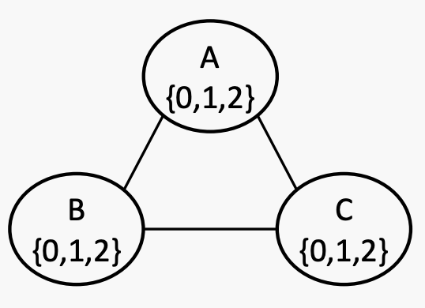

# Week 8&9&10 Search & CSP & Game

### Search

什么是搜索？

搜索不是关于预测，而是关于选择和决策，比如规划和分配。

搜索技术是通用的问题解决方法。

路径规划（Google 地图），在游戏中进行下一步移动（AlphaGo），以及任务分配（Uber 出租车）。

**搜索是从起始状态导航到目标状态的过程。**

搜索问题由以下内容组成：

* State Space: 取值空间，所有取值的可能
* Start State: agent开始搜索的地方
* Goal State: agent寻找的desired state
* Goal test: 检验是否到达goal
* successor function：转化方程。通常与代价有关

还有State space graph 和 Search Tree

*   State space graph：一种搜索问题的数学表示形式。node代表状态，arc代表转换

    
*   Search Tree：解决搜索问题的过程可以被抽象成为一棵搜索树。

    

开始状态为根节点，孩子对应后继，节点显示状态，但对应于实现这些状态的计划（即路径）。

#### 通用树搜索

```flow
 function Tree-Search (problem, strategy) returns a solution, or failure
   initialise the search tree via setting the start state of problem as root node  and put it in Frontier
 loop do
   if there are no nodes in Frontier for expansion then return failure
   else choose a node in Frontier for expansion according to strategy and
   remove it from Frontier
   if the chosen node is a goal state then return the corresponding solution
   else expand the node based on problem and add the resulting nodes to Frontier
 end
```

* Frontier: 存储等待扩展的节点。
* Expansion: 查找并显示节点的子节点。
* Expansion strategy: 来决定扩展 Frontier 中的哪个节点，也称为explore。

#### DFS

<figure><figcaption></figcaption></figure>

What is the order of the nodes to be expanded by DFS in this example (tie will be broken alphabetically)?

S -> A -> B -> C -> G

#### BFS

S -> A -> C -> G

### Constraint Satisfaction Problems (CSP)

上面展示的搜索问题都是planning问题，我们关心到目标的路径。

还有一种问题是Identification问题，我们不关心分配过程，顺序，只关心分配结果，比如说出租车分配，n皇后。

<figure><figcaption></figcaption></figure>

而CSP问题就是一种细分的identification问题，CSP有需要满足的约束(constraints)，但对结果没有偏好。

constraints是指合法解决方案不能违反的硬性约束。偏好有时被称为软约束（或目标），我们需要优化，例如，最小化成本。也就是说，CSP问题不需要考虑成本，只要达成目标即可。

CSP由以下几部分组成：

* variables
* Domain for each variable
* constraints

在CSP中，如果每个variables都有一个值，则assignment是complete的，否则它是partial的。solution是满足所有constraints条件的complete assignment。

例子：

<figure><figcaption></figcaption></figure>

CSP和标准搜索问题的对比：

标准搜索问题：

* state是黑盒，可以是任意的数据结构
* 目标测试可以是对状态的任何函数

CSP：

* 状态被定义为变量X1, X2...，domain为D1, D2
* 目标测试是一组constraints指定变量值的允许组合。

#### CSP问题例子

例1: 图着色

<figure><figcaption></figcaption></figure>

<figure><figcaption></figcaption></figure>

nodes correspond to the variables and arcs reflect the constraints.所以T和V中间没有arc

例2: 数独

<figure><figcaption></figcaption></figure>

当constraint涉及到超过两个变量时，用square和connet来表示约束

<figure><figcaption></figcaption></figure>

例3: 扫雷

<figure><figcaption></figcaption></figure>

例4: N皇后

<figure><figcaption></figcaption></figure>

> 行相同，不同列要么00 要么01 要么10.后面就变成列相同，对角线相同

#### CSP的分类

variables

* 域有限离散变量
* 域无限离散/连续变量，例如涉及时间的变量

constraints

* 一元，二元和高阶约束（Unary, binary and high-order），也就是这个约束涉及到多少个变量

如果有n个变量，每个域为d，那么有O(d^n)的assignments。assignments不管对错

对于4皇后问题，就有2^16种分配

#### 真实世界的CSP

* 分配问题：谁教哪个班
* 时间表问题：每个班在什么时候在哪上课
* 硬件配置
* 交通调度
* 工厂调度
* 电路布局
* 故障诊断

许多CSP问题也可以考虑偏好（即目标），在这种情况下，它们会变成受限优化问题。

#### 例题

<figure><figcaption></figcaption></figure>

> Variables: T, W, O, F, U, R, a1, a2
>
> Domain: T, W, O, F, U, R: \{0..9\} a1, a2: \{0, 1\}
>
> Constrain:
>
> * O+O = a1\*10+R
> * W+W+a1 = a2\*10+U
> * T+T+a2 = F\*10+O
> * F != 0
> * 注意：alldiff(T,W,O,F,U,R)

<figure><figcaption></figcaption></figure>

### Generate and Test - Brute Force

* 详尽的生成-测试算法是生成所有完整的赋值，然后依次测试它们，并返回满足所有约束条件的第一个。
*   它需要存储所有 𝑑^𝑛 个完整的赋值，其中 𝑑 是域大小，𝑛 是变量数量。

    所以我们需要别的算法

### Solve CSPs by standard search formulation

通过一般的搜索方法解决CSP

* Initial state: the empty assignment {}
* Successor function: assign a value to an unassigned variable
* Goal: the current assignment is complete and satisfies all the constraints.

#### BFS

<figure><figcaption></figcaption></figure>

#### DFS

<figure><figcaption></figcaption></figure>

#### Check constraints as you go

例子：有三个变量 A、B 和 C，它们的取值范围均为 \{0, 1, 2\}。约束条件是 A\<B\<C。如果出现平局，则按字母顺序和数字大小来决定胜负。

这种方法的思想是，在每步分配的时候，都只分配不破坏constraints的值。可能需要进行一些计算来检查约束条件，比如“增量目标测试”。

<figure><figcaption></figcaption></figure>

#### Consider one variable at a layer

回溯是一种深度优先搜索方法，具有两个额外的特点：1）在进行时检查约束条件，2）考虑一个变量在每一层。

<figure><figcaption></figcaption></figure>

#### Basic strategy: Backtracking

<figure><figcaption></figcaption></figure>

#### Speed-ups

两个想法：

◆ Filtering：我们能否早期检测到不可避免的故障

◆ Ordering：下一个应该分配哪个变量

#### Speed-up: Filtering

跟踪未分配变量和交叉域，排除不良选项。有不同的过滤方法。forward checking是其中之一。

forward checking：当添加到现有分配时违反约束的相邻变量值进行划掉。也就是说，当分配一个变量时，划掉所有其邻居域上现在被违反的任何内容。

**Forward checking**

有三个变量A、B和C，它们的取值范围为\{0, 1, 2\}。约束条件是B>A>C。如果出现平局，则按字母顺序和数字顺序进行打破。

这是一开始的状态。当A被分配为0时，其邻居B和C的域减少，因此很快就知道这个赋值是不合法的（因为C现在为空）。




#### Speed-up: Ordering

考虑剩余值的最小数量，即选择在其定义域中剩余合法值最少的变量。

例子：有三个变量 A、B 和 C，它们的取值范围均为 \{0, 1, 2\}。约束条件是 A ≤ B < C。如果出现平局，则按字母顺序和数字大小来决定胜负。

当A被分配为0的时候，由于B大于等于A，所以B为012，C大于A，所以为12，所以先分配C，再分配B

Also called “most constrained variable” or “fail-fast” ordering

<figure><figcaption></figcaption></figure>

#### 结合：Backtracking + Forward Checking + Ordering

有三个变量A，B，C，所有的域都是\{0, 1, 2\}。约束条件：A ≤ B < C 和 A + B + C = 3。打破平局的顺序是按字母表和数字排序。使用回溯、前向检查和排序来解决问题

<figure><figcaption></figcaption></figure>

### Local Search

Tree Search方法：系统地搜索分配空间。

* 从一个空的分配开始。
* 为未分配的变量赋值，并在找到解决方案之前处理约束。

但如果空间太大甚至是无限的，那么在任何合理的时间内，系统化搜索可能会失败地考虑到足够多的空间以提供任何有意义的结果。

Local Search方法：不是系统地搜索空间，而是设计为在平均情况下快速找到解决方案

* 从（任意）完整分配开始，因此可以违反约束。
* 尝试通过迭代改进分配。

**流程：**

* 随机生成一个complete assignment
* 当solution没有满足，或者stop criterion没有达到
  * 第一步：变量选择 - 随机选择一个违反约束的变量。
  * 第二部：值选择（最小冲突启发式）- 选择违反约束最少的值。

例子：A<=B\<C

首先，随机生成一个分配，A1，B0, C2

发现A，B违反要求，所以根据字母表选择变量A，由于0违反最少的约束，所以A选择0. A0, B0, C2, 满足条件。

**问题：**

Local Search理论上不总是能找到答案，基于问题的landscape和search strategy，但是实践上，基本能在50步之内完成million-queens.

#### Local Search - N皇后

<figure><figcaption></figcaption></figure>

首先随机生成一个状态，\{1,1,1,1\}

然后发现没有满足结果，所以随机选择Q3变化。从左到右违反的数量分别是：3 2 1 0，所以状态变为\{1,1,4,1\}

然后选择Q1变化，从左到又违反2 2 0 2，所以变成\{3,1,4,1\}

然后选择Q4变化，从做到右违反1 0 3 1，所以变成\{3,1,4,2\}，满足，找到solution

### Optimisation

优化问题：带有偏好的搜索问题，即具有目标函数。

它们由Variables、Domain和Objective Function组成。

Objective：

* 单目标（Single-objective）优化问题，例如，旅行商问题（TSP）：最小化旅行成本。
* 多目标(Multi-objective)优化问题，例如，在TSP中增加一个额外的目标：最小化旅行时间。

Constraints:

* 无约束优化问题。
* 约束优化问题。

Tree Search可能会失效，因为有些search space是连续的，Local Search更管用

#### Local Search for Optimisation

通常快速且省内存

* 可处理搜索状态难以表示/制定的问题。
* 在问题发生变化时，例如在航空公司调度问题中，可以用于在线设置。

method：

* 爬山算法，例如梯度下降。
* 模拟退火，禁忌搜索（保留一个小列表最近访问的解决方案，并禁止算法返回到这些解决方案）。

### Backtracking Homework

考虑以下4x4数独问题，其中每列、每行和四个区域都包含1到4的所有数字。使用带有前向检查和排序的回溯搜索来解决这个问题。

给出要访问的所有状态的顺序。假设单元格的平局首先从上到下打破，然后从左到右打破，并且数字的平局按数字顺序打破。

<figure><figcaption></figcaption></figure>

### Game is a search problem

游戏通常是一个对抗搜索问题，你的对手会对你的策略发表意见。

<figure><figcaption></figcaption></figure>

Games类型

* 游戏中是否有一些随机因素？
  * 确定性，例如 井字棋，国际象棋，中国象棋，围棋
  * 不确定性，扑克牌，麻将
* 几个玩家？
* 是否对抗？
  * 零和博弈：井字棋，下棋，围棋，扑克
  * 非零和博弈：囚徒困境
* 状态是否可见？
  * 完整信息：井字棋，国际象棋，中国象棋，围棋
  * 不完整信息：扑克，麻将

#### Formalisation Game to Search

* State：S，初始为s0
* Action：A
* Transition function：S x A -> S
* Terminal Test: S->(true, false)
* Players:P = (1..N)
* Utility(效用) Function：𝑆\_𝑡𝑒𝑟𝑚𝑖𝑛𝑎l × 𝑃 → 𝑅（结果上的值）
  * 一个效用函数（也称为客观函数或回报函数）定义了以终端状态 𝑠 结束的游戏对于玩家 𝑝 的最终数值。
  * 效用就是achievable outcome，其实就是目前得分。
  * 对于N皇后问题，有效的结果就是1，无效的就是0

搜索算法的目标：对于一个玩家，我们希望该算法能够找到一种策略（政策），为每个状态推荐一步移动，以便他们最终可以获得最大可实现效用。

对于井字棋的效用定义：

<figure><figcaption></figcaption></figure>

### Minmax

节点的极小值是终端状态的效用，从该节点开始，两个玩家都会最优地进行游戏。

因此，双人游戏的过程是一个玩家（称为Max玩家）要最大化其效用，而其对手（称为Min玩家）要最小化Max的效用。

<figure><figcaption></figcaption></figure>

<figure><figcaption></figcaption></figure>

例子：

<figure><figcaption></figcaption></figure>

第一个玩家最大化自己的效用，另一个玩家最小化自己的效用。

Minmax时间复杂度为O(b^m), 空间复杂度为(bm)，b为每个节点的分支数，m为最大深度

在大多数情况下，解决它们是完全不可行的，但我们不需要搜索整个树，所以要用到Pruning剪枝

### Alpha-Beta Game Tree Pruning

还是上面那个树

<figure><figcaption></figcaption></figure>

### Alpha-Beta Pruning

◆ 一般配置（对于代理Max）

◆ 让 𝑎 是Max目前至少可以获得的价值。

◆ 我们现在正在计算某个节点 𝑛 的最小值

◆ 当我们探索 𝑛 的子节点时，如果我们发现该节点的价值永远不会比 𝑎 更好（对于代理Max），那么我们可以停止考虑𝑛的其他子节点。

◆ Alpha-beta pruning的特性

◆ 对根节点来说，修剪对极小化值没有影响。

◆ 良好的子节点排序提高了修剪效果。

◆ 完美排序的复杂度：O(b^(𝑚/2))，这意味着你可以比对手深入搜索两倍。

◆ 许多游戏（例如国际象棋、围棋）的完全搜索仍然是无望的。

### Pruning Exercise

<figure><figcaption></figcaption></figure>

Q1:

<figure><figcaption></figcaption></figure>

Q2:

<figure><figcaption></figcaption></figure>

\
