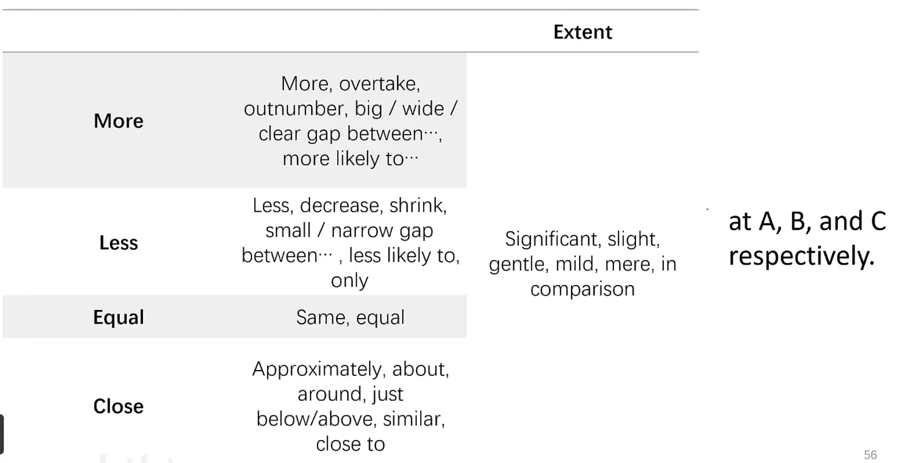

# 小作文用语总结

The proportion continues to rise, eventually accounting for 12%.

|              |                                                                                                                                                                                                                                                                                               |                                                                       |
| ------------ | --------------------------------------------------------------------------------------------------------------------------------------------------------------------------------------------------------------------------------------------------------------------------------------------- | --------------------------------------------------------------------- |
| 趋势类型         | 高分句型模板                                                                                                                                                                                                                                                                                        | 同义替换/变体                                                               |
| **持续上升**     | - rose/increased/climbed steadily to ...   - increased consistently, reaching ...                                                                                                                                                                                                          | rise/increase/climb/grow + steadily/gradually/consistently            |
| **持续下降**     | - fell/declined/dropped steadily to ...   - dropped consistently from ... to ...                                                                                                                                                                                                           | fall/decline/drop/decrease + steadily/gradually/consistently          |
| **震荡上升**     | - climbed steadily with minor fluctuations   - rose overall, despite some fluctuations in ...                                                                                                                                                                                              | with minor/small/slight fluctuations; despite some variations         |
| **震荡下降**     | - fell steadily with minor fluctuations   - declined overall, despite occasional increases in ...                                                                                                                                                                                          | despite some variations; with minor/occasional fluctuations           |
| **趋于平稳**     | - levelled off at ...   - reach a plateau at - tended to flatten and eventually stabilised around ...                                                                                                                                                                                      | remained constant/unchanged; stabilised at/around                     |
| **登顶（峰值）**   | - peaked at ... in ...   - hit a peak of ... before declining a little bit by ... in the decades                                                                                                                                                                                           | reached a maximum of; hit a high of                                   |
| **触底（低谷）**   | - fell to a low of ... before recovering a bit by ... in the decades                                                                                                                                                                                                                          | hit a low of; dropped to its minimum                                  |
| **先上升后下降**   | - increased steadily and hit a peak of ... before declining a little bit by ... in the decades                                                                                                                                                                                                | rose/increased/climbed + before/then/afterwards fell/dropped/declined |
| **先下降后上升**   | - dropped steadily and fell to a low of ... before recovering a bit by ... in the decades                                                                                                                                                                                                     | fell/dropped/declined + before/then/afterwards rose/increased/climbed |
| **相反趋势（对比）** | - moved in opposite directions   - showed contrasting trends   - xxx was a different story.                                                                                                                                                                                             | whereas / in contrast to / on the other hand                          |
| **时间主语句型**   | - the period saw a rise in (a significant hike) ... , contrasted with a fall in ...   - the years witnessed a decline in ... , contrasted with an increase in ...  1. **Central heating saw steady growth from 33% in 1972 to 64% in 1983.** 2. **experienced a gradual decline** | the period experienced / recorded / noted                             |
| **小幅变化**     | - rose slightly to ...   - increased modestly from ... to ...   - fell marginally to ...                                                                                                                                                                                                | slightly / modestly / marginally / a little                           |
| **大幅变化**     | - jumped sharply to ...   - skyrocketed to   - surged to ...     - fell significantly from ... to   - slide   - xxx was a turning point, where xxx jumped sharply to ...                                                                                                 | sharply / significantly / considerably / substantially                |

副词：

几种句式：

1. **数据在什么时间涨了**

2. **the proportion of woman engineering in space grew consistantly from 7% in 2009 to 21% in 2020**

3. **时间主语**

4. **The years between 1999 to 2010 witnessed a significant hike in China's GDP.**

5. **展示趋势**

6. **the proportion of woman engineering in space demonstrated an apparent upward trend, increasing from 7% to 21% from 2009 to 2020.**

7. 数字上升/下降

8. A slight rise can be seen in the proportion of woman engineering in space, from 7% in 2009 to 21% in 2020
9. There was a slight rise in the proportion of woman engineering in space, from 7% in 2009 to 21% in 2020

10. 先上升，然后加速

11. the proportion of woman engineering in space rose consistantly from 7% in 2009 to 21% in 2020, before a rapid increase to 29% in 2025
12. **the proportion of woman engineering in space rose consistantly from 7% in 2009 to 21% in 2020, followed by a rapid increase to 29% in 2025**

## 连接词

afterwards 之后

following this

subsequently

later on

in contrast 对比

consequently 因此 flexible workers find themselves in great demand, and consequently gain high salaries

moreover，furthermore，in addition

notably, it is worth noting that

## 静态图表达

- 两倍：

- was nearly/almost twice as high as ...
- A is 2 times as large as B

- 权重

- A fifth
- Almost a quater 24%
- just less than a third 31%
- a little under half 48%
- about 3 quaters 77%
- approximately 9 out of 10 92%

- 略高：was slightly/marginally higher than...
- 占多数：accounted for the majority/minority of.. 

- Housing accounted for the majority of total spending.

- 排序：Food ranked first, followed by transport and housing.
- 占比：

- Car ownership stood at 65% in 1990.
- Food made up 30% of total expenditure.
- Science graduates represented 40% of the total.
- The proportion of rural population was recorded at 25%.

- 极值

- had the highest/lowest proportion
- was the largest/smallest category
- ... took the lead in ...
- ... came bottom

- 显著的组

- The most noticeable feature is that...
- One of the most prominent features

- 不显著

- the gap is less obvious

- 不同之处有大有小

- while there are also some differences, both significant and minor.

- 规律

- which further demonstrates the pattern

- 转折

- when it comes to
- in the meantime

- 替换 比重

- share
- rate
- incidence
- proportion
- percentage

- 替换 while

- whereas

## 地图题

交叉路 - Intersection

交通岛，环形路 - roundabout

商业区 - Business district

新增了商业功能 commercial features was added

翻新 - renovated

延长 - extend

扩大 - expand enlarge

改地址 - relocate

拆除 - demolished，knock down

梯形区域 - Trapezoidal area

描述一段角度的变化：stretch from northwestern corner to due north 从西北到正北

对着 - opposite to / on the opposite side of

A 在 B 的东边 A is in(内部) / on(接壤) / to(不接壤) the east of B

A 在 B 的东角落 A is at/in the east corner of B

区域分类：

- commercial
- recreational
- residential
- industrial
- dining facilities

## 流程图

原料 raw materials

圆柱形 cylindrical

流水线 conveyor belt

顺时针搅拌 Stir clockwise.

逆时针搅拌 stir counterclockwise

